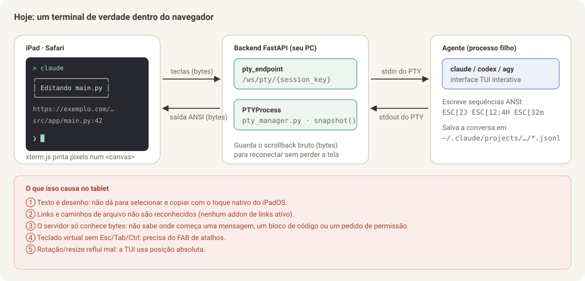
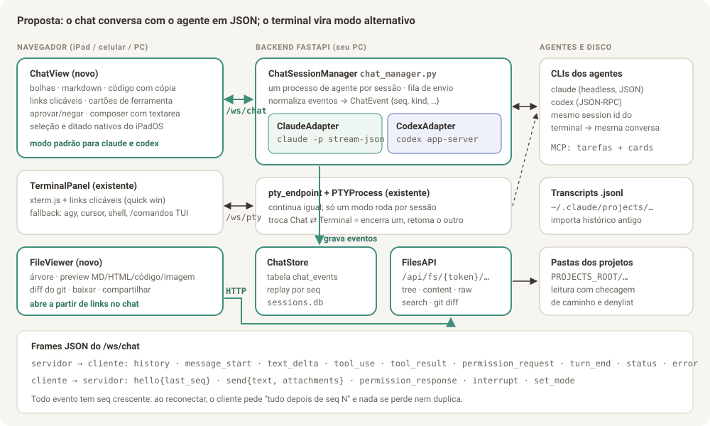

# Parte 0 — Visão geral e diagnóstico

> **Para quem é este documento:** para você (Bruno) entender o problema e as
> decisões, e para o agente que vai implementar entender *por que* cada
> decisão foi tomada antes de mexer no código. Leia esta parte antes das outras.

## 0.1 O pedido, em uma frase por item

| # | Pedido | Onde está a solução |
|---|--------|---------------------|
| 0a | Liberar espaço: a lista de clientes da sidebar vira a lista de projetos do cliente (com voltar), sobrando o lado direito para o visualizador | [Parte 8 — Planejamento da Fase N](08-planejamento-navegacao-cliente-projeto.md) |
| 1a | **Primeira entrega:** como links no terminal não são clicáveis, o próprio agente faz o arquivo aparecer na tela, cada abertura vira uma aba nova, com botão de tela cheia | [Parte 6 — Planejamento da Fase V](06-planejamento-fase-v.md) |
| 1a+ | Aba **Artefatos** por cliente e projeto (md, pdf, html), abrindo no painel lateral de visualização, sem mudar o layout | [Parte 7 — Planejamento da Fase A](07-planejamento-artefatos.md) |
| 1b | Ver arquivos `.html`, `.md` e de código no tablet e poder baixá-los, com o TaskNexus rodando no PC (navegador de arquivos completo) | [Parte 1 — Visualizador de arquivos](01-visualizador-de-arquivos.md) |
| 2 | Trocar o terminal por uma conversa estilo WhatsApp, com links, blocos de código e markdown como no GitHub | [Parte 2 — Chat conversacional](02-chat-conversacional.md) |
| 3 | Layout mais amigável | [Parte 3 — Layout amigável](03-layout-amigavel.md) |
| 4 | Outras melhorias que a equipe enxergar | [Parte 4 — Melhorias adicionais](04-melhorias-adicionais.md) |
| — | Como executar tudo isso com um agente | [Parte 5 — Plano de execução e prompts](05-plano-de-execucao-e-prompts.md) |
| — | Retomar o trabalho numa janela nova | [Contexto para o agente](CONTEXTO-PARA-AGENTE.md) |

## 0.2 A equipe e o que cada papel olhou

O documento foi escrito combinando quatro olhares. Em cada parte você vai ver
seções marcadas com o papel que respondeu por elas.

| Papel | Pergunta que respondeu | Onde aparece |
|-------|------------------------|--------------|
| **Design** | Como isso deve parecer no iPad, no celular e no PC? Que tokens, tipografia e componentes? | Mockups, seção "Design" de cada parte, Parte 3 inteira |
| **UX** | Qual é o caminho mais curto do dedo até o resultado? O que acontece quando dá errado? | Fluxos, estados vazios/erro, gestos, atalhos |
| **TL (tech lead)** | Qual arquitetura resolve de verdade, sem gambiarra, e o que ela arrisca? | Diagramas de arquitetura, decisões com alternativas descartadas, segurança |
| **Dev** | Quais arquivos criar/alterar, com qual contrato, e como testar? | Seções "Implementação", contratos de API, critérios de aceite, Parte 5 |

## 0.3 Como o TaskNexus funciona hoje (resumo técnico)

- **Backend:** Python + FastAPI (`backend/app/main.py`, ~2.950 linhas num arquivo só).
- **Frontend:** React 18 + Vite, sem TypeScript e sem biblioteca de UI. Layout
  ativo é o **v2** (`frontend/src/layouts/v2/`), com tokens de cor `--v2-*` em
  `theme.css` e fontes Figtree + IBM Plex Mono self-hosted.
- **Conversa com os agentes:** cada sessão é um processo `claude`, `codex`,
  `agy`, `cursor-agent` ou um shell, rodando dentro de um **PTY** no seu PC
  (`backend/app/pty_manager.py`). O navegador recebe os **bytes crus** do PTY
  por WebSocket (`/ws/pty/{session_key}`) e desenha num **xterm.js**
  (`frontend/src/components/TerminalPanel.jsx`).
- **Chave de sessão:** `session_key = "{projectId}::{agentId}[::sufixo]"`. O id
  de conversa do CLI fica em `sessions.db` (tabela `sessions`,
  `ConversationStore`), e é o que permite `--resume`.
- **Notificação de fim de turno:** hook `Stop` do claude (e `notify` do codex)
  faz POST em `/api/hooks/stop` → `mark_needs_attention` → badge, som e Web Push.
- **Board e Tarefas:** CRUD em SQLite, e os agentes criam cards/tarefas via
  dois servidores MCP injetados no spawn.
- **Anexos:** já existe upload por projeto em `.escritorio/attachments/`
  (`backend/app/attachments.py`) e o botão "Usar no chat", que cola o caminho
  no terminal.
- **Autenticação:** **nenhuma.** A premissa é "só eu acesso, pela minha
  Tailscale/LAN". Isso importa muito para a Parte 1 (ver 0.6).

## 0.4 Por que o terminal é ruim no tablet (causa raiz)

O problema não é o tema nem o tamanho da fonte. É estrutural:

1. **O texto vira desenho.** O xterm.js pinta os caracteres num `<canvas>`
   (ou WebGL). O iPadOS não tem texto real para selecionar, então o toque
   longo, a lupa e o menu "Copiar" nativos não funcionam. Qualquer solução
   de cópia dentro do xterm é imitação da seleção nativa.
2. **O servidor não sabe o que é uma mensagem.** O backend só repassa bytes.
   Ele não sabe onde começa a resposta do agente, onde está um bloco de
   código, um link, ou um pedido de permissão. Sem essa estrutura não dá para
   desenhar bolhas, botão de copiar código ou botão "Permitir".
3. **A TUI dos agentes é feita para teclado físico.** Esc, Tab, Shift+Tab,
   Ctrl+C e setas são o jeito de operar o claude/codex. No teclado virtual
   essas teclas não existem, por isso nasceu o FAB de atalhos
   (`TerminalShortcutsFab.jsx`), que é um remendo bem feito, mas remendo.
4. **Resize e rotação quebram a tela.** A TUI desenha com posição absoluta
   de cursor. Girar o iPad muda colunas/linhas e o snapshot antigo reflui mal
   (o próprio código já documenta isso em `pty_endpoint`).
5. **Links não são clicáveis.** O projeto não usa `@xterm/addon-web-links`
   nem um link provider. URLs e caminhos `arquivo.py:42` são só texto.

**Conclusão do TL:** dá para melhorar o terminal (e a Parte 4 traz quick wins
para isso), mas o salto que você pediu só acontece quando o backend passa a
receber **eventos estruturados** do agente, em vez de pixels de terminal. Os
CLIs do claude e do codex já oferecem isso oficialmente, e o chat é construído
em cima disso.

## 0.5 A solução em uma imagem

Três ideias sustentam tudo:

1. **Chat estruturado ao lado do terminal, não no lugar dele.** Para `claude`
   e `codex`, a sessão passa a abrir por padrão em **modo Chat**: o backend
   roda o CLI no modo headless com saída JSON e repassa eventos normalizados
   para a tela. O **modo Terminal** continua existindo, com o mesmo id de
   conversa, para quem quiser a TUI ou para agentes sem modo JSON (`agy`,
   `cursor`, shell).
2. **Tudo que é arquivo vira link.** Qualquer caminho que o agente menciona
   no chat abre o **visualizador de arquivos**, com preview de markdown,
   HTML e código, diff do git e botões de baixar e compartilhar.
3. **O layout passa a ser pensado para o toque primeiro.** Lista de conversas
   estilo WhatsApp, três painéis no iPad deitado, pilha com abas no celular,
   alvos de toque de 44 px e texto real (selecionável) em tudo.

## 0.6 Decisões importantes e o que foi descartado

| Decisão | Escolhida | Descartada e por quê |
|---------|-----------|----------------------|
| De onde vem a conversa estruturada | Modo headless oficial: `claude -p --input-format stream-json --output-format stream-json` (Parte 2) | **Ler a tela do terminal e "adivinhar" mensagens:** frágil, quebra a cada versão do CLI. O README do projeto já rejeita parsing de terminal. |
| O terminal some? | Não. Vira "modo Terminal", alternável por sessão | Remover: perderia `agy`, `cursor`, shells e os comandos de TUI (`/config`, `/model` interativos). |
| Histórico ao abrir uma conversa antiga | Log próprio `chat_events` no SQLite + importação única do `.jsonl` do claude | Só ler o `.jsonl` sempre: formato interno do CLI, pode mudar sem aviso. Usamos só para importar uma vez. |
| Preview de HTML | `<iframe sandbox="allow-scripts">` servindo o arquivo de uma rota própria com CSP `sandbox` | Injetar o HTML na página: o HTML poderia chamar a API do TaskNexus (criar card, apagar coluna) com a sua sessão. |
| Destaque de sintaxe | **Shiki** com carregamento preguiçoso das linguagens | highlight.js: mais leve, porém visual pior e sem os temas do VS Code; Prism: manutenção parada. |
| Autenticação | **Obrigatória antes do navegador de arquivos completo** (Parte 1 / fase F1). A Fase V pode vir antes porque só serve arquivos que o agente (ou você) abriu, por um id aleatório, com denylist | Continuar sem auth: com a API de arquivos livre, qualquer um na sua rede baixaria seu `~/.ssh` se um caminho escapasse. Ver Parte 4, item 4.1. |
| Primeira entrega | **Fase V:** tool MCP `abrir_no_visualizador` + visualizador em dropdown com abas e tela cheia (Parte 6) | Começar pelo chat estruturado: resolve mais, mas demora muito mais; o problema imediato é não conseguir abrir arquivos |

## 0.7 Glossário rápido

- **PTY:** terminal virtual. É o "fio" que liga o processo do agente ao xterm.js.
- **TUI:** interface de texto desenhada no terminal (o visual do `claude` interativo).
- **Headless / `-p`:** modo do CLI sem TUI, que conversa em JSON pela entrada e saída padrão.
- **stream-json:** formato em que cada linha é um objeto JSON (um evento).
- **Evento normalizado:** o formato único que o TaskNexus usa internamente, igual para claude e codex (Parte 2, seção 2.5).
- **Sandbox (iframe):** isola o HTML visualizado para ele não acessar a página nem a API.
- **Token de acesso:** senha longa gerada pelo servidor para você entrar no TaskNexus pelo tablet.

## 0.8 Como ler e usar estes documentos com um agente

1. Leia as Partes 1 a 4 na ordem, olhando os mockups.
2. Marque o que você não quer (cada melhoria tem id, ex.: `4.3`).
3. Comece pela **Fase V** ([Parte 6](06-planejamento-fase-v.md)). Para as
   fases seguintes, abra a [Parte 5](05-plano-de-execucao-e-prompts.md) e copie o prompt da fase
   que quer executar. Cada prompt já manda o agente ler as partes relevantes
   deste diretório, então **mantenha a pasta `docs/melhorias-tablet/` no repositório**.
4. Execute uma fase por PR. Cada fase foi desenhada para funcionar sozinha.
