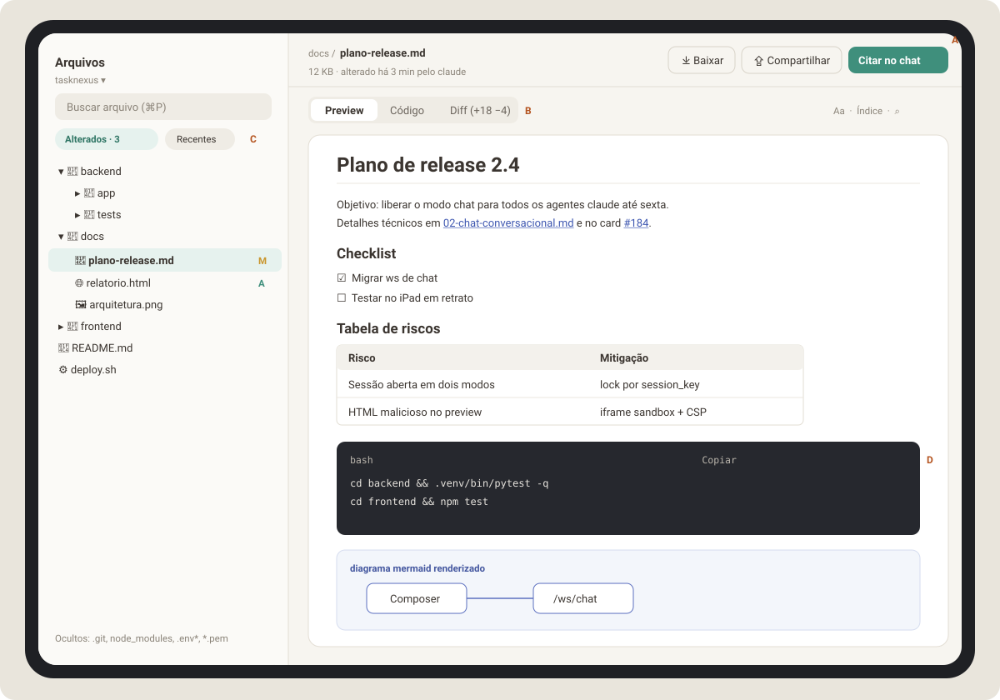
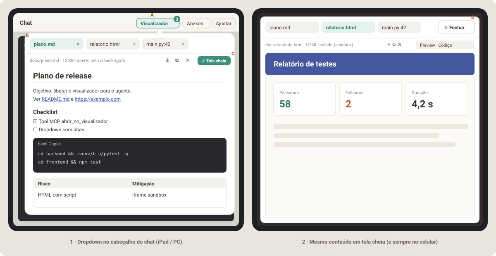
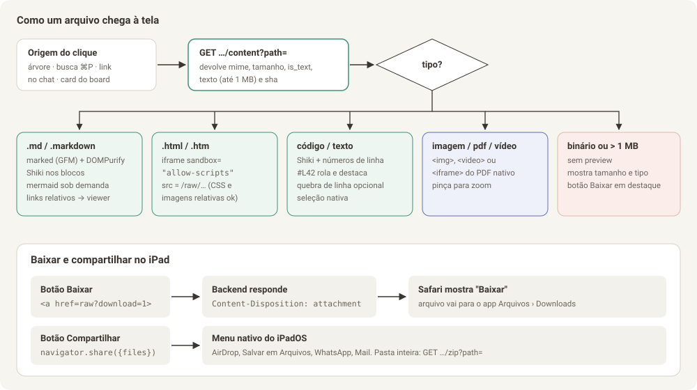

# Parte 1 — Visualizador de arquivos (ver, navegar e baixar pelo tablet)

> **Objetivo:** com o TaskNexus rodando no PC, abrir no iPad qualquer arquivo
> dos projetos (`.md`, `.html`, código, imagens, PDF), ler com conforto,
> copiar trechos e **baixar ou compartilhar** o arquivo para o próprio tablet.
>
> **Pré-requisito obrigatório:** autenticação (Parte 4, item 4.1). Sem ela,
> esta API expõe arquivos do seu PC para qualquer aparelho da rede.
>
> **Atualização:** esta parte virou a **segunda** etapa do visualizador. A
> primeira é a **Fase V** (seção 1.0 e [Parte 6](06-planejamento-fase-v.md)):
> o próprio agente abre o arquivo na tela, porque hoje não dá para clicar em
> links no terminal.



Legenda do mockup: **A** ações do arquivo (baixar, compartilhar, citar no
chat) · **B** abas Preview / Código / Diff · **C** filtros "Alterados"
(git) e "Recentes" · **D** bloco de código com botão Copiar.

---

## 1.0 Primeira entrega: o agente abre o arquivo na tela (Fase V)

Hoje o chat é um terminal e os links não são clicáveis. Por isso, antes da
árvore de pastas e da busca, vem uma entrega menor e mais urgente:

- **O agente mostra o arquivo:** uma ferramenta MCP nova,
  `abrir_no_visualizador(caminho, titulo?, linha?)`, registrada para o
  `claude` e o `codex` do mesmo jeito que as ferramentas de card e tarefa. A
  descrição da ferramenta orienta o agente a usá-la sempre que criar ou
  alterar um arquivo que você deva ver.
- **Cada abertura é uma aba nova** num **visualizador em dropdown**, que fica no
  cabeçalho do chat, ao lado de "Anexos". O mesmo arquivo pedido de novo
  reaproveita a aba e recarrega o conteúdo.
- **Botão Tela cheia:** o dropdown vira um **modal de tela cheia** na página,
  com as mesmas abas e um botão **✕ Fechar**. No celular abre sempre em tela cheia.
- **Aviso ao vivo** pelo WebSocket do terminal que já está aberto (frame de
  controle `viewer_open`). As abas ficam salvas no banco, então nada se perde
  se a tela estiver fechada.
- **Baixar, copiar e abrir no navegador** em cada aba. Markdown como no GitHub,
  HTML isolado em `iframe` sandbox e código com destaque de sintaxe.
- **Bônus:** links `https://` e caminhos de arquivo no terminal ficam
  clicáveis (addon de links do xterm) e abrem no visualizador.



O plano completo, com contratos, arquivos, testes e aceite, está na
[Parte 6 — Planejamento da Fase V](06-planejamento-fase-v.md). O código dessa
fase (`file_access.py`, renderers, `DiffRenderer` futuro) é reaproveitado pelo
restante desta Parte 1.

---

## 1.1 Histórias de uso (UX)

| # | Como… | Quero… | Para… |
|---|-------|--------|-------|
| H1 | usuário no iPad | tocar num caminho de arquivo citado pelo agente no chat | ver o arquivo sem sair da conversa |
| H2 | usuário no iPad | navegar pelas pastas do projeto e buscar por nome | achar um arquivo que não foi citado |
| H3 | usuário revisando o trabalho do agente | ver só os arquivos alterados e o diff | revisar o que mudou antes de aprovar |
| H4 | usuário | ver um `.md` renderizado como no GitHub (tabelas, checklists, código, mermaid) | ler documentação e planos |
| H5 | usuário | ver um `.html` renderizado de verdade, com o CSS dele | conferir relatórios e protótipos gerados pelo agente |
| H6 | usuário | baixar o arquivo ou mandar por AirDrop / WhatsApp / Arquivos | usar o arquivo fora do TaskNexus |
| H7 | usuário | selecionar e copiar um trecho com o toque nativo | colar em outro app |
| H8 | usuário | "citar no chat" um arquivo ou trecho | pedir ao agente para mexer exatamente ali |

### Fluxos principais

1. **Do chat para o arquivo (H1):** toque no link `backend/app/main.py:42` →
   abre o painel de contexto (iPad deitado), um slide-over (iPad em pé) ou uma
   tela nova (celular) → rola até a linha 42 e a destaca por 2 s → botão "voltar"
   ou gesto de arrastar para a direita fecha.
2. **Navegar (H2):** aba **Arquivos** → escolhe o projeto (padrão: o projeto
   da conversa ativa) → árvore carregada por pasta, sob demanda → toque no
   arquivo abre o viewer.
3. **Buscar (H2):** `⌘P` no teclado físico, ou o campo de busca → busca
   aproximada por nome (estilo VS Code) → Enter/toque abre.
4. **Revisar (H3):** chip "Alterados · N" → lista do `git status` → toque
   abre direto na aba **Diff**.
5. **Baixar (H6):** botão **Baixar** → Safari mostra o aviso de download →
   arquivo cai em Arquivos › Downloads. Botão **Compartilhar** → folha de
   compartilhamento do iPadOS.

### Estados que precisam existir

| Estado | O que mostrar |
|--------|---------------|
| Carregando | esqueleto do documento (3–4 barras cinza), nunca spinner no meio da tela |
| Arquivo grande (> 1 MB) | "Arquivo grande (4,3 MB). O preview foi desativado para não travar o tablet." + botões Baixar e "Mostrar as primeiras 2.000 linhas" |
| Binário sem preview | ícone do tipo, nome, tamanho, data, botão Baixar em destaque |
| Arquivo bloqueado (denylist) | "Este arquivo está protegido (segredos e chaves não são exibidos pelo TaskNexus)." |
| Não encontrado / apagado | "O arquivo não existe mais. Ele pode ter sido movido pelo agente." + botão "Buscar pelo nome" |
| Sem permissão de leitura no disco | mensagem do sistema operacional traduzida + caminho |
| Arquivo mudou enquanto aberto | faixa discreta no topo: "Arquivo alterado agora · Recarregar" |

---

## 1.2 Design

- **Estrutura:** o viewer é um componente único (`FileViewer`) usado em três
  lugares: tela **Arquivos**, **painel de contexto** ao lado do chat e **folha
  em tela cheia** no celular. Mesmo componente, contêiner diferente.
- **Cabeçalho do arquivo:** breadcrumb (`docs / plano-release.md`), linha de
  metadados (tamanho, "alterado há 3 min", autor quando vier do agente) e
  ações à direita. No celular, as ações viram ícones com rótulo acessível.
- **Abas:** controle segmentado `Preview | Código | Diff`, 36 px de altura,
  mesmo estilo do seletor Chat/Terminal (Parte 3). A aba Diff só aparece
  quando o arquivo tem alteração no git.
- **Tipografia de leitura:** corpo em Figtree 16 px / 1,6 no tablet
  (15 px no celular), coluna de no máximo 76 caracteres; código em IBM Plex
  Mono 13,5 px. Controle "Aa" com 3 tamanhos (salvo em `localStorage`).
- **Markdown:** visual de referência é o GitHub: títulos com linha inferior
  em H1/H2, tabelas com cabeçalho preenchido e rolagem horizontal própria,
  checklists com caixas reais (somente leitura), citações com barra lateral
  de 3 px na cor `--v2-border`, blocos de código escuros em ambos os temas.
- **Blocos de código:** cabeçalho com linguagem + nome do arquivo quando
  houver, botões **Copiar** e **Quebrar linhas**. Números de linha na aba
  Código, não no Preview.
- **Árvore:** linhas de 40 px (alvo de toque), indentação de 16 px por nível,
  ícone por tipo, letra de status git à direita (`M` amarelo, `A` verde,
  `D` vermelho, `?` cinza). Pastas ocultas por padrão com opção "Mostrar
  ocultos".
- **Cores:** apenas tokens `--v2-*` existentes. Diff usa `--v2-accent-soft`
  para linhas adicionadas e `--v2-danger-soft` para removidas.

---

## 1.3 Arquitetura (TL)



### 1.3.1 Por que um "token de projeto" na URL

O `project_id` pode conter `/` (projetos aninhados, ex.: `podesubir/teste`).
As rotas de anexos já usam `{project_id:path}`, o que funciona quando o
sufixo é fixo. Para arquivos, precisamos de **dois** caminhos na mesma URL
(o do projeto e o do arquivo), e a rota `raw` precisa que **links relativos
dentro de um HTML** funcionem (`<link href="style.css">` tem que resolver para
o arquivo vizinho). Solução:

```
project_token = base64url(project_id)  (sem padding "=")
/api/fs/{project_token}/raw/{file_path:path}
```

Assim, um HTML em `/api/fs/cG9kZXN1Ymly/raw/docs/relatorio.html` que pede
`style.css` faz o navegador buscar `/api/fs/cG9kZXN1Ymly/raw/docs/style.css`,
que é exatamente o arquivo vizinho.

### 1.3.2 Endpoints novos

Todos exigem autenticação (4.1) e resolvem o projeto com a mesma lógica de
`_resolve_project_or_404`.

| Método e rota | Para quê | Resposta |
|---------------|----------|----------|
| `GET /api/fs/{token}/tree?path=docs` | lista **uma** pasta (lazy) | `{"path":"docs","entries":[{"name":"plano.md","type":"file","size":12034,"mtime":1727290000.1,"git":"M"}], "truncated":false}` |
| `GET /api/fs/{token}/content?path=docs/plano.md` | metadados + texto para preview | `{"path","size","mtime","mime","kind":"markdown|html|code|image|pdf|video|binary","language":"python","is_text":true,"text":"…","truncated":false,"sha256":"…"}` |
| `GET /api/fs/{token}/raw/{file_path}` | bytes do arquivo (preview de HTML, imagem, PDF) | `FileResponse` com `Content-Type` correto e cabeçalhos de segurança (1.4) |
| `GET /api/fs/{token}/raw/{file_path}?download=1` | download | igual acima + `Content-Disposition: attachment; filename*=UTF-8''nome.ext` |
| `GET /api/fs/{token}/zip?path=docs` | baixar pasta | `StreamingResponse` de um zip gerado em streaming, com limite de 200 MB |
| `GET /api/fs/{token}/search?q=plano&limit=50` | busca por nome | `{"results":[{"path":"docs/plano-release.md","score":0.92}]}` |
| `GET /api/fs/{token}/git/status` | arquivos alterados | `{"is_repo":true,"branch":"main","files":[{"path":"docs/plano.md","status":"M","added":18,"removed":4}]}` |
| `GET /api/fs/{token}/git/diff?path=docs/plano.md` | diff unificado de um arquivo | `{"path","diff":"@@ -1,4 +1,6 @@…","binary":false}` |
| `GET /api/fs/{token}/events` (opcional, fase 2) | aviso de "arquivo mudou" | Server-Sent Events com `{"path","mtime"}` |

Regras de implementação:

- **`tree`**: ordena pastas primeiro, depois arquivos, ambos por nome sem
  diferenciar maiúsculas. Máximo de 2.000 entradas por pasta (`truncated:true`
  acima disso). Pastas ignoradas por padrão: `.git`, `node_modules`,
  `__pycache__`, `.venv*`, `dist`, `build`, `.next`, `.pytest_cache`,
  `.escritorio`. Parâmetro `show_hidden=1` mostra pontos-arquivos, **nunca**
  os da denylist.
- **`content`**: lê no máximo 1 MB. Detecta texto lendo os primeiros 8 KB
  (sem byte `\x00` e decodificável como UTF-8, com fallback latin-1). `kind`
  vem da extensão, `language` de um mapa extensão → id do Shiki
  (`.py→python`, `.jsx→jsx`, `.ps1→powershell`, `Dockerfile→docker`…).
- **`search`**: se `rg` (ripgrep) estiver no PATH, usa `rg --files` (respeita
  `.gitignore`, muito rápido); senão, `os.walk` com as mesmas exclusões.
  Pontuação por subsequência (estilo fuzzy do VS Code) feita em Python.
  Cache por projeto de 30 s.
- **`git/*`**: `git -C <projeto> status --porcelain=v1 -z` e
  `git diff --numstat` / `git diff -- <arquivo>` via
  `asyncio.create_subprocess_exec` (**nunca** `shell=True`), timeout de 5 s.
  Arquivos não rastreados (`??`) mostram o conteúdo inteiro como adição.
- **Tudo que toca disco roda em thread** (`asyncio.to_thread`) para não travar
  o loop que também atende os WebSockets.

### 1.3.3 Onde colocar o código

Não aumente o `main.py`. Crie:

```
backend/app/files_api.py        # APIRouter com as rotas acima
backend/app/file_access.py      # resolve_safe_path, denylist, detecção de tipo
backend/app/git_info.py         # status e diff via subprocess
backend/tests/test_file_access.py
backend/tests/test_files_api.py
```

e registre com `app.include_router(files_router)` no `main.py`.

---

## 1.4 Segurança (TL) — leia com atenção

### 1.4.1 Contenção de caminho

Função única, usada por **todas** as rotas:

```python
def resolve_safe_path(project_root: str, rel_path: str) -> str:
    """Devolve o caminho absoluto real ou levanta PermissionError/FileNotFoundError."""
    if "\x00" in rel_path or "\\" in rel_path:
        raise PermissionError("caractere inválido")
    candidate = os.path.realpath(os.path.join(project_root, rel_path.lstrip("/")))
    root = os.path.realpath(project_root)
    if os.path.commonpath([root, candidate]) != root:
        raise PermissionError("fora do projeto")
    if is_denied(os.path.relpath(candidate, root)):
        raise PermissionError("arquivo protegido")
    return candidate
```

- `realpath` resolve **links simbólicos**: um symlink dentro do projeto que
  aponte para `~/.ssh` é recusado porque o destino real fica fora da raiz.
- A lógica é a mesma de `_is_within_directory` em `attachments.py`; reaproveite
  ou extraia para um util comum, sem duplicar.
- O middleware `RejectBackslashPathMiddleware` já existente continua valendo.

### 1.4.2 Denylist (nunca exibir nem baixar)

`.env`, `.env.*` (exceto `.env.example`), `*.pem`, `*.key`, `*.p12`, `*.pfx`,
`id_rsa*`, `id_ed25519*`, `*.kdbx`, `.git/` (conteúdo interno), `.npmrc`,
`.pypirc`, `credentials*.json`, `*.sqlite`/`*.db` do próprio TaskNexus
(`sessions.db`). A lista fica em `file_access.py` e é testada.

### 1.4.3 HTML isolado

Um HTML gerado pelo agente pode ter JavaScript. Se ele rodasse na mesma origem
do TaskNexus, poderia chamar `/api/cards`, `/api/sessions/.../paste` (escrever
no terminal do agente!) etc. Por isso, duas camadas:

1. **No frontend:** `<iframe src="/api/fs/.../raw/relatorio.html" sandbox="allow-scripts allow-popups allow-popups-to-escape-sandbox">`,
   **sem** `allow-same-origin`. O conteúdo roda numa origem opaca.
2. **No backend**, na rota `raw` para `text/html`, `image/svg+xml` e `text/xml`:
   ```
   Content-Security-Policy: sandbox allow-scripts allow-popups; default-src * data: blob: 'unsafe-inline' 'unsafe-eval'
   X-Content-Type-Options: nosniff
   Cross-Origin-Resource-Policy: same-origin
   ```
   A diretiva `sandbox` no cabeçalho protege até quando alguém abre a URL
   direto numa aba, fora do iframe.

**Armadilha importante (auth × sandbox):** dentro de um iframe sem
`allow-same-origin`, o navegador trata as requisições de CSS, imagens e
scripts do HTML como vindas de outro site, e **não envia o cookie de sessão**
(`SameSite=Lax`/`Strict`). Resultado: o HTML abriria sem estilo e sem imagens
(401). A solução é uma URL de preview **assinada no próprio caminho**:

```
GET /api/fs/{token}/preview-url?path=docs/relatorio.html
→ {"url": "/api/fs/pv/{assinatura}/docs/relatorio.html", "expires_in": 900}

assinatura = base64url(hmac_sha256(SECRET, f"{project_id}|{expira_em}")) + "." + expira_em
```

A rota `/api/fs/pv/{assinatura}/{file_path:path}` aceita a assinatura no lugar
do cookie, vale para **qualquer arquivo daquele projeto** por 15 minutos
(assim `style.css` e `img/logo.png` relativos funcionam) e aplica as mesmas
regras de `resolve_safe_path` e denylist. O iframe usa essa URL.

Além disso, como o `CORSMiddleware` hoje está com `allow_origins=["*"]`,
restrinja para a própria origem quando a auth entrar (4.1). Uma origem opaca
(`null`) não pode ser aceita.

### 1.4.4 Limites

| Limite | Valor | Motivo |
|--------|-------|--------|
| Texto no `content` | 1 MB | iPad renderizando markdown gigante trava |
| Arquivo no `raw` | sem limite (streaming) | download precisa funcionar para arquivos grandes |
| Zip de pasta | 200 MB e 10.000 arquivos | evitar travar o PC |
| Entradas por pasta | 2.000 | árvore responsiva |

---

## 1.5 Frontend (Dev)

### 1.5.1 Dependências novas

| Pacote | Uso | Observação |
|--------|-----|------------|
| `shiki` | destaque de sintaxe | usar `createHighlighterCore` + `createOnigurumaEngine` (ou engine JS) e **carregar cada linguagem sob demanda** (`import('shiki/langs/python.mjs')`). Temas `github-light` e `github-dark`, trocados pelo `data-theme` já existente |
| `mermaid` | diagramas em markdown | `import('mermaid')` só quando o documento tiver bloco ```` ```mermaid ```` |
| `marked` + `dompurify` | já instalados | reaproveitar `utils/markdown.js`, ampliando (1.5.3) |

Não use `react-markdown` para não ter dois renderizadores de markdown no app.

### 1.5.2 Componentes

```
frontend/src/features/files/
  FilesScreen.jsx          # tela "Arquivos": seletor de projeto + árvore + viewer
  FileTree.jsx             # árvore lazy, teclado (setas) e toque
  FileSearch.jsx           # busca ⌘P (modal no tablet, tela no celular)
  FileViewer.jsx           # cabeçalho + abas + escolhe o renderizador pelo kind
  renderers/
    MarkdownRenderer.jsx   # marked + DOMPurify + Shiki + mermaid + links
    HtmlRenderer.jsx       # iframe sandbox + alternância "ver código"
    CodeRenderer.jsx       # Shiki com números de linha, #L42, quebra de linha
    ImageRenderer.jsx      #  com zoom por pinça (CSS touch-action)
    PdfRenderer.jsx        # <iframe> do PDF (Safari tem visualizador nativo)
    BinaryRenderer.jsx     # só metadados + Baixar
    DiffRenderer.jsx       # diff unificado com cores e números das duas versões
  useFileContent.js        # busca /content, cache em memória por path+mtime
  fileLinks.js             # detecta caminhos em texto e monta href interno
  fsApi.js                 # funções fetch das rotas /api/fs
```

### 1.5.3 Markdown "como no GitHub"

Amplie `utils/markdown.js` (hoje: `marked.parse` + `DOMPurify.sanitize`):

1. `marked.use({ gfm: true })` para tabelas, checklists, autolinks e riscado.
2. Renderer de `code` que emite `<pre data-lang="python"><code>…</code></pre>`
   e deixa o destaque para depois (Shiki é assíncrono): o componente percorre
   os `<pre data-lang>` após montar e substitui pelo HTML do Shiki.
3. IDs nos títulos (`slug`) para o índice lateral e para links `#secao`.
4. Links:
   - `http(s)://` → `target="_blank" rel="noopener noreferrer"`.
   - Relativos (`../outro.md`, `img/x.png`) → resolvidos contra a pasta do
     arquivo atual e abertos **no próprio viewer** (clique interceptado).
   - Imagens relativas → `src` reescrito para `/api/fs/{token}/raw/...`.
5. DOMPurify com `ADD_ATTR: ['target']` e hook `afterSanitizeAttributes`
   que força `rel="noopener noreferrer"` em links externos.
6. Blocos `mermaid` → `<div class="mermaid-src">` renderizado com
   `mermaid.render()` usando `securityLevel: 'strict'`.

### 1.5.4 Baixar e compartilhar no iPad

```jsx
// Baixar: link real, sem JavaScript. O Safari do iPadOS respeita
// Content-Disposition: attachment e salva em Arquivos › Downloads.
<a className="btn" href={`${rawUrl}?download=1`} download={fileName}>Baixar</a>

// Compartilhar: Web Share API nível 2 (suportada no Safari do iPadOS).
async function share() {
  const blob = await (await fetch(rawUrl)).blob();
  const file = new File([blob], fileName, { type: blob.type });
  if (navigator.canShare?.({ files: [file] })) {
    await navigator.share({ files: [file], title: fileName });
  } else {
    window.location.href = `${rawUrl}?download=1`; // fallback
  }
}
```

- `navigator.share` só funciona em **contexto seguro** (HTTPS ou localhost),
  o mesmo requisito do Web Push já documentado no README. Pela Tailscale com
  `https://<host>.ts.net` funciona.
- Precisa ser chamado **dentro do toque do usuário**; por isso busque o blob
  antes (ao abrir o arquivo, se for < 20 MB) ou mostre "Preparando…" e peça um
  segundo toque.
- "Copiar conteúdo" usa `utils/clipboard.js` que já existe.

### 1.5.5 Links de arquivo no texto (usado também pelo chat)

`fileLinks.js` exporta `linkifyFilePaths(text, knownRoots)` que reconhece:

```
backend/app/main.py
backend/app/main.py:42
backend/app/main.py:42:7
./frontend/src/App.jsx
/home/bruno/projetos/tasknexus/README.md   (absoluto dentro do projeto)
`src/utils/markdown.js`                    (entre crases)
```

Regras: precisa ter pelo menos uma `/` **ou** uma extensão conhecida; não
pode estar dentro de URL; caminhos absolutos só viram link se estiverem dentro
da raiz do projeto. O link gerado é interno:
`/arquivos?p=<token>&f=<path>&l=42`.

### 1.5.6 Rota e navegação

- Nova tela `arquivos` no `AppV2` (ao lado de chat, board, tarefas,
  configuração). Hoje `v2Screen` é um `useState`; para permitir link direto,
  adicione suporte a `/arquivos?...` no `useRoute` ou leia `location.search`
  ao montar.
- No chat, o viewer abre no **painel de contexto** (Parte 3) e não troca de tela.

---

## 1.6 Testes e critérios de aceite

### Backend (pytest)

- `resolve_safe_path` recusa: `../x`, `a/../../x`, caminho absoluto fora da
  raiz, symlink para fora, `\x00`, `\\`, cada item da denylist.
- `tree` ignora `node_modules` e `.git`, ordena pastas antes, corta em 2.000.
- `content` de arquivo binário devolve `is_text:false` e sem `text`.
- `raw` de `.html` tem `Content-Security-Policy` com `sandbox`.
- `raw?download=1` tem `Content-Disposition: attachment` com nome UTF-8
  (teste com `relatório ção.md`).
- `git/status` num diretório sem git devolve `is_repo:false` sem erro 500.

### Frontend (vitest)

- `linkifyFilePaths` com uma tabela de 20 casos (positivos e negativos, incluindo URLs).
- `MarkdownRenderer` reescreve imagem relativa para `/api/fs/.../raw/...` e
  adiciona `rel="noopener noreferrer"` em link externo.
- `HtmlRenderer` renderiza iframe **sem** `allow-same-origin`.
- `FileViewer` mostra o estado "Arquivo grande" quando `truncated:true`.

### Aceite manual no iPad (Safari e PWA instalado)

1. Abrir um `.md` com tabela, checklist, código Python e mermaid: tudo renderiza.
2. Selecionar três linhas de um bloco de código com o dedo e colar no Notas.
3. Abrir um `.html` com CSS e imagem relativos: aparece igual ao navegador do PC.
4. Esse HTML tenta `fetch('/api/cards')`: a chamada falha (origem opaca).
5. Baixar um `.zip` de 50 MB: aparece em Arquivos › Downloads.
6. Compartilhar um `.md` por AirDrop para o Mac.
7. Tocar em `backend/app/main.py:42` no chat: abre na linha 42 destacada.
8. Tentar `/api/fs/<token>/raw/../../.ssh/id_rsa`: resposta 403.
