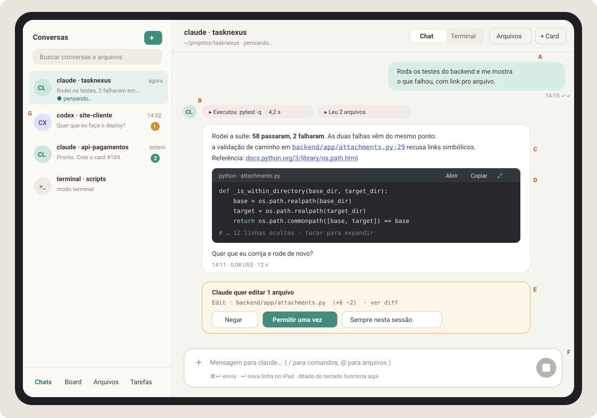

# TaskNexus no tablet — documentação das melhorias

Documentação de design, UX, arquitetura e implementação para tornar o
TaskNexus confortável no iPad e no celular: **chat no lugar do terminal**,
**visualizador e download de arquivos**, **layout pensado para toque** e
melhorias extras. Escrita para ser lida por você e executada por um agente
Claude, fase por fase.



## Partes

| Parte | Conteúdo | HTML |
|-------|----------|------|
| [0 · Visão geral e diagnóstico](00-visao-geral-e-diagnostico.md) | Como o sistema funciona hoje, por que o terminal é ruim no tablet, a solução numa imagem, decisões e alternativas descartadas | [html](00-visao-geral-e-diagnostico.html) |
| [1 · Visualizador de arquivos](01-visualizador-de-arquivos.md) | Ver `.md`, `.html`, código, imagens e PDF; baixar e compartilhar no iPad; API, segurança, componentes, testes | [html](01-visualizador-de-arquivos.html) |
| [2 · Chat conversacional](02-chat-conversacional.md) | Conversa estilo WhatsApp com markdown, código, links e aprovações; protocolo, banco, código, testes | [html](02-chat-conversacional.html) |
| [3 · Layout amigável](03-layout-amigavel.md) | Diagnóstico de UX, tokens, layouts por tamanho de tela, rotas, lista de conversas, atalhos, acessibilidade | [html](03-layout-amigavel.html) |
| [4 · Melhorias adicionais](04-melhorias-adicionais.md) | 14 melhorias com o quê, por quê, como, esforço e prioridade (inclui autenticação obrigatória) | [html](04-melhorias-adicionais.html) |
| [5 · Plano de execução e prompts](05-plano-de-execucao-e-prompts.md) | Fases FN, FV, FA e F0–F4, critérios de pronto e prompts prontos para colar num agente | [html](05-plano-de-execucao-e-prompts.html) |
| [6 · Planejamento da Fase V](06-planejamento-fase-v.md) | O agente abre arquivos na tela, em abas, num painel à direita com tela cheia. Requisitos, UX, contratos, ordem de commits, testes e aceite | [html](06-planejamento-fase-v.html) |
| [7 · Planejamento da Fase A](07-planejamento-artefatos.md) | Aba **Artefatos** por cliente e projeto (md, pdf, html) no layout atual, abrindo no painel lateral. Requisitos, UX, contratos, testes e aceite | [html](07-planejamento-artefatos.html) |
| [8 · Planejamento da Fase N](08-planejamento-navegacao-cliente-projeto.md) | Sidebar: clientes → projetos com voltar, filtro global por projeto e espaço à direita para o visualizador (colunas viram trilhos quando ele abre) | [html](08-planejamento-navegacao-cliente-projeto.html) |
| [Contexto para o agente](CONTEXTO-PARA-AGENTE.md) | Resumo de tudo (decisões, estado, próximos passos) para retomar numa janela de contexto nova | [html](CONTEXTO-PARA-AGENTE.html) |

Versão em página única, com todas as partes:
[`documentacao-completa.html`](documentacao-completa.html) (imagens embutidas, boa para abrir no iPad) e
[`documentacao-completa.md`](documentacao-completa.md) (um único Markdown para entregar a um agente).

## Imagens

| Arquivo | O que mostra |
|---------|--------------|
| `img/01-arquitetura-atual.svg` | Fluxo atual xterm.js ⇄ WebSocket ⇄ PTY ⇄ CLI e os problemas no tablet |
| `img/02-arquitetura-proposta.svg` | Chat estruturado, adaptadores, ChatStore e API de arquivos |
| `img/03-mockup-chat-ipad.svg` | Chat no iPad deitado |
| `img/04-mockup-arquivos-ipad.svg` | Visualizador de arquivos no iPad |
| `img/05-mockup-celular.svg` | Lista, conversa e arquivo no celular |
| `img/06-sequencia-turno.svg` | Sequência de um turno com streaming e aprovação |
| `img/07-fluxo-visualizador.svg` | Escolha do renderizador e fluxo de download/compartilhar |
| `img/08-navegacao-responsiva.svg` | Três layouts por largura de tela |
| `img/09-roadmap.svg` | Ordem das fases |
| `img/10-mockup-visualizador-dropdown.svg` | Visualizador em dropdown com abas e em tela cheia (Fase V) |
| `img/11-fluxo-agente-abre-arquivo.svg` | Caminho da tool MCP até a aba aparecer na tela (Fase V) |
| `img/12-mockup-artefatos.svg` | Tela Artefatos no layout atual com o painel lateral aberto (Fase A) |
| `img/13-mockup-sidebar-cliente-projeto.svg` | Clientes → projetos na sidebar e visualizador encaixado à direita, com as contas de largura (Fase N) |

## Como regenerar os HTML

Os `.md` são a fonte. Depois de editar, rode:

```bash
pip install markdown pygments pymdown-extensions
python3 docs/melhorias-tablet/build_html.py
```

O script gera um `.html` por parte, o `documentacao-completa.html` com as
imagens embutidas e o `documentacao-completa.md` (todas as partes num arquivo só).
