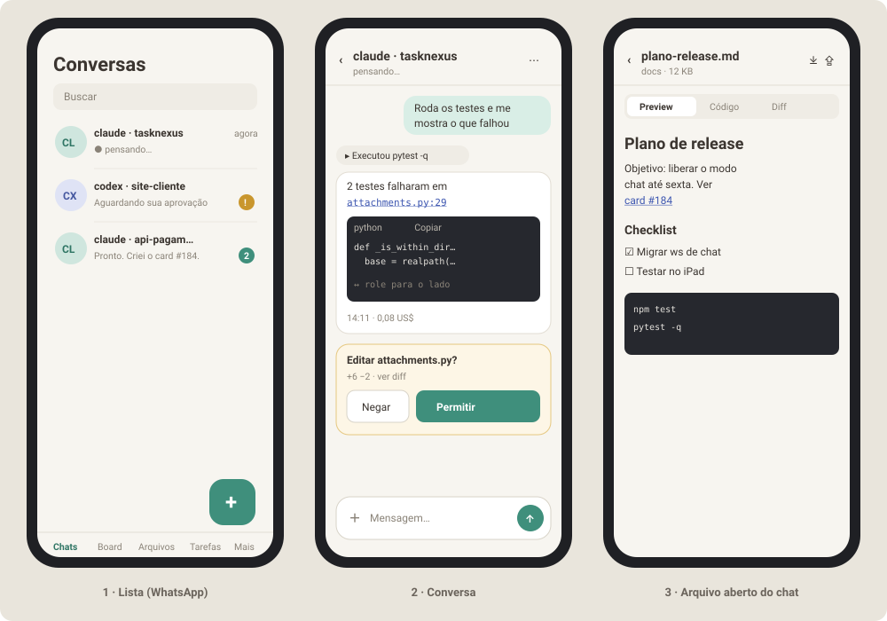
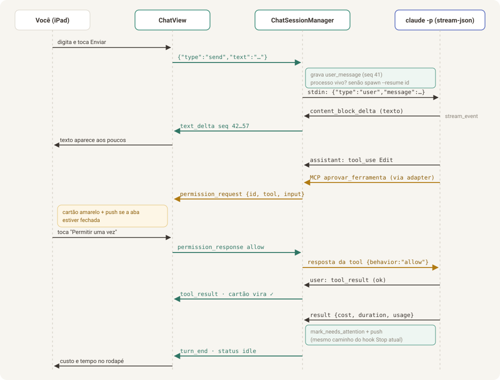
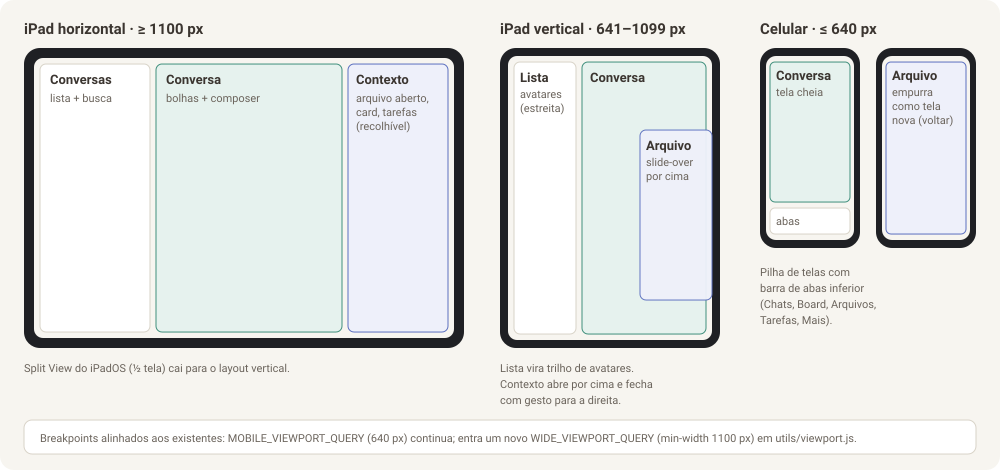
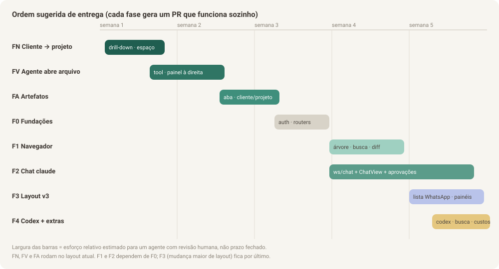
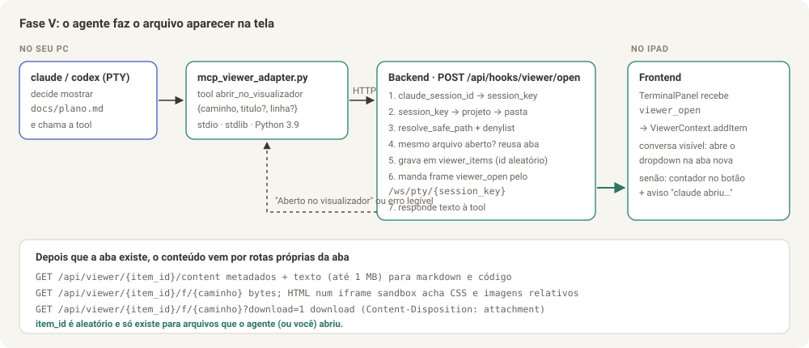
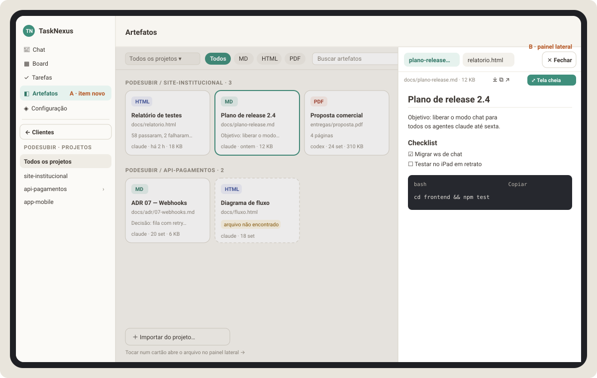
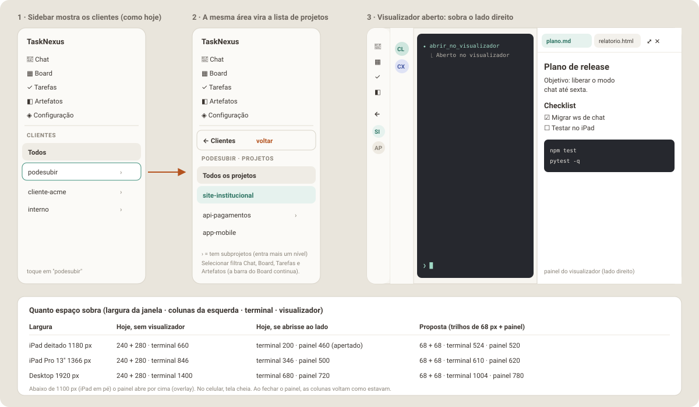

# TaskNexus no tablet — documentação completa (arquivo único)

> Gerado por `build_html.py` a partir dos .md desta pasta. Não edite este
> arquivo: edite as partes e rode o script de novo.

## Sumário

- C · Contexto para o agente (`CONTEXTO-PARA-AGENTE.md`)
- 0 · Visão geral e diagnóstico (`00-visao-geral-e-diagnostico.md`)
- 1 · Visualizador de arquivos (`01-visualizador-de-arquivos.md`)
- 2 · Chat conversacional (`02-chat-conversacional.md`)
- 3 · Layout amigável (`03-layout-amigavel.md`)
- 4 · Melhorias adicionais (`04-melhorias-adicionais.md`)
- 5 · Plano e prompts (`05-plano-de-execucao-e-prompts.md`)
- 6 · Planejamento da Fase V (`06-planejamento-fase-v.md`)
- 7 · Planejamento da Fase A (`07-planejamento-artefatos.md`)
- 8 · Planejamento da Fase N (`08-planejamento-navegacao-cliente-projeto.md`)

---

<!-- ===== CONTEXTO-PARA-AGENTE.md ===== -->

## Contexto para o agente (leia primeiro numa janela nova)

> Este arquivo existe para que **qualquer agente, numa janela de contexto
> limpa**, entenda em poucos minutos o que já foi decidido e feito, e continue
> o trabalho sem precisar da conversa original. Se você é esse agente, leia
> este arquivo inteiro antes de qualquer outra coisa.

### 1. Quem pediu e como gosta de trabalhar

- **Usuário:** Bruno, dono do repositório `brunopodesubir/TaskNexus-adjustes`.
- **Idioma:** português do Brasil em tudo (docs, comentários, mensagens de commit).
- **Formato de documentação:** sempre **um `.md` e um `.html`** de cada
  documento. O HTML é gerado pelo `build_html.py` desta pasta.
- **Como ele usa o TaskNexus:** o backend roda no PC dele (Windows com
  `deploy.ps1`, e também macOS/Linux com `deploy.sh`), e ele acessa pelo
  **iPad** (Safari e PWA instalado), via Tailscale (`https://<host>.ts.net`).
- **Fluxo de trabalho combinado:** planejamento e documentação numa janela;
  desenvolvimento numa **janela de contexto limpa**. Quando ele pedir, o agente
  de planejamento entrega o **prompt de desenvolvimento** da fase. Não
  entregar nem executar a fase sem ele pedir.
- **Qualidade esperada:** trabalho de "equipe completa" (Design, UX, TL e
  Dev), documentação muito explicada, com imagens e diagramas, testes, e
  sem gambiarra.

### 2. O problema

O TaskNexus é um "escritório" web para conversar com agentes de IA (`claude`,
`codex`, `agy`, `cursor-agent`, shells) rodando no PC, mais Board (kanban) e
Tarefas. A conversa hoje é um **terminal real** (xterm.js ligado a um PTY por
WebSocket). No tablet isso é ruim:

- não dá para **clicar em links** nem em caminhos de arquivo;
- não dá para **selecionar e copiar** texto com o toque nativo (o xterm desenha em canvas);
- faltam Esc, Tab e Ctrl no teclado virtual;
- a tela se desorganiza ao girar o iPad;
- não há como **ver arquivos** `.md`/`.html`/código nem **baixá-los** para o tablet.

### 3. O que foi pedido

1. Visualizar arquivos `.html`, `.md` e de código, e baixá-los no tablet.
2. Trocar o terminal por um **chat estilo WhatsApp** (links, blocos de código,
   markdown como no GitHub).
3. Um layout mais amigável.
4. Outras melhorias que a equipe enxergar.
5. **Ajuste posterior (mais recente, tem prioridade):** como não dá para
   clicar em links no terminal, a primeira entrega é o **próprio agente fazer o
   arquivo aparecer na tela**. Cada abertura vira **uma aba nova**, num
   visualizador em **dropdown** com botão de **tela cheia** (modal na página
   com botão de fechar). Isso virou a **Fase V**.
6. **Ajuste seguinte:** uma aba **Artefatos**, "igual à do Claude", organizada
   **por cliente e projeto**, com os artefatos criados (`.md`, `.pdf`, `.html`).
   Tocar num artefato abre o **painel lateral de visualização**. **Sem mexer no
   layout:** tudo em cima do layout v2 atual. Isso virou a **Fase A**.
7. **Ajuste seguinte:** liberar espaço no desktop/tablet. Ao selecionar um
   cliente, **a própria lista de clientes da sidebar vira a lista de projetos**
   dele, com seta/botão para **voltar aos clientes**, sobrando o **lado
   direito** para o visualizador (o "dropdown"). Isso virou a **Fase N**.

### 4. Onde está cada coisa (esta pasta)

| Arquivo | Para quê |
|---------|----------|
| `README.md` | Índice |
| `00-visao-geral-e-diagnostico.md` | Arquitetura atual, causa raiz, decisões e alternativas descartadas |
| `01-visualizador-de-arquivos.md` | Visualizador. A seção 1.0 resume a Fase V; o resto é o navegador de arquivos completo (fase F1) |
| `02-chat-conversacional.md` | Chat estruturado via `claude -p --input-format stream-json --output-format stream-json`, aprovações por tool MCP, protocolo `/ws/chat`, banco `chat_events` |
| `03-layout-amigavel.md` | Tokens, layouts por largura, rotas reais, lista estilo WhatsApp, ⌘K, acessibilidade |
| `04-melhorias-adicionais.md` | 14 melhorias (4.1 autenticação é obrigatória antes do navegador completo) |
| `05-plano-de-execucao-e-prompts.md` | Fases FV, F0–F4 e prompts das fases F0–F4 |
| `06-planejamento-fase-v.md` | **Plano de desenvolvimento da Fase V (segunda a executar)** |
| `08-planejamento-navegacao-cliente-projeto.md` | **Plano da Fase N (sidebar clientes → projetos + espaço à direita), a primeira a executar** |
| `07-planejamento-artefatos.md` | **Plano de desenvolvimento da Fase A (aba Artefatos), logo depois da V** |
| `documentacao-completa.md` / `.html` | Todas as partes num arquivo só |
| `img/*.svg` | Diagramas e mockups (01–11) |
| `build_html.py` | Gera os HTML e o `documentacao-completa.md`: `pip install markdown pygments pymdown-extensions && python3 docs/melhorias-tablet/build_html.py` |

### 5. Decisões já tomadas (não reabrir sem o Bruno pedir)

| Tema | Decisão |
|------|---------|
| Ordem | **FN** (sidebar cliente → projeto) → **FV** (agente abre arquivo) → **FA** (aba Artefatos) → **F0** (auth + routers + restante dos quick wins) → **F1** (navegador de arquivos) e **F2** (chat claude) → **F3** (layout v3) → **F4** (codex + extras) |
| Como o agente mostra arquivo | Tool MCP `abrir_no_visualizador(caminho, titulo?, linha?)` num servidor novo `escritorio-visualizador`, registrado em `_escritorio_mcp_servers()` (vale para `claude` e `codex`) |
| Como a tela fica sabendo | Frame de controle `{"type":"viewer_open",…}` no WebSocket `/ws/pty/{session_key}` já existente, com abas persistidas na tabela `viewer_items` |
| "Aba nova" | Aba **dentro do visualizador** (não do navegador); o mesmo arquivo reaproveita a aba e recarrega (interpretação a confirmar com o Bruno; alternativa trivial documentada na Parte 6) |
| Tela cheia | Modal em portal (`document.body`), mesmo contrato do `CenteredModal.jsx`, com ✕ Fechar e Esc; no celular abre sempre em tela cheia |
| Segurança do visualizador | Rotas por `item_id` aleatório, `resolve_safe_path` (realpath + commonpath), denylist de segredos, HTML em `iframe sandbox` sem `allow-same-origin` + CSP `sandbox` |
| Artefatos | Tabela `artifacts` única por (projeto, caminho); tool `publicar_artefato` no servidor `escritorio-visualizador`; `abrir_no_visualizador` de `.md`/`.html`/`.pdf` publica automaticamente; remover da lista não apaga o arquivo; tela nova `artefatos` em `NAV_ITEMS` do `AppV2`, com `ClienteProjetoFilterBar`; o visualizador é o mesmo painel à direita do chat |
| Navegação | Drill-down no `ClienteList` (Clientes → Projetos → subprojetos, com **← voltar**); escopo global `useNavScope` (cliente + projeto, salvo em `localStorage`) filtra Chat, Board, Tarefas e Artefatos; cliente sem subprojetos só é selecionado; `ClienteProjetoFilterBar` **continua** no Board (principalmente em "Todos"), Tarefas e Artefatos, partindo da sidebar e agindo só na tela (decisão do Bruno) |
| Visualizador | Abre **à direita**: encaixado (`ViewerDock`) em ≥ 1100 px com a sidebar e a lista de chats recolhidas automaticamente **só enquanto aberto** (sem gravar a preferência; se o usuário expandir com o painel aberto, fica expandida; ao fechar, volta tudo como estava), por cima (`ViewerDrawer`) em 641–1099 px, tela cheia no celular. Onde as Partes 6/7 dizem "dropdown", é esse painel |
| Layout | **Não mexer no layout agora.** Fases V e A entram em cima do v2 atual; o layout v3 (Parte 3) fica para depois |
| Autenticação | Obrigatória antes do navegador de arquivos livre (F1); a FV pode vir antes por ter superfície limitada |
| Chat estruturado | Modo headless oficial do `claude` (flags verificadas na 2.1.x); aprovações por `--permission-prompt-tool` apontando para uma tool MCP nossa; **não** usar o SDK Python do Claude porque o backend roda em **Python 3.9.6** (SDK exige 3.10+) |
| Terminal | Continua existindo como "modo Terminal"; nunca rodar TUI e modo JSON ao mesmo tempo na mesma sessão |
| Stack | Sem TypeScript, sem biblioteca de UI/CSS, tokens `--v2-*` de `frontend/src/layouts/v2/theme.css`, fontes Figtree e IBM Plex Mono self-hosted |

### 6. Mapa do código que importa

| Área | Arquivo | Observação |
|------|---------|------------|
| Rotas, WebSocket do PTY, hooks, spawn dos CLIs | `backend/app/main.py` (~2.950 linhas) | `pty_endpoint`, `_active_connections`, `_ensure_pty`, `_escritorio_mcp_servers`, `_build_mcp_config_json`, `_build_codex_config_overrides`, `_hook_callback_base_url`, `_resolve_project_or_404`, hooks `/api/hooks/*` |
| Processo PTY | `backend/app/pty_manager.py` | `snapshot()`, `_schedule_reap` (SIGTERM → SIGKILL) |
| Id de conversa ↔ session_key | `backend/app/conversation_store.py` | `get_session_key_by_claude_id` |
| Modelo de adapter MCP | `backend/app/mcp_card_adapter.py`, `mcp_task_adapter.py` | stdio JSON-RPC, stdlib, Python 3.9 |
| Contenção de caminho existente | `backend/app/attachments.py` | `_is_within_directory` |
| Terminal no navegador | `frontend/src/components/TerminalPanel.jsx` | `CONTROL_FRAME_TYPES`, `isControlFrame`, `ws.onmessage` |
| Estado das sessões | `frontend/src/components/TerminalContext.jsx` | `TerminalProvider`, `useTerminal` |
| Casco do layout v2 | `frontend/src/layouts/v2/AppV2.jsx` | `NAV_ITEMS`, `SCREEN_TITLES`, `v2Screen`; topbar com `AttachmentsMenu` e `ResetLayoutButton` (guarda `!isMobile && v2Screen === 'chat'`) |
| Filtro cliente/projeto | `layouts/v2/useClienteProjetoFilter.js`, `ClienteProjetoFilterBar.jsx`, `utils/clientes.js` | usado por `BoardV2` e `TarefasV2`; subárvore por prefixo (`collectSubtreeIds`) |
| Drawer lateral existente | `frontend/src/components/TasksDrawer.jsx` | padrão para o `ViewerDrawer` da Fase A |
| Padrão de popover | `frontend/src/layouts/v2/AttachmentsMenu.jsx`, `TaskQuickCreatePopover.jsx` | scrim, Esc, clique fora |
| Padrão de modal | `frontend/src/layouts/v2/CenteredModal.jsx` | portal; invariante em `fixedPositioningInvariant.test.js` |
| Markdown | `frontend/src/utils/markdown.js` | `marked` + `DOMPurify` |
| Copiar | `frontend/src/utils/clipboard.js` | `copyTextToClipboard` |
| Testes | `backend/tests/` (pytest), `frontend/src/**/*.test.js(x)` (vitest) | `cd backend && .venv/bin/pytest`; `cd frontend && npm test` |

### 7. Estado atual

- **Integração:** as fases **N, V (V-1 backend + V-2 frontend) e A (backend +
  frontend)** foram desenvolvidas por subagentes, validadas pelo integrador e
  mergeadas na branch `claude/elegant-carson-ehd59f`, que vai para a `main` num
  **PR único** com o checklist de teste manual do Bruno. O PR antigo da V-1
  (`brunopodesubir/TaskNexus-adjustes#2`) foi substituído por esse PR único.
- **Onde está o "como ficou" de cada fase:** Fase N na seção **8.7**; V-1 na
  **6.10**; V-2 na **6.11**; Artefatos backend na **7.10** e frontend na **7.11**.
  Capturas em `docs/melhorias-tablet/capturas/fase-v2/` e `capturas/fase-a/`.
- **Testes na integração:** frontend 94 arquivos / 1635 testes verdes; backend
  1212 passaram, 21 pulados (o `test_pty_manager.py::test_terminate_kills_process_group`
  falha só no contêiner de nuvem, por falta de reaper de zumbis, e já falhava antes).
- **Próxima ação:** o Bruno testa o PR único no iPad/PC/celular. Depois do merge,
  as próximas fases do roteiro são **F0** (autenticação + routers + restante dos
  quick wins do terminal), **F1** (navegador de arquivos), **F2** (chat
  estruturado), **F3** (layout v3) e **F4** (codex + extras) — Parte 5.
- **Pendências conhecidas** (estão no PR): aprovação da tool na TUI do claude na
  1ª chamada; PDF dentro de iframe no Safari pode mostrar só a 1ª página;
  vídeo sem Range (vira download); CORS `*` e sem autenticação até a F0; teste com
  o codex real e no Windows; ambiguidade de "artefato" num claude que também tenha
  a tool de Artifact do claude.ai (dizer "artefato do TaskNexus"); paginação da
  lista de artefatos; link relativo de artefato para arquivo não publicado abre cru.

### 8. Regras para quem for desenvolver

1. Ler este arquivo, o `README.md` do projeto, a parte da fase e o código citado antes de escrever qualquer coisa.
2. Python **3.9** no backend (sem `match`, sem `X | Y` fora de `from __future__ import annotations`).
3. Nunca `shell=True`. Todo caminho vindo de cliente ou agente passa por `resolve_safe_path`.
4. Testes para todo código novo; `pytest` e `npm test` verdes a cada commit.
5. Não quebrar: modo Terminal, Board, Tarefas, push, `deploy.sh`, `deploy.ps1`.
6. Comentários explicam o **porquê**, em português, no estilo do código existente.
7. Se o código real divergir da documentação, seguir o código e **atualizar a doc** no mesmo PR (e regenerar os HTML com `build_html.py`).
8. Commits pequenos, um PR por fase, com checklist de aceite manual no iPad.

---

<!-- ===== 00-visao-geral-e-diagnostico.md ===== -->

## Parte 0 — Visão geral e diagnóstico

> **Para quem é este documento:** para você (Bruno) entender o problema e as
> decisões, e para o agente que vai implementar entender *por que* cada
> decisão foi tomada antes de mexer no código. Leia esta parte antes das outras.

### 0.1 O pedido, em uma frase por item

| # | Pedido | Onde está a solução |
|---|--------|---------------------|
| 0a | Liberar espaço: a lista de clientes da sidebar vira a lista de projetos do cliente (com voltar), sobrando o lado direito para o visualizador | [Parte 8 — Planejamento da Fase N](08-planejamento-navegacao-cliente-projeto.md) |
| 1a | **Primeira entrega:** como links no terminal não são clicáveis, o próprio agente faz o arquivo aparecer na tela, cada abertura vira uma aba nova, com botão de tela cheia | [Parte 6 — Planejamento da Fase V](06-planejamento-fase-v.md) |
| 1a+ | Aba **Artefatos** por cliente e projeto (md, pdf, html), abrindo no painel lateral de visualização, sem mudar o layout | [Parte 7 — Planejamento da Fase A](07-planejamento-artefatos.md) |
| 1b | Ver arquivos `.html`, `.md` e de código no tablet e poder baixá-los, com o TaskNexus rodando no PC (navegador de arquivos completo) | [Parte 1 — Visualizador de arquivos](01-visualizador-de-arquivos.md) |
| 2 | Trocar o terminal por uma conversa estilo WhatsApp, com links, blocos de código e markdown como no GitHub | [Parte 2 — Chat conversacional](02-chat-conversacional.md) |
| 3 | Layout mais amigável | [Parte 3 — Layout amigável](03-layout-amigavel.md) |
| 4 | Outras melhorias que a equipe enxergar | [Parte 4 — Melhorias adicionais](04-melhorias-adicionais.md) |
| — | Como executar tudo isso com um agente | [Parte 5 — Plano de execução e prompts](05-plano-de-execucao-e-prompts.md) |
| — | Retomar o trabalho numa janela nova | [Contexto para o agente](CONTEXTO-PARA-AGENTE.md) |

### 0.2 A equipe e o que cada papel olhou

O documento foi escrito combinando quatro olhares. Em cada parte você vai ver
seções marcadas com o papel que respondeu por elas.

| Papel | Pergunta que respondeu | Onde aparece |
|-------|------------------------|--------------|
| **Design** | Como isso deve parecer no iPad, no celular e no PC? Que tokens, tipografia e componentes? | Mockups, seção "Design" de cada parte, Parte 3 inteira |
| **UX** | Qual é o caminho mais curto do dedo até o resultado? O que acontece quando dá errado? | Fluxos, estados vazios/erro, gestos, atalhos |
| **TL (tech lead)** | Qual arquitetura resolve de verdade, sem gambiarra, e o que ela arrisca? | Diagramas de arquitetura, decisões com alternativas descartadas, segurança |
| **Dev** | Quais arquivos criar/alterar, com qual contrato, e como testar? | Seções "Implementação", contratos de API, critérios de aceite, Parte 5 |

### 0.3 Como o TaskNexus funciona hoje (resumo técnico)

- **Backend:** Python + FastAPI (`backend/app/main.py`, ~2.950 linhas num arquivo só).
- **Frontend:** React 18 + Vite, sem TypeScript e sem biblioteca de UI. Layout
  ativo é o **v2** (`frontend/src/layouts/v2/`), com tokens de cor `--v2-*` em
  `theme.css` e fontes Figtree + IBM Plex Mono self-hosted.
- **Conversa com os agentes:** cada sessão é um processo `claude`, `codex`,
  `agy`, `cursor-agent` ou um shell, rodando dentro de um **PTY** no seu PC
  (`backend/app/pty_manager.py`). O navegador recebe os **bytes crus** do PTY
  por WebSocket (`/ws/pty/{session_key}`) e desenha num **xterm.js**
  (`frontend/src/components/TerminalPanel.jsx`).
- **Chave de sessão:** `session_key = "{projectId}::{agentId}[::sufixo]"`. O id
  de conversa do CLI fica em `sessions.db` (tabela `sessions`,
  `ConversationStore`), e é o que permite `--resume`.
- **Notificação de fim de turno:** hook `Stop` do claude (e `notify` do codex)
  faz POST em `/api/hooks/stop` → `mark_needs_attention` → badge, som e Web Push.
- **Board e Tarefas:** CRUD em SQLite, e os agentes criam cards/tarefas via
  dois servidores MCP injetados no spawn.
- **Anexos:** já existe upload por projeto em `.escritorio/attachments/`
  (`backend/app/attachments.py`) e o botão "Usar no chat", que cola o caminho
  no terminal.
- **Autenticação:** **nenhuma.** A premissa é "só eu acesso, pela minha
  Tailscale/LAN". Isso importa muito para a Parte 1 (ver 0.6).


### 0.4 Por que o terminal é ruim no tablet (causa raiz)

O problema não é o tema nem o tamanho da fonte. É estrutural:

1. **O texto vira desenho.** O xterm.js pinta os caracteres num `<canvas>`
   (ou WebGL). O iPadOS não tem texto real para selecionar, então o toque
   longo, a lupa e o menu "Copiar" nativos não funcionam. Qualquer solução
   de cópia dentro do xterm é imitação da seleção nativa.
2. **O servidor não sabe o que é uma mensagem.** O backend só repassa bytes.
   Ele não sabe onde começa a resposta do agente, onde está um bloco de
   código, um link, ou um pedido de permissão. Sem essa estrutura não dá para
   desenhar bolhas, botão de copiar código ou botão "Permitir".
3. **A TUI dos agentes é feita para teclado físico.** Esc, Tab, Shift+Tab,
   Ctrl+C e setas são o jeito de operar o claude/codex. No teclado virtual
   essas teclas não existem, por isso nasceu o FAB de atalhos
   (`TerminalShortcutsFab.jsx`), que é um remendo bem feito, mas remendo.
4. **Resize e rotação quebram a tela.** A TUI desenha com posição absoluta
   de cursor. Girar o iPad muda colunas/linhas e o snapshot antigo reflui mal
   (o próprio código já documenta isso em `pty_endpoint`).
5. **Links não são clicáveis.** O projeto não usa `@xterm/addon-web-links`
   nem um link provider. URLs e caminhos `arquivo.py:42` são só texto.

**Conclusão do TL:** dá para melhorar o terminal (e a Parte 4 traz quick wins
para isso), mas o salto que você pediu só acontece quando o backend passa a
receber **eventos estruturados** do agente, em vez de pixels de terminal. Os
CLIs do claude e do codex já oferecem isso oficialmente, e o chat é construído
em cima disso.

### 0.5 A solução em uma imagem


Três ideias sustentam tudo:

1. **Chat estruturado ao lado do terminal, não no lugar dele.** Para `claude`
   e `codex`, a sessão passa a abrir por padrão em **modo Chat**: o backend
   roda o CLI no modo headless com saída JSON e repassa eventos normalizados
   para a tela. O **modo Terminal** continua existindo, com o mesmo id de
   conversa, para quem quiser a TUI ou para agentes sem modo JSON (`agy`,
   `cursor`, shell).
2. **Tudo que é arquivo vira link.** Qualquer caminho que o agente menciona
   no chat abre o **visualizador de arquivos**, com preview de markdown,
   HTML e código, diff do git e botões de baixar e compartilhar.
3. **O layout passa a ser pensado para o toque primeiro.** Lista de conversas
   estilo WhatsApp, três painéis no iPad deitado, pilha com abas no celular,
   alvos de toque de 44 px e texto real (selecionável) em tudo.

### 0.6 Decisões importantes e o que foi descartado

| Decisão | Escolhida | Descartada e por quê |
|---------|-----------|----------------------|
| De onde vem a conversa estruturada | Modo headless oficial: `claude -p --input-format stream-json --output-format stream-json` (Parte 2) | **Ler a tela do terminal e "adivinhar" mensagens:** frágil, quebra a cada versão do CLI. O README do projeto já rejeita parsing de terminal. |
| O terminal some? | Não. Vira "modo Terminal", alternável por sessão | Remover: perderia `agy`, `cursor`, shells e os comandos de TUI (`/config`, `/model` interativos). |
| Histórico ao abrir uma conversa antiga | Log próprio `chat_events` no SQLite + importação única do `.jsonl` do claude | Só ler o `.jsonl` sempre: formato interno do CLI, pode mudar sem aviso. Usamos só para importar uma vez. |
| Preview de HTML | `<iframe sandbox="allow-scripts">` servindo o arquivo de uma rota própria com CSP `sandbox` | Injetar o HTML na página: o HTML poderia chamar a API do TaskNexus (criar card, apagar coluna) com a sua sessão. |
| Destaque de sintaxe | **Shiki** com carregamento preguiçoso das linguagens | highlight.js: mais leve, porém visual pior e sem os temas do VS Code; Prism: manutenção parada. |
| Autenticação | **Obrigatória antes do navegador de arquivos completo** (Parte 1 / fase F1). A Fase V pode vir antes porque só serve arquivos que o agente (ou você) abriu, por um id aleatório, com denylist | Continuar sem auth: com a API de arquivos livre, qualquer um na sua rede baixaria seu `~/.ssh` se um caminho escapasse. Ver Parte 4, item 4.1. |
| Primeira entrega | **Fase V:** tool MCP `abrir_no_visualizador` + visualizador em dropdown com abas e tela cheia (Parte 6) | Começar pelo chat estruturado: resolve mais, mas demora muito mais; o problema imediato é não conseguir abrir arquivos |

### 0.7 Glossário rápido

- **PTY:** terminal virtual. É o "fio" que liga o processo do agente ao xterm.js.
- **TUI:** interface de texto desenhada no terminal (o visual do `claude` interativo).
- **Headless / `-p`:** modo do CLI sem TUI, que conversa em JSON pela entrada e saída padrão.
- **stream-json:** formato em que cada linha é um objeto JSON (um evento).
- **Evento normalizado:** o formato único que o TaskNexus usa internamente, igual para claude e codex (Parte 2, seção 2.5).
- **Sandbox (iframe):** isola o HTML visualizado para ele não acessar a página nem a API.
- **Token de acesso:** senha longa gerada pelo servidor para você entrar no TaskNexus pelo tablet.

### 0.8 Como ler e usar estes documentos com um agente

1. Leia as Partes 1 a 4 na ordem, olhando os mockups.
2. Marque o que você não quer (cada melhoria tem id, ex.: `4.3`).
3. Comece pela **Fase V** ([Parte 6](06-planejamento-fase-v.md)). Para as
   fases seguintes, abra a [Parte 5](05-plano-de-execucao-e-prompts.md) e copie o prompt da fase
   que quer executar. Cada prompt já manda o agente ler as partes relevantes
   deste diretório, então **mantenha a pasta `docs/melhorias-tablet/` no repositório**.
4. Execute uma fase por PR. Cada fase foi desenhada para funcionar sozinha.

---

<!-- ===== 01-visualizador-de-arquivos.md ===== -->

## Parte 1 — Visualizador de arquivos (ver, navegar e baixar pelo tablet)

> **Objetivo:** com o TaskNexus rodando no PC, abrir no iPad qualquer arquivo
> dos projetos (`.md`, `.html`, código, imagens, PDF), ler com conforto,
> copiar trechos e **baixar ou compartilhar** o arquivo para o próprio tablet.
>
> **Pré-requisito obrigatório:** autenticação (Parte 4, item 4.1). Sem ela,
> esta API expõe arquivos do seu PC para qualquer aparelho da rede.
>
> **Atualização:** esta parte virou a **segunda** etapa do visualizador. A
> primeira é a **Fase V** (seção 1.0 e [Parte 6](06-planejamento-fase-v.md)):
> o próprio agente abre o arquivo na tela, porque hoje não dá para clicar em
> links no terminal.


Legenda do mockup: **A** ações do arquivo (baixar, compartilhar, citar no
chat) · **B** abas Preview / Código / Diff · **C** filtros "Alterados"
(git) e "Recentes" · **D** bloco de código com botão Copiar.

---

### 1.0 Primeira entrega: o agente abre o arquivo na tela (Fase V)

Hoje o chat é um terminal e os links não são clicáveis. Por isso, antes da
árvore de pastas e da busca, vem uma entrega menor e mais urgente:

- **O agente mostra o arquivo:** uma ferramenta MCP nova,
  `abrir_no_visualizador(caminho, titulo?, linha?)`, registrada para o
  `claude` e o `codex` do mesmo jeito que as ferramentas de card e tarefa. A
  descrição da ferramenta orienta o agente a usá-la sempre que criar ou
  alterar um arquivo que você deva ver.
- **Cada abertura é uma aba nova** num **visualizador em dropdown**, que fica no
  cabeçalho do chat, ao lado de "Anexos". O mesmo arquivo pedido de novo
  reaproveita a aba e recarrega o conteúdo.
- **Botão Tela cheia:** o dropdown vira um **modal de tela cheia** na página,
  com as mesmas abas e um botão **✕ Fechar**. No celular abre sempre em tela cheia.
- **Aviso ao vivo** pelo WebSocket do terminal que já está aberto (frame de
  controle `viewer_open`). As abas ficam salvas no banco, então nada se perde
  se a tela estiver fechada.
- **Baixar, copiar e abrir no navegador** em cada aba. Markdown como no GitHub,
  HTML isolado em `iframe` sandbox e código com destaque de sintaxe.
- **Bônus:** links `https://` e caminhos de arquivo no terminal ficam
  clicáveis (addon de links do xterm) e abrem no visualizador.


O plano completo, com contratos, arquivos, testes e aceite, está na
[Parte 6 — Planejamento da Fase V](06-planejamento-fase-v.md). O código dessa
fase (`file_access.py`, renderers, `DiffRenderer` futuro) é reaproveitado pelo
restante desta Parte 1.

---

### 1.1 Histórias de uso (UX)

| # | Como… | Quero… | Para… |
|---|-------|--------|-------|
| H1 | usuário no iPad | tocar num caminho de arquivo citado pelo agente no chat | ver o arquivo sem sair da conversa |
| H2 | usuário no iPad | navegar pelas pastas do projeto e buscar por nome | achar um arquivo que não foi citado |
| H3 | usuário revisando o trabalho do agente | ver só os arquivos alterados e o diff | revisar o que mudou antes de aprovar |
| H4 | usuário | ver um `.md` renderizado como no GitHub (tabelas, checklists, código, mermaid) | ler documentação e planos |
| H5 | usuário | ver um `.html` renderizado de verdade, com o CSS dele | conferir relatórios e protótipos gerados pelo agente |
| H6 | usuário | baixar o arquivo ou mandar por AirDrop / WhatsApp / Arquivos | usar o arquivo fora do TaskNexus |
| H7 | usuário | selecionar e copiar um trecho com o toque nativo | colar em outro app |
| H8 | usuário | "citar no chat" um arquivo ou trecho | pedir ao agente para mexer exatamente ali |

#### Fluxos principais

1. **Do chat para o arquivo (H1):** toque no link `backend/app/main.py:42` →
   abre o painel de contexto (iPad deitado), um slide-over (iPad em pé) ou uma
   tela nova (celular) → rola até a linha 42 e a destaca por 2 s → botão "voltar"
   ou gesto de arrastar para a direita fecha.
2. **Navegar (H2):** aba **Arquivos** → escolhe o projeto (padrão: o projeto
   da conversa ativa) → árvore carregada por pasta, sob demanda → toque no
   arquivo abre o viewer.
3. **Buscar (H2):** `⌘P` no teclado físico, ou o campo de busca → busca
   aproximada por nome (estilo VS Code) → Enter/toque abre.
4. **Revisar (H3):** chip "Alterados · N" → lista do `git status` → toque
   abre direto na aba **Diff**.
5. **Baixar (H6):** botão **Baixar** → Safari mostra o aviso de download →
   arquivo cai em Arquivos › Downloads. Botão **Compartilhar** → folha de
   compartilhamento do iPadOS.

#### Estados que precisam existir

| Estado | O que mostrar |
|--------|---------------|
| Carregando | esqueleto do documento (3–4 barras cinza), nunca spinner no meio da tela |
| Arquivo grande (> 1 MB) | "Arquivo grande (4,3 MB). O preview foi desativado para não travar o tablet." + botões Baixar e "Mostrar as primeiras 2.000 linhas" |
| Binário sem preview | ícone do tipo, nome, tamanho, data, botão Baixar em destaque |
| Arquivo bloqueado (denylist) | "Este arquivo está protegido (segredos e chaves não são exibidos pelo TaskNexus)." |
| Não encontrado / apagado | "O arquivo não existe mais. Ele pode ter sido movido pelo agente." + botão "Buscar pelo nome" |
| Sem permissão de leitura no disco | mensagem do sistema operacional traduzida + caminho |
| Arquivo mudou enquanto aberto | faixa discreta no topo: "Arquivo alterado agora · Recarregar" |

---

### 1.2 Design

- **Estrutura:** o viewer é um componente único (`FileViewer`) usado em três
  lugares: tela **Arquivos**, **painel de contexto** ao lado do chat e **folha
  em tela cheia** no celular. Mesmo componente, contêiner diferente.
- **Cabeçalho do arquivo:** breadcrumb (`docs / plano-release.md`), linha de
  metadados (tamanho, "alterado há 3 min", autor quando vier do agente) e
  ações à direita. No celular, as ações viram ícones com rótulo acessível.
- **Abas:** controle segmentado `Preview | Código | Diff`, 36 px de altura,
  mesmo estilo do seletor Chat/Terminal (Parte 3). A aba Diff só aparece
  quando o arquivo tem alteração no git.
- **Tipografia de leitura:** corpo em Figtree 16 px / 1,6 no tablet
  (15 px no celular), coluna de no máximo 76 caracteres; código em IBM Plex
  Mono 13,5 px. Controle "Aa" com 3 tamanhos (salvo em `localStorage`).
- **Markdown:** visual de referência é o GitHub: títulos com linha inferior
  em H1/H2, tabelas com cabeçalho preenchido e rolagem horizontal própria,
  checklists com caixas reais (somente leitura), citações com barra lateral
  de 3 px na cor `--v2-border`, blocos de código escuros em ambos os temas.
- **Blocos de código:** cabeçalho com linguagem + nome do arquivo quando
  houver, botões **Copiar** e **Quebrar linhas**. Números de linha na aba
  Código, não no Preview.
- **Árvore:** linhas de 40 px (alvo de toque), indentação de 16 px por nível,
  ícone por tipo, letra de status git à direita (`M` amarelo, `A` verde,
  `D` vermelho, `?` cinza). Pastas ocultas por padrão com opção "Mostrar
  ocultos".
- **Cores:** apenas tokens `--v2-*` existentes. Diff usa `--v2-accent-soft`
  para linhas adicionadas e `--v2-danger-soft` para removidas.

---

### 1.3 Arquitetura (TL)


#### 1.3.1 Por que um "token de projeto" na URL

O `project_id` pode conter `/` (projetos aninhados, ex.: `podesubir/teste`).
As rotas de anexos já usam `{project_id:path}`, o que funciona quando o
sufixo é fixo. Para arquivos, precisamos de **dois** caminhos na mesma URL
(o do projeto e o do arquivo), e a rota `raw` precisa que **links relativos
dentro de um HTML** funcionem (`<link href="style.css">` tem que resolver para
o arquivo vizinho). Solução:

```
project_token = base64url(project_id)  (sem padding "=")
/api/fs/{project_token}/raw/{file_path:path}
```

Assim, um HTML em `/api/fs/cG9kZXN1Ymly/raw/docs/relatorio.html` que pede
`style.css` faz o navegador buscar `/api/fs/cG9kZXN1Ymly/raw/docs/style.css`,
que é exatamente o arquivo vizinho.

#### 1.3.2 Endpoints novos

Todos exigem autenticação (4.1) e resolvem o projeto com a mesma lógica de
`_resolve_project_or_404`.

| Método e rota | Para quê | Resposta |
|---------------|----------|----------|
| `GET /api/fs/{token}/tree?path=docs` | lista **uma** pasta (lazy) | `{"path":"docs","entries":[{"name":"plano.md","type":"file","size":12034,"mtime":1727290000.1,"git":"M"}], "truncated":false}` |
| `GET /api/fs/{token}/content?path=docs/plano.md` | metadados + texto para preview | `{"path","size","mtime","mime","kind":"markdown|html|code|image|pdf|video|binary","language":"python","is_text":true,"text":"…","truncated":false,"sha256":"…"}` |
| `GET /api/fs/{token}/raw/{file_path}` | bytes do arquivo (preview de HTML, imagem, PDF) | `FileResponse` com `Content-Type` correto e cabeçalhos de segurança (1.4) |
| `GET /api/fs/{token}/raw/{file_path}?download=1` | download | igual acima + `Content-Disposition: attachment; filename*=UTF-8''nome.ext` |
| `GET /api/fs/{token}/zip?path=docs` | baixar pasta | `StreamingResponse` de um zip gerado em streaming, com limite de 200 MB |
| `GET /api/fs/{token}/search?q=plano&limit=50` | busca por nome | `{"results":[{"path":"docs/plano-release.md","score":0.92}]}` |
| `GET /api/fs/{token}/git/status` | arquivos alterados | `{"is_repo":true,"branch":"main","files":[{"path":"docs/plano.md","status":"M","added":18,"removed":4}]}` |
| `GET /api/fs/{token}/git/diff?path=docs/plano.md` | diff unificado de um arquivo | `{"path","diff":"@@ -1,4 +1,6 @@…","binary":false}` |
| `GET /api/fs/{token}/events` (opcional, fase 2) | aviso de "arquivo mudou" | Server-Sent Events com `{"path","mtime"}` |

Regras de implementação:

- **`tree`**: ordena pastas primeiro, depois arquivos, ambos por nome sem
  diferenciar maiúsculas. Máximo de 2.000 entradas por pasta (`truncated:true`
  acima disso). Pastas ignoradas por padrão: `.git`, `node_modules`,
  `__pycache__`, `.venv*`, `dist`, `build`, `.next`, `.pytest_cache`,
  `.escritorio`. Parâmetro `show_hidden=1` mostra pontos-arquivos, **nunca**
  os da denylist.
- **`content`**: lê no máximo 1 MB. Detecta texto lendo os primeiros 8 KB
  (sem byte `\x00` e decodificável como UTF-8, com fallback latin-1). `kind`
  vem da extensão, `language` de um mapa extensão → id do Shiki
  (`.py→python`, `.jsx→jsx`, `.ps1→powershell`, `Dockerfile→docker`…).
- **`search`**: se `rg` (ripgrep) estiver no PATH, usa `rg --files` (respeita
  `.gitignore`, muito rápido); senão, `os.walk` com as mesmas exclusões.
  Pontuação por subsequência (estilo fuzzy do VS Code) feita em Python.
  Cache por projeto de 30 s.
- **`git/*`**: `git -C <projeto> status --porcelain=v1 -z` e
  `git diff --numstat` / `git diff -- <arquivo>` via
  `asyncio.create_subprocess_exec` (**nunca** `shell=True`), timeout de 5 s.
  Arquivos não rastreados (`??`) mostram o conteúdo inteiro como adição.
- **Tudo que toca disco roda em thread** (`asyncio.to_thread`) para não travar
  o loop que também atende os WebSockets.

#### 1.3.3 Onde colocar o código

Não aumente o `main.py`. Crie:

```
backend/app/files_api.py        # APIRouter com as rotas acima
backend/app/file_access.py      # resolve_safe_path, denylist, detecção de tipo
backend/app/git_info.py         # status e diff via subprocess
backend/tests/test_file_access.py
backend/tests/test_files_api.py
```

e registre com `app.include_router(files_router)` no `main.py`.

---

### 1.4 Segurança (TL) — leia com atenção

#### 1.4.1 Contenção de caminho

Função única, usada por **todas** as rotas:

```python
def resolve_safe_path(project_root: str, rel_path: str) -> str:
    """Devolve o caminho absoluto real ou levanta PermissionError/FileNotFoundError."""
    if "\x00" in rel_path or "\\" in rel_path:
        raise PermissionError("caractere inválido")
    candidate = os.path.realpath(os.path.join(project_root, rel_path.lstrip("/")))
    root = os.path.realpath(project_root)
    if os.path.commonpath([root, candidate]) != root:
        raise PermissionError("fora do projeto")
    if is_denied(os.path.relpath(candidate, root)):
        raise PermissionError("arquivo protegido")
    return candidate
```

- `realpath` resolve **links simbólicos**: um symlink dentro do projeto que
  aponte para `~/.ssh` é recusado porque o destino real fica fora da raiz.
- A lógica é a mesma de `_is_within_directory` em `attachments.py`; reaproveite
  ou extraia para um util comum, sem duplicar.
- O middleware `RejectBackslashPathMiddleware` já existente continua valendo.

#### 1.4.2 Denylist (nunca exibir nem baixar)

`.env`, `.env.*` (exceto `.env.example`), `*.pem`, `*.key`, `*.p12`, `*.pfx`,
`id_rsa*`, `id_ed25519*`, `*.kdbx`, `.git/` (conteúdo interno), `.npmrc`,
`.pypirc`, `credentials*.json`, `*.sqlite`/`*.db` do próprio TaskNexus
(`sessions.db`). A lista fica em `file_access.py` e é testada.

#### 1.4.3 HTML isolado

Um HTML gerado pelo agente pode ter JavaScript. Se ele rodasse na mesma origem
do TaskNexus, poderia chamar `/api/cards`, `/api/sessions/.../paste` (escrever
no terminal do agente!) etc. Por isso, duas camadas:

1. **No frontend:** `<iframe src="/api/fs/.../raw/relatorio.html" sandbox="allow-scripts allow-popups allow-popups-to-escape-sandbox">`,
   **sem** `allow-same-origin`. O conteúdo roda numa origem opaca.
2. **No backend**, na rota `raw` para `text/html`, `image/svg+xml` e `text/xml`:
   ```
   Content-Security-Policy: sandbox allow-scripts allow-popups; default-src * data: blob: 'unsafe-inline' 'unsafe-eval'
   X-Content-Type-Options: nosniff
   Cross-Origin-Resource-Policy: same-origin
   ```
   A diretiva `sandbox` no cabeçalho protege até quando alguém abre a URL
   direto numa aba, fora do iframe.

**Armadilha importante (auth × sandbox):** dentro de um iframe sem
`allow-same-origin`, o navegador trata as requisições de CSS, imagens e
scripts do HTML como vindas de outro site, e **não envia o cookie de sessão**
(`SameSite=Lax`/`Strict`). Resultado: o HTML abriria sem estilo e sem imagens
(401). A solução é uma URL de preview **assinada no próprio caminho**:

```
GET /api/fs/{token}/preview-url?path=docs/relatorio.html
→ {"url": "/api/fs/pv/{assinatura}/docs/relatorio.html", "expires_in": 900}

assinatura = base64url(hmac_sha256(SECRET, f"{project_id}|{expira_em}")) + "." + expira_em
```

A rota `/api/fs/pv/{assinatura}/{file_path:path}` aceita a assinatura no lugar
do cookie, vale para **qualquer arquivo daquele projeto** por 15 minutos
(assim `style.css` e `img/logo.png` relativos funcionam) e aplica as mesmas
regras de `resolve_safe_path` e denylist. O iframe usa essa URL.

Além disso, como o `CORSMiddleware` hoje está com `allow_origins=["*"]`,
restrinja para a própria origem quando a auth entrar (4.1). Uma origem opaca
(`null`) não pode ser aceita.

#### 1.4.4 Limites

| Limite | Valor | Motivo |
|--------|-------|--------|
| Texto no `content` | 1 MB | iPad renderizando markdown gigante trava |
| Arquivo no `raw` | sem limite (streaming) | download precisa funcionar para arquivos grandes |
| Zip de pasta | 200 MB e 10.000 arquivos | evitar travar o PC |
| Entradas por pasta | 2.000 | árvore responsiva |

---

### 1.5 Frontend (Dev)

#### 1.5.1 Dependências novas

| Pacote | Uso | Observação |
|--------|-----|------------|
| `shiki` | destaque de sintaxe | usar `createHighlighterCore` + `createOnigurumaEngine` (ou engine JS) e **carregar cada linguagem sob demanda** (`import('shiki/langs/python.mjs')`). Temas `github-light` e `github-dark`, trocados pelo `data-theme` já existente |
| `mermaid` | diagramas em markdown | `import('mermaid')` só quando o documento tiver bloco ```` ```mermaid ```` |
| `marked` + `dompurify` | já instalados | reaproveitar `utils/markdown.js`, ampliando (1.5.3) |

Não use `react-markdown` para não ter dois renderizadores de markdown no app.

#### 1.5.2 Componentes

```
frontend/src/features/files/
  FilesScreen.jsx          # tela "Arquivos": seletor de projeto + árvore + viewer
  FileTree.jsx             # árvore lazy, teclado (setas) e toque
  FileSearch.jsx           # busca ⌘P (modal no tablet, tela no celular)
  FileViewer.jsx           # cabeçalho + abas + escolhe o renderizador pelo kind
  renderers/
    MarkdownRenderer.jsx   # marked + DOMPurify + Shiki + mermaid + links
    HtmlRenderer.jsx       # iframe sandbox + alternância "ver código"
    CodeRenderer.jsx       # Shiki com números de linha, #L42, quebra de linha
    ImageRenderer.jsx      #  com zoom por pinça (CSS touch-action)
    PdfRenderer.jsx        # <iframe> do PDF (Safari tem visualizador nativo)
    BinaryRenderer.jsx     # só metadados + Baixar
    DiffRenderer.jsx       # diff unificado com cores e números das duas versões
  useFileContent.js        # busca /content, cache em memória por path+mtime
  fileLinks.js             # detecta caminhos em texto e monta href interno
  fsApi.js                 # funções fetch das rotas /api/fs
```

#### 1.5.3 Markdown "como no GitHub"

Amplie `utils/markdown.js` (hoje: `marked.parse` + `DOMPurify.sanitize`):

1. `marked.use({ gfm: true })` para tabelas, checklists, autolinks e riscado.
2. Renderer de `code` que emite `<pre data-lang="python"><code>…</code></pre>`
   e deixa o destaque para depois (Shiki é assíncrono): o componente percorre
   os `<pre data-lang>` após montar e substitui pelo HTML do Shiki.
3. IDs nos títulos (`slug`) para o índice lateral e para links `#secao`.
4. Links:
   - `http(s)://` → `target="_blank" rel="noopener noreferrer"`.
   - Relativos (`../outro.md`, `img/x.png`) → resolvidos contra a pasta do
     arquivo atual e abertos **no próprio viewer** (clique interceptado).
   - Imagens relativas → `src` reescrito para `/api/fs/{token}/raw/...`.
5. DOMPurify com `ADD_ATTR: ['target']` e hook `afterSanitizeAttributes`
   que força `rel="noopener noreferrer"` em links externos.
6. Blocos `mermaid` → `<div class="mermaid-src">` renderizado com
   `mermaid.render()` usando `securityLevel: 'strict'`.

#### 1.5.4 Baixar e compartilhar no iPad

```jsx
// Baixar: link real, sem JavaScript. O Safari do iPadOS respeita
// Content-Disposition: attachment e salva em Arquivos › Downloads.
<a className="btn" href={`${rawUrl}?download=1`} download={fileName}>Baixar</a>

// Compartilhar: Web Share API nível 2 (suportada no Safari do iPadOS).
async function share() {
  const blob = await (await fetch(rawUrl)).blob();
  const file = new File([blob], fileName, { type: blob.type });
  if (navigator.canShare?.({ files: [file] })) {
    await navigator.share({ files: [file], title: fileName });
  } else {
    window.location.href = `${rawUrl}?download=1`; // fallback
  }
}
```

- `navigator.share` só funciona em **contexto seguro** (HTTPS ou localhost),
  o mesmo requisito do Web Push já documentado no README. Pela Tailscale com
  `https://<host>.ts.net` funciona.
- Precisa ser chamado **dentro do toque do usuário**; por isso busque o blob
  antes (ao abrir o arquivo, se for < 20 MB) ou mostre "Preparando…" e peça um
  segundo toque.
- "Copiar conteúdo" usa `utils/clipboard.js` que já existe.

#### 1.5.5 Links de arquivo no texto (usado também pelo chat)

`fileLinks.js` exporta `linkifyFilePaths(text, knownRoots)` que reconhece:

```
backend/app/main.py
backend/app/main.py:42
backend/app/main.py:42:7
./frontend/src/App.jsx
/home/bruno/projetos/tasknexus/README.md   (absoluto dentro do projeto)
`src/utils/markdown.js`                    (entre crases)
```

Regras: precisa ter pelo menos uma `/` **ou** uma extensão conhecida; não
pode estar dentro de URL; caminhos absolutos só viram link se estiverem dentro
da raiz do projeto. O link gerado é interno:
`/arquivos?p=<token>&f=<path>&l=42`.

#### 1.5.6 Rota e navegação

- Nova tela `arquivos` no `AppV2` (ao lado de chat, board, tarefas,
  configuração). Hoje `v2Screen` é um `useState`; para permitir link direto,
  adicione suporte a `/arquivos?...` no `useRoute` ou leia `location.search`
  ao montar.
- No chat, o viewer abre no **painel de contexto** (Parte 3) e não troca de tela.

---

### 1.6 Testes e critérios de aceite

#### Backend (pytest)

- `resolve_safe_path` recusa: `../x`, `a/../../x`, caminho absoluto fora da
  raiz, symlink para fora, `\x00`, `\\`, cada item da denylist.
- `tree` ignora `node_modules` e `.git`, ordena pastas antes, corta em 2.000.
- `content` de arquivo binário devolve `is_text:false` e sem `text`.
- `raw` de `.html` tem `Content-Security-Policy` com `sandbox`.
- `raw?download=1` tem `Content-Disposition: attachment` com nome UTF-8
  (teste com `relatório ção.md`).
- `git/status` num diretório sem git devolve `is_repo:false` sem erro 500.

#### Frontend (vitest)

- `linkifyFilePaths` com uma tabela de 20 casos (positivos e negativos, incluindo URLs).
- `MarkdownRenderer` reescreve imagem relativa para `/api/fs/.../raw/...` e
  adiciona `rel="noopener noreferrer"` em link externo.
- `HtmlRenderer` renderiza iframe **sem** `allow-same-origin`.
- `FileViewer` mostra o estado "Arquivo grande" quando `truncated:true`.

#### Aceite manual no iPad (Safari e PWA instalado)

1. Abrir um `.md` com tabela, checklist, código Python e mermaid: tudo renderiza.
2. Selecionar três linhas de um bloco de código com o dedo e colar no Notas.
3. Abrir um `.html` com CSS e imagem relativos: aparece igual ao navegador do PC.
4. Esse HTML tenta `fetch('/api/cards')`: a chamada falha (origem opaca).
5. Baixar um `.zip` de 50 MB: aparece em Arquivos › Downloads.
6. Compartilhar um `.md` por AirDrop para o Mac.
7. Tocar em `backend/app/main.py:42` no chat: abre na linha 42 destacada.
8. Tentar `/api/fs/<token>/raw/../../.ssh/id_rsa`: resposta 403.

---

<!-- ===== 02-chat-conversacional.md ===== -->

## Parte 2 — Chat conversacional (do terminal para uma conversa estilo WhatsApp)

> **Objetivo:** conversar com o `claude` (e depois com o `codex`) numa tela de
> chat de verdade: bolhas, markdown como no GitHub, blocos de código com botão
> copiar, links clicáveis, cartões para o que o agente está fazendo, botões
> para aprovar ações e um campo de texto normal, com seleção, correção e
> ditado nativos do iPad. O terminal continua disponível como **modo
> alternativo** da mesma conversa.


Legenda: **A** sua mensagem (bolha à direita, com hora e status) · **B**
cartões compactos de ferramenta ("Executou pytest", "Leu 2 arquivos") ·
**C** resposta do agente em markdown com link de arquivo e link externo ·
**D** bloco de código com Abrir / Copiar / Expandir · **E** pedido de
aprovação com três botões · **F** composer (campo de mensagem) · **G** lista de
conversas com prévia da última mensagem, status e contador de não lidas.



---

### 2.1 O que muda para você

| Hoje (terminal) | Com o chat |
|-----------------|------------|
| Texto desenhado em canvas, sem seleção nativa | Texto real: toque longo, lupa, "Copiar", "Compartilhar" |
| Links e caminhos são texto morto | URLs abrem numa aba; caminhos abrem o visualizador (Parte 1) |
| Código aparece no meio do resto | Bloco destacado com linguagem, cor e botão Copiar |
| Pedir permissão = navegar na TUI com setas e Enter | Cartão com **Negar / Permitir uma vez / Sempre nesta sessão** |
| Precisa de Esc, Tab, Ctrl+C no teclado virtual | Botões: **Parar** (no lugar do Ctrl+C/Esc), menu **/** para comandos |
| Girar o iPad bagunça a tela | Layout fluido, nada a redesenhar |
| Uma aba por vez vê a sessão (a outra é derrubada) | Vários aparelhos podem acompanhar a mesma conversa ao mesmo tempo |
| Notificação "terminou" sem conteúdo | Notificação com o começo da resposta ou "precisa de aprovação" |

---

### 2.2 UX — fluxos e comportamentos

#### 2.2.1 Enviar uma mensagem

1. Você digita no composer. O rascunho é salvo por conversa (sobrevive a
   recarregar a página).
2. **Enviar:**
   - teclado físico: `⌘ Enter` sempre envia; `Enter` envia se a opção
     "Enter envia" estiver ligada (padrão ligada quando há teclado físico,
     desligada no teclado virtual, igual ao WhatsApp no iPad);
   - teclado virtual: botão redondo de enviar.
3. A bolha aparece na hora com relógio (⏱). Quando o backend confirma
   (`user_message` com `seq`), vira ✓. Quando o agente começa a responder, ✓✓.
4. O cabeçalho mostra "pensando…" e o botão de enviar vira **Parar** (■).
5. O texto da resposta aparece aos poucos (streaming). Se você rolou para
   cima para ler algo, a tela **não** puxa você para baixo; aparece o botão
   "↓ Novas mensagens".

**Mandar outra mensagem enquanto o agente trabalha:** permitido. A mensagem
fica numa fila visível ("na fila · será enviada quando o claude terminar")
com opção de cancelar. Isso espelha o comportamento do CLI e evita misturar
turnos.

#### 2.2.2 Acompanhar o trabalho do agente

- Cada uso de ferramenta vira um **cartão compacto** numa linha
  ("▸ Leu `main.py`", "▸ Executou `pytest -q` · 4,2 s", "▸ Editou 2 arquivos
  +14 −3"). Vários cartões seguidos se agrupam ("▸ 6 ações"), expansíveis.
- Toque no cartão abre os detalhes num painel: comando e saída completa em
  monoespaçado (com Copiar), ou o **diff** da edição, ou a lista de arquivos lidos.
- Erro de ferramenta: cartão com borda `--v2-danger` e a mensagem de erro visível
  sem precisar expandir.

#### 2.2.3 Aprovar ou negar

- O pedido aparece como cartão amarelo no fim da conversa, com o que o agente
  quer fazer em linguagem humana ("Claude quer executar `npm test`",
  "Claude quer editar `attachments.py` (+6 −2)") e um link "ver diff/detalhes".
- Botões: **Negar** (abre campo opcional "diga ao agente o que fazer em vez
  disso"), **Permitir uma vez**, **Sempre nesta sessão** (para aquela
  ferramenta; para `Bash`, para aquele comando/prefixo).
- Se a aba não estiver aberta, chega um push: "claude · tasknexus precisa de
  aprovação". Tocar abre direto no cartão.
- O pedido aparece em todos os aparelhos abertos; quem responder primeiro
  resolve, e nos outros o cartão vira "Permitido por você no iPad".
- Seletor no cabeçalho: **Aprovação: Perguntar sempre · Aceitar edições ·
  Liberado · Só planejar** (mapeia para `--permission-mode` do claude:
  `default`, `acceptEdits`, `bypassPermissions`, `plan`).

#### 2.2.4 Parar

Botão **Parar** interrompe o turno atual. A resposta parcial fica visível com
a marca "interrompido". A próxima mensagem continua a mesma conversa.

#### 2.2.5 Anexos, imagens e @arquivos

- **＋ Anexar**: foto, captura de tela ou arquivo. Reaproveita o upload de
  anexos que já existe (`.escritorio/attachments/`). Imagens vão como
  conteúdo de imagem na mensagem (o claude enxerga); outros arquivos vão como
  caminho no texto.
- **Colar imagem** (`⌘V` com captura na área de transferência) anexa direto.
- Digitar **@** abre a busca de arquivos (Parte 1, rota `search`) e insere o
  caminho como chip; o agente recebe o caminho relativo.
- Digitar **/** abre a lista de comandos: comandos do projeto
  (`.claude/commands/*.md`) e os comandos que funcionam em modo headless.
  Comandos que só existem na TUI (ex.: seletores interativos) aparecem com
  "abrir no modo Terminal".

#### 2.2.6 Ações numa mensagem

Toque longo (iPad/celular) ou botão "⋯" ao passar o mouse (PC):
**Copiar texto · Copiar como markdown · Responder citando · Criar card no
Board · Criar tarefa · Abrir arquivos citados · Selecionar texto**.
"Selecionar texto" abre a mensagem numa folha só com o texto, para seleção
livre sem conflito com o toque longo.

#### 2.2.7 Trocar entre Chat e Terminal

- Controle segmentado **Chat | Terminal** no cabeçalho.
- Trocar encerra o processo do modo atual e retoma o **mesmo id de conversa**
  no outro modo (`--resume`). Mostra "Trocando para o terminal…" por ~1 s.
- Ao voltar para o Chat, o que foi conversado no terminal aparece no
  histórico (importado do transcript, ver 2.6).
- Não é possível trocar no meio de um turno: o botão fica desabilitado com a
  dica "aguarde o agente terminar ou toque em Parar".
- Agentes sem modo estruturado (`agy`, `cursor`, `terminal`) abrem direto no
  Terminal e o controle não aparece.

#### 2.2.8 Estados e mensagens de sistema

| Situação | Como aparece |
|----------|--------------|
| Conversa nova, vazia | Saudação curta com o nome do agente e do projeto + 3 sugestões ("Explique este projeto", "Rode os testes", "O que mudou desde ontem?") |
| Reconectando | Faixa fina no topo: "Reconectando…" (nada some da tela) |
| Processo do agente morreu | Aviso no fluxo: "O claude encerrou inesperadamente. Sua próxima mensagem retoma a conversa." + botão "Ver log" |
| Retomada falhou (id não existe) | Mesmo fluxo de hoje (`resume_failed`), em forma de cartão: "Não encontrei essa conversa no claude. Começar uma nova?" |
| Contexto compactado | Separador: "— conversa resumida pelo claude para caber no contexto —" |
| Fim de turno | Rodapé discreto na última resposta: hora · custo · duração |

---

### 2.3 Design — anatomia de uma conversa

| Elemento | Especificação |
|----------|---------------|
| Bolha sua | Alinhada à direita, largura máx. 75 %, fundo `--v2-accent-soft`, raio 16 px (canto inferior direito 6 px), texto 15 px |
| Resposta do agente | Alinhada à esquerda, **cartão largo** (máx. 760 px) em `--v2-surface` com borda `--v2-border`: respostas longas com código ficam ilegíveis numa bolha estreita. Avatar de 28 px com iniciais do agente só na primeira mensagem de um grupo |
| Markdown | O mesmo `MarkdownRenderer` da Parte 1, em tamanho de chat (15 px) |
| Bloco de código | Fundo escuro nos dois temas, cabeçalho com linguagem + nome do arquivo quando houver, **Copiar**, **Abrir** (viewer) e **⤢** (tela cheia). Blocos com mais de 18 linhas mostram 12 e um "mostrar mais". Rolagem horizontal própria (a página nunca rola para o lado) |
| Cartão de ferramenta | Pílula de 28 px, `--v2-surface-2`, ícone por tipo (📄 ler, ✏️ editar, ▶ executar, 🔎 buscar, 🌐 web, 🧩 MCP) — ícones em SVG, não emoji |
| Pedido de aprovação | `--v2-warn-soft` com borda `--v2-warn`; botões de 40 px de altura; "Permitir uma vez" é o primário |
| Separador de data | "Hoje", "Ontem", "qua., 24 set." centralizado, 12 px, `--v2-text-faint` |
| Indicador "pensando" | Três pontos pulsando ao lado do avatar (respeita `prefers-reduced-motion`) + texto de status do cabeçalho |
| Composer | Caixa com raio 18 px, textarea auto-ajustável até 40 % da altura visível, botão ＋ à esquerda, enviar/parar à direita (44 px). Fica acima do teclado virtual usando o `useVisibleViewportShell` que já existe |
| Links | Cor `--v2-accent-2`, sublinhado; caminhos de arquivo em monoespaçado com ícone de documento |

Regra de ouro do Design: **todo texto é texto real** (nada de canvas), com
`user-select: text` e `-webkit-touch-callout: default` nas mensagens.

---

### 2.4 Arquitetura (TL)



A figura mostra um turno completo: sua mensagem vira uma linha JSON no stdin
do claude, o texto volta em pedaços (`text_delta`), o pedido de permissão
passa pelo cartão amarelo e volta como decisão, e o `result` fecha o turno
disparando a mesma notificação que o hook `Stop` dispara hoje.

#### 2.4.1 Como obter eventos estruturados do claude

O `claude` CLI (versão verificada: 2.1.x) tem um modo não interativo que
conversa em JSON por linhas, com **as mesmas flags de sessão** que o
TaskNexus já usa:

```bash
claude -p \
  --input-format stream-json \
  --output-format stream-json \
  --verbose \
  --include-partial-messages \
  --session-id <uuid>          # conversa nova  (ou --resume <uuid>)
  --settings '<json do hook Stop>'        # já montado por _build_stop_hook_settings()
  --mcp-config '<json dos MCP>'           # já montado por _build_mcp_config_json()
  --append-system-prompt '<prompt>'       # só em conversa nova
  --permission-mode default
  --permission-prompt-tool mcp__escritorio_perm__aprovar_ferramenta
```

- **Entrada (stdin):** uma linha JSON por mensagem sua:
  `{"type":"user","message":{"role":"user","content":[{"type":"text","text":"Roda os testes"}]}}`.
  O processo **continua vivo** esperando a próxima linha, então a conversa
  inteira usa um processo só.
- **Saída (stdout):** uma linha JSON por evento. Os tipos que importam:

| `type` na saída | O que é | Vira evento normalizado |
|-----------------|---------|--------------------------|
| `system` (subtype `init`) | sessão pronta: id, modelo, ferramentas, MCPs | `status {state:"ready", model}` |
| `stream_event` | pedaços da resposta enquanto é gerada (`content_block_delta` com `text_delta`) | `text_delta` |
| `assistant` | mensagem completa do modelo: blocos `text`, `tool_use`, `thinking` | `assistant_message`, `tool_use` |
| `user` | resultados de ferramenta (`tool_result`) devolvidos ao modelo | `tool_result` |
| `result` | fim do turno: `total_cost_usd`, `duration_ms`, `usage`, `is_error` | `turn_end` |

> **Tarefa de verificação para o agente implementador:** antes de escrever o
> parser, rode o comando acima num projeto de teste, grave a saída de 3
> conversas (simples, com ferramenta, com erro) em
> `backend/tests/fixtures/claude_stream/*.jsonl` e escreva o parser contra
> essas gravações. O formato acima é o documentado, mas o detalhe de cada
> campo deve vir da gravação, não da memória.

#### 2.4.2 Como aprovar ferramentas pelo chat

Hoje, no modo interativo, o próprio TUI pergunta. No modo `-p` não existe
TUI, então usamos a flag documentada `--permission-prompt-tool`: o claude
chama **uma ferramenta MCP nossa** sempre que precisaria perguntar. É o mesmo
padrão dos dois servidores MCP que o TaskNexus já injeta
(`mcp_task_adapter.py`, `mcp_card_adapter.py`):

```
claude  ──chama tool──▶  mcp_permission_adapter.py (stdio, stdlib puro)
                              │ POST /api/hooks/permission {session_id, tool_name, input}
                              ▼ (a requisição fica aberta esperando)
                         PermissionBroker (backend)
                              │ emite permission_request no /ws/chat
                              ▼
                         você toca "Permitir uma vez"
                              │ permission_response pelo /ws/chat
                              ▼
                         broker resolve o Future → HTTP 200 {"behavior":"allow","updatedInput":{…}}
claude  ◀──resultado da tool──┘
```

- Resposta da tool, conforme o contrato do `--permission-prompt-tool`:
  permitir → `{"behavior":"allow","updatedInput":<input original ou editado>}`;
  negar → `{"behavior":"deny","message":"<motivo que o agente vai ler>"}`.
  O adapter devolve isso como **texto JSON** no conteúdo do resultado da tool MCP.
- **Tempo limite:** 30 minutos sem resposta → nega com a mensagem
  "Sem resposta do usuário; pergunte de novo quando ele voltar".
- **"Sempre nesta sessão":** o broker guarda uma regra em memória
  (`tool_name`, e para `Bash` o prefixo do comando) e responde `allow` sem
  perguntar nas próximas vezes. Regras somem quando a sessão reinicia (seguro por padrão).
- **Compatibilidade:** o adapter segue as mesmas restrições dos outros
  (Python 3.9, só biblioteca padrão, TLS de loopback sem verificação).
- **Por que não o Claude Agent SDK para Python?** Ele encapsula exatamente
  este protocolo e seria a opção mais limpa, mas exige Python 3.10+, e o
  ambiente do TaskNexus roda Python 3.9.6 (ver docstring de
  `mcp_task_adapter.py`). Se o backend for migrado para 3.10+, trocar
  `ClaudeStreamAdapter` por um adapter baseado no SDK (`ClaudeSDKClient`,
  callback `can_use_tool`) é uma troca isolada, porque o resto do sistema só
  enxerga eventos normalizados.

#### 2.4.3 Interromper

1. Tentar o pedido de interrupção do protocolo stream-json (é o que o SDK
   oficial usa; confirmar o formato na gravação/documentação da versão instalada).
2. Se não houver confirmação em 3 s: encerrar o processo (mesmo `_schedule_reap`
   do `pty_manager`, que já faz SIGTERM → SIGKILL) e marcar a sessão para
   `--resume` na próxima mensagem. A resposta parcial fica salva como "interrompida".

#### 2.4.4 Ciclo de vida do processo

| Momento | O que acontece |
|---------|----------------|
| Primeira mensagem (ou abrir a conversa) | `ChatSessionManager` pega o lock da `session_key`, garante que **não** há PTY vivo para ela (se houver, encerra), e sobe `claude -p … --resume <id>` (ou `--session-id` se nova) |
| Mensagens seguintes | Escreve no stdin do mesmo processo |
| Ninguém conectado | Processo continua até terminar o turno atual; depois de 10 min ocioso e sem cliente, é encerrado (a conversa não se perde: próxima mensagem faz `--resume`) |
| Troca para Terminal | Encerra o processo `-p`, e o `pty_endpoint` sobe a TUI com `--resume` (fluxo atual) |
| Backend reinicia | Nada a recuperar em memória: histórico está no `chat_events`, id está no `sessions` |

**Uma regra inegociável:** nunca rodar o processo `-p` e a TUI ao mesmo tempo
para a mesma conversa. Os dois escreveriam no mesmo transcript. O lock por
`session_key` (o `_ensure_pty` já usa um lock parecido) cobre os dois modos.

#### 2.4.5 Codex (fase 4)

O `codex` tem um servidor JSON-RPC (`codex app-server`) com eventos de
mensagem, uso de ferramenta e **pedidos de aprovação** (execução de comando e
aplicação de patch) e retomada de conversa por id. O `CodexAdapter` traduz
esses eventos para o mesmo formato normalizado. Pontos a verificar na versão
instalada antes de implementar: nome exato dos métodos de "iniciar/retomar
conversa", "enviar mensagem" e "responder aprovação", e se o `notify` atual
(`codex_notify_adapter.py`) continua necessário (provavelmente não: o fim do
turno já chega como evento). Enquanto isso não estiver pronto, o codex segue
no modo Terminal, que já funciona.

---

### 2.5 Contratos (Dev)

#### 2.5.1 Evento normalizado (`ChatEvent`)

Formato único, independente do agente. É o que vai para o SQLite e para o WebSocket.

```jsonc
{
  "seq": 57,                      // crescente por session_key, começa em 1
  "ts": 1727290001.52,            // epoch em segundos
  "kind": "tool_use",             // ver tabela abaixo
  "message_id": "msg_01H…",       // agrupa deltas e blocos da mesma resposta
  "data": { … }                   // depende do kind
}
```

| `kind` | `data` | Persistido? |
|--------|--------|-------------|
| `user_message` | `{text, attachments:[{name,path,mime}], client_id}` | sim |
| `text_delta` | `{text}` | **não** (só ao vivo) |
| `assistant_message` | `{text, thinking?:string}` (texto final completo) | sim |
| `tool_use` | `{tool_use_id, name, input, summary}` (`summary` = "Executou pytest -q") | sim |
| `tool_result` | `{tool_use_id, ok, output_preview, output_size, diff?}` (preview até 4 KB; completo via REST) | sim |
| `permission_request` | `{request_id, tool_name, input, summary, diff?}` | sim |
| `permission_resolved` | `{request_id, decision:"allow"|"deny"|"allow_always", by_device, message?}` | sim |
| `turn_end` | `{cost_usd, duration_ms, usage, interrupted, is_error}` | sim |
| `status` | `{state:"idle"|"thinking"|"waiting_permission"|"starting"|"stopped", model?}` | não |
| `notice` | `{level:"info"|"warn"|"error", text, code}` (compactação, processo morreu, retomada falhou) | sim |

`summary` é gerado no backend por uma função pura por ferramenta (`Bash` →
"Executou `cmd`", `Read` → "Leu `arquivo`", `Edit`/`Write` → "Editou
`arquivo` +a −r", `Grep`/`Glob` → "Buscou `padrão`", `WebFetch` → "Abriu
`domínio`", MCP → "Usou `servidor.tool`"), assim o frontend não precisa
conhecer cada ferramenta.

#### 2.5.2 WebSocket `/ws/chat/{session_key}`

**Cliente → servidor**

```jsonc
{"type":"hello","last_seq":41,"device":"iPad"}          // primeira mensagem sempre
{"type":"send","client_id":"c-8f2…","text":"Roda os testes","attachments":[]}
{"type":"permission_response","request_id":"p-12","decision":"allow"}   // allow | deny | allow_always
{"type":"permission_response","request_id":"p-12","decision":"deny","message":"use o venv"}
{"type":"interrupt"}
{"type":"cancel_queued","client_id":"c-8f2…"}
{"type":"set_permission_mode","mode":"acceptEdits"}
```

**Servidor → cliente**

```jsonc
{"type":"history","events":[…],"has_more":true,"partial":{"message_id":"…","text":"…"}}
{"type":"event","event":{ChatEvent}}
{"type":"queued","client_id":"c-8f2…","position":1}
{"type":"error","code":"agent_unavailable","detail":"…"}
```

- `hello.last_seq`: o servidor manda só o que veio depois. Primeira abertura:
  últimos 200 eventos; `has_more` libera o "carregar mais antigas" via REST.
- `partial`: se você reconectar no meio de uma resposta, recebe o texto
  acumulado até ali e continua recebendo `text_delta`.
- **Vários clientes por sessão:** diferente do `/ws/pty` (que derruba a
  conexão anterior), o chat mantém uma lista de assinantes e manda cada
  evento para todos.
- Autenticação: mesma do resto (4.1), validada no handshake.

#### 2.5.3 REST complementar

| Rota | Uso |
|------|-----|
| `GET /api/chat/{session_key}/events?before_seq=…&limit=100` | paginação para trás |
| `GET /api/chat/{session_key}/tool-output/{tool_use_id}` | saída completa de uma ferramenta |
| `POST /api/chat/{session_key}/mode` `{mode:"chat"|"terminal"}` | troca de modo (409 se houver turno em andamento) |
| `POST /api/hooks/permission` | usado **só** pelo `mcp_permission_adapter` (loopback) |
| `GET /api/chat/{session_key}/commands` | lista de comandos `/` disponíveis |

#### 2.5.4 Banco de dados

```sql
CREATE TABLE IF NOT EXISTS chat_events (
  session_key  TEXT    NOT NULL,
  seq          INTEGER NOT NULL,
  ts           REAL    NOT NULL,
  kind         TEXT    NOT NULL,
  message_id   TEXT,
  data         TEXT    NOT NULL,          -- JSON
  source_uuid  TEXT,                      -- uuid da linha do .jsonl importada (dedupe)
  PRIMARY KEY (session_key, seq)
);
CREATE UNIQUE INDEX IF NOT EXISTS ix_chat_events_source
  ON chat_events(session_key, source_uuid) WHERE source_uuid IS NOT NULL;

-- colunas novas em sessions, no mesmo estilo de ALTER tolerante de ConversationStore.initialize()
ALTER TABLE sessions ADD COLUMN mode TEXT NOT NULL DEFAULT 'chat';
ALTER TABLE sessions ADD COLUMN last_preview TEXT;        -- 1ª linha da última mensagem, para a lista
ALTER TABLE sessions ADD COLUMN last_event_at REAL;
ALTER TABLE sessions ADD COLUMN transcript_cursor TEXT;   -- último uuid importado do .jsonl
```

`ChatStore` segue o padrão dos stores atuais: conexão `aiosqlite` própria,
`PRAGMA journal_mode=WAL` e `busy_timeout=5000`.

---

### 2.6 Histórico e conversas antigas

- As conversas criadas no terminal já existem no transcript do claude:
  `~/.claude/projects/<caminho-do-projeto-com-hifens>/<session-id>.jsonl`
  (uma linha por evento, com `type` `user`/`assistant` e `uuid`).
- `transcript_import.py` lê esse arquivo **a partir do `transcript_cursor`**
  e grava em `chat_events` com `source_uuid`, ignorando tipos internos.
  Roda: (1) na primeira vez que uma conversa antiga é aberta no Chat;
  (2) ao voltar do modo Terminal para o Chat.
- É uma **importação**, não a fonte de verdade: se o formato do `.jsonl`
  mudar, o chat continua funcionando para conversas novas; só a importação
  precisa de ajuste. Teste com fixtures reais gravadas.
- Codex: transcripts ficam em `~/.codex/sessions/AAAA/MM/DD/rollout-*.jsonl`;
  mesma ideia, adapter próprio, fase 4.

---

### 2.7 Estrutura de código

#### Backend

```
backend/app/chat/
  __init__.py
  router.py                  # /ws/chat, REST /api/chat/*, /api/hooks/permission
  manager.py                 # ChatSessionManager: lock por sessão, fila, assinantes, ciclo de vida
  store.py                   # ChatStore (chat_events + colunas novas em sessions)
  events.py                  # dataclasses/pydantic do ChatEvent + summarize_tool()
  permission_broker.py       # Futures por request_id, regras "sempre", timeout
  transcript_import.py       # .jsonl do claude → chat_events
  adapters/
    base.py                  # interface AgentAdapter: start(), send(), interrupt(), events() async-iter, stop()
    claude_stream.py         # claude -p stream-json → ChatEvent
    codex_appserver.py       # fase 4
backend/app/mcp_permission_adapter.py   # servidor MCP stdio (stdlib) com a tool aprovar_ferramenta
backend/tests/chat/…                    # testes + fixtures/claude_stream/*.jsonl
```

Reaproveitar do `main.py` (extrair para um módulo comum em vez de copiar):
`_build_stop_hook_settings`, `_build_mcp_config_json` (adicionar o servidor de
permissão), resolução de agente/projeto, `store` (ConversationStore) para o id
da conversa, `mark_needs_attention` + `_dispatch_push_for_session` no `turn_end`.

Atenção ao hook `Stop`: no modo `-p` ele também dispara. Como o `turn_end`
já chama `mark_needs_attention`, deixe o hook ligado (idempotente) ou
desligue-o só no modo chat. Não dispare **dois** pushes: use o mesmo ledger
`push_notified` que já existe.

#### Frontend

```
frontend/src/features/chat/
  ChatView.jsx               # cabeçalho + lista + composer; substitui <TerminalPanel> quando mode === 'chat'
  ChatHeader.jsx             # nome, status, Chat|Terminal, modo de aprovação, ações
  MessageList.jsx            # lista virtualizada, âncora no fim, "↓ Novas mensagens"
  UserBubble.jsx
  AssistantMessage.jsx       # markdown + rodapé de custo/tempo
  CodeBlock.jsx              # usado também pelo MarkdownRenderer da Parte 1
  ToolCallGroup.jsx / ToolCallChip.jsx / ToolCallSheet.jsx
  PermissionCard.jsx
  NoticeRow.jsx / DateSeparator.jsx / ThinkingIndicator.jsx
  Composer.jsx               # textarea, ⌘Enter, rascunho, anexos, colar imagem
  SlashMenu.jsx / MentionMenu.jsx
  MessageActionsSheet.jsx    # toque longo
  useChatSession.js          # WebSocket, hello/last_seq, reconexão com backoff, fila local
  chatReducer.js             # PURO: aplica eventos ao estado (fácil de testar)
  linkify.js                 # URLs + caminhos (reusa fileLinks.js da Parte 1)
```

- **Lista longa:** usar `react-virtuoso` (suporta "grudar no fim" e itens de
  altura variável). Alternativa sem dependência: `content-visibility: auto`
  nos itens, aceitável até ~500 mensagens.
- **Streaming sem travar o iPad:** acumular `text_delta` num `ref` e aplicar
  no estado no máximo a cada `requestAnimationFrame`; re-renderizar o
  markdown da mensagem em andamento no máximo a cada 100 ms; se houver
  bloco ```` ``` ```` aberto sem fechar, fechar temporariamente só para
  renderizar.
- **Integração no layout atual:** `ChatV2.jsx` hoje monta um `TerminalPanel`
  por sessão (todas no DOM, `display:none` nas inativas). Passa a montar
  `ChatView` quando `session.mode === 'chat'` e `TerminalPanel` quando
  `'terminal'`. Manter a regra "sessões montadas continuam montadas" também para o chat.
- **Lista de conversas:** `ChatSidebarV2`/`ChatList` passam a mostrar
  `last_preview`, hora de `last_event_at` e o status (`pensando…`,
  `aguardando aprovação`). Isso vem de `/api/sessions/persisted` (adicionar os
  campos) e de um canal leve de status (pode ser o polling de 7 s que já existe).

---

### 2.8 Testes e critérios de aceite

#### Backend

- Parser do `claude_stream` contra as fixtures gravadas: cada linha vira o
  `ChatEvent` esperado (tabela de casos).
- `summarize_tool` para cada ferramenta conhecida e para MCP desconhecida.
- `ChatSessionManager`: duas mensagens seguidas → a segunda entra na fila e só
  vai para o stdin depois do `turn_end`.
- Lock: com chat ativo, abrir `/ws/pty` da mesma sessão encerra o processo do
  chat antes (ou recusa com mensagem clara, decidir e testar).
- `PermissionBroker`: allow, deny com mensagem, allow_always (segunda chamada
  não emite `permission_request`), timeout → deny.
- `hello{last_seq:N}` devolve exatamente os eventos `> N`.
- Importação do `.jsonl` é idempotente (rodar duas vezes não duplica).
- Adapter fake (sem CLI real) para testar o WebSocket ponta a ponta.

#### Frontend

- `chatReducer`: sequência de eventos → estado (mensagem otimista vira
  confirmada, deltas se juntam, `tool_result` marca o chip, `permission_resolved`
  fecha o cartão, reconexão com `partial` não duplica texto).
- `Composer`: ⌘Enter envia; Enter com "Enter envia" desligado quebra linha;
  rascunho restaurado.
- `linkify`: URLs e caminhos viram links; texto dentro de bloco de código não
  vira link, mas caminhos em código inline viram.

#### Aceite manual no iPad

1. Conversa nova no Chat: pedir "liste os arquivos da raiz e leia o README";
   ver cartões de ferramenta e resposta em markdown.
2. Selecionar metade de um parágrafo com o dedo e copiar.
3. Tocar num link externo (abre aba) e num caminho de arquivo (abre viewer).
4. Pedir uma edição: aparece cartão de aprovação; negar com mensagem; o agente
   reage à mensagem.
5. "Sempre nesta sessão" para `Bash(npm test)`: segunda execução não pergunta.
6. Fechar o Safari no meio de um turno longo; receber o push; reabrir e ver a
   conversa completa, sem buracos.
7. Abrir a mesma conversa no PC e no iPad ao mesmo tempo; aprovar no PC; o
   cartão fecha no iPad.
8. Trocar para Terminal, mandar uma mensagem na TUI, voltar para Chat: a
   mensagem aparece no histórico.
9. Ditar uma mensagem com o microfone do teclado do iPad.
10. Girar o iPad durante o streaming: nada quebra.

---

<!-- ===== 03-layout-amigavel.md ===== -->

## Parte 3 — Layout mais amigável (touch primeiro, sem perder o PC)

> **Objetivo:** fazer o TaskNexus parecer um app de mensagens bem feito no
> iPad e no celular, e continuar produtivo no PC com teclado. Esta parte é o
> "layout v3", mas **não** é uma reescrita: é uma evolução do v2, reusando os
> tokens `--v2-*`, as fontes self-hosted e os hooks de viewport que já existem.

---

### 3.1 Diagnóstico de UX do layout atual

| # | Problema observado | Impacto no tablet | Correção proposta |
|---|--------------------|-------------------|-------------------|
| P1 | O chat é um terminal que ocupa toda a coluna | Todo o resto (ler, copiar, clicar) herda os problemas do terminal | Chat estruturado (Parte 2) |
| P2 | Navegação por 4 abas internas em `useState`, sem URL | Não dá para abrir "o arquivo X" ou "a conversa Y" por link, nem voltar com o gesto do iPad | Rotas reais para telas, conversas e arquivos (3.4) |
| P3 | A lista de conversas mostra nome e status, sem prévia | Não dá para saber o que aconteceu sem abrir cada uma | Lista estilo WhatsApp com prévia, hora e contadores (3.5) |
| P4 | Atalhos de teclado num FAB flutuante arrastável | Cobre conteúdo e exige aprender posições | No chat, some (não precisa). No modo Terminal, continua |
| P5 | Três larguras tratadas com dois breakpoints (640/820 px) | iPad deitado (1180–1366 px) desperdiça espaço; não há painel lateral de contexto | Três layouts: celular, iPad em pé, iPad deitado/PC (3.3) |
| P6 | Estilos inline em objetos JS espalhados pelos componentes | Difícil manter consistência de espaçamento e alvo de toque | Camada de componentes base + tokens de espaçamento e tipo (3.2, 3.6) |
| P7 | Não há busca global | Achar uma conversa, card ou arquivo exige navegar | Paleta de comandos ⌘K + busca na lista (3.7) |
| P8 | Alvos de toque pequenos em alguns controles (ex.: botão "+ Tarefa" com 24 px) | Toque errado, frustração | Mínimo de 44 × 44 px em qualquer controle tocável |

---

### 3.2 Sistema visual (Design)

#### 3.2.1 O que se mantém

- **Paleta `--v2-*`** (`frontend/src/layouts/v2/theme.css`), clara e escura:
  neutros quentes, acento verde-azulado (`--v2-accent`, matiz 168) e acento
  secundário índigo (`--v2-accent-2`, matiz 268). Ela já é boa e tem
  identidade; não troque.
- **Fontes:** Figtree (interface e leitura) e IBM Plex Mono (código), já servidas localmente.
- **Troca de tema** via `data-theme` e troca de layout via `data-layout`.

#### 3.2.2 O que entra (tokens novos, no mesmo arquivo `theme.css`)

```css
:root {
  /* Espaçamento em grade de 4 px */
  --v2-space-1: 4px;  --v2-space-2: 8px;  --v2-space-3: 12px;
  --v2-space-4: 16px; --v2-space-5: 20px; --v2-space-6: 24px; --v2-space-8: 32px;

  /* Tipografia (escala 1,125) */
  --v2-text-xs: 12px;  --v2-text-sm: 13px;  --v2-text-md: 15px;
  --v2-text-lg: 17px;  --v2-text-xl: 20px;  --v2-text-2xl: 24px;
  --v2-leading-tight: 1.3; --v2-leading-body: 1.55;

  /* Raios por função, não um raio para tudo */
  --v2-radius-control: 10px;   /* botões, inputs */
  --v2-radius-card: 14px;      /* cartões, respostas */
  --v2-radius-bubble: 16px;    /* bolhas de mensagem */
  --v2-radius-sheet: 20px;     /* bottom sheets */

  /* Toque */
  --v2-hit: 44px;              /* alvo mínimo */
  --v2-row: 56px;              /* linha de lista confortável */

  /* Movimento */
  --v2-ease: cubic-bezier(.2, .8, .2, 1);
  --v2-dur-fast: 120ms; --v2-dur: 200ms;

  /* Superfícies novas do chat */
  --v2-bubble-me: var(--v2-accent-soft);
  --v2-code-bg: oklch(0.24 0.012 262);   /* escuro nos dois temas */
  --v2-code-fg: oklch(0.92 0.01 262);
  --v2-link: var(--v2-accent-2);
}
@media (prefers-reduced-motion: reduce) { :root { --v2-dur-fast: 0ms; --v2-dur: 0ms; } }
```

(O `theme.css` tem uma "lápide" para `--v2-bubble-me`, removido quando as
bolhas mockadas saíram. Com bolhas reais ele volta, derivado do acento.)

#### 3.2.3 Tipografia por contexto

| Contexto | Tamanho | Peso | Altura de linha |
|----------|---------|------|-----------------|
| Título de tela | `--v2-text-xl` | 700 | tight |
| Nome da conversa na lista | `--v2-text-md` | 600 | tight |
| Prévia na lista, metadados | `--v2-text-sm` | 400 | tight, `--v2-text-dim` |
| Mensagem de chat | `--v2-text-md` (16 px no iPad) | 400 | body |
| Leitura de markdown no viewer | 16 px, coluna ≤ 76 caracteres | 400 | 1,6 |
| Código | 13,5 px Plex Mono | 400 | 1,5 |
| Rótulos em caixa alta | `--v2-text-xs`, `letter-spacing: .06em` | 600 | — |

Números que se alinham (custos, contadores, horas) usam
`font-variant-numeric: tabular-nums`.

---

### 3.3 Layout por tamanho de tela



| Largura | Estrutura | Detalhes |
|---------|-----------|----------|
| **≤ 640 px** (celular, já é `MOBILE_VIEWPORT_QUERY`) | Pilha de telas + **barra de abas inferior** (Chats · Board · Arquivos · Tarefas · Mais) | A conversa ocupa a tela toda e esconde a barra de abas; arquivo aberto do chat empurra uma tela nova; gesto de voltar do sistema funciona porque cada tela é uma URL |
| **641–1099 px** (iPad em pé, Split View) | **Trilho** de 72 px com avatares das conversas + conversa | Painel de contexto (arquivo, card, tarefas) abre como **slide-over** de 420 px por cima, fecha arrastando para a direita ou tocando fora |
| **≥ 1100 px** (iPad deitado, PC) — novo `WIDE_VIEWPORT_QUERY` | **Três painéis:** lista (300 px) · conversa (flexível) · contexto (380–520 px, recolhível) | Divisórias arrastáveis com largura salva em `localStorage`; ⌘\ recolhe o painel de contexto |

Regras gerais:

- O **painel de contexto** é o lugar para tudo que é "ao lado da conversa":
  arquivo aberto (Parte 1), diff de uma edição, card do board citado,
  tarefas da sessão (hoje no `TasksDrawer`). Uma pilha com botão voltar
  dentro do painel permite ir de um arquivo a outro.
- Usar `100dvh` e o `useVisibleViewportShell` existente para que o composer
  fique sempre acima do teclado virtual.
- Respeitar as `safe-area-inset-*` (os tokens `--v2-safe-*` já existem).
- Nenhuma página rola na horizontal. Só tabelas, código e diffs, cada um
  dentro da própria caixa com `overflow-x: auto`.

---

### 3.4 Navegação com URLs reais

Hoje `AppV2` escolhe a tela com `useState` (`v2Screen`) e o `useRoute` só
diferencia `/` e `/tarefas`. Proposta de rotas (mantendo o roteador caseiro,
sem adicionar biblioteca):

| URL | Tela |
|-----|------|
| `/` | redireciona para `/chats` |
| `/chats` | lista (no celular) ou última conversa aberta (tablet/PC) |
| `/chats/{session_key codificada}` | conversa |
| `/chats/{sk}?painel=arquivo&f=docs/plano.md&l=42` | conversa + arquivo no painel de contexto |
| `/arquivos/{project_token}` e `/arquivos/{project_token}/{caminho}` | tela de arquivos |
| `/board`, `/board?card=184` | board, com card aberto |
| `/tarefas` | tarefas |
| `/config` | configuração |

- `useRoute` ganha `params` e `query` simples; `navigate(to, {replace})`.
- **Efeito imediato no iPad:** o gesto de voltar e o botão voltar do Safari
  passam a funcionar; links de push notification e de "citar no chat" viram
  URLs normais.
- Manter o comportamento atual de **não desmontar** sessões ao trocar de tela
  (o `TerminalProvider` fica acima do roteador).

---

### 3.5 Lista de conversas estilo WhatsApp

Cada linha (56–68 px):

```
[avatar 40px]  claude · tasknexus                         14:10
               Rodei os testes, 2 falharam em attach…     (2)
               ● pensando…  |  ⚠ aguardando aprovação
```

- **Avatar:** iniciais do agente (CL, CX, AG, >_) com a cor do agente;
  anel pulsando quando está trabalhando (já existe `.v2-chat-avatar--running`).
- **Prévia:** primeira linha da última mensagem (`last_preview`, Parte 2),
  com prefixo "Você: " quando foi sua.
- **Contador:** mensagens do agente desde a última vez que você abriu
  (evolui o `needs_attention`, que hoje é só booleano).
- **Selo amarelo "!"** quando há aprovação pendente; essas conversas sobem
  para o topo.
- **Ordenação:** aprovação pendente → mais recente atividade.
- **Gestos:** deslizar para a esquerda → Renomear / Encerrar; toque longo →
  menu com as mesmas ações (acessível sem gesto).
- **Agrupamento opcional** por cliente/projeto (o `ClienteProjetoFilterBar`
  existente vira filtro em chips no topo da lista).
- **Busca** no topo filtra por nome, projeto e conteúdo das mensagens
  (busca no `chat_events` com `LIKE`, suficiente para uso pessoal; FTS5 depois se precisar).

---

### 3.6 Componentes base (para parar de repetir estilo inline)

Hoje cada componente declara um objeto `styles` com valores soltos. Criar uma
pasta pequena de primitivos, **em CSS com classes** (sem Tailwind, sem lib de UI,
alinhado à decisão do projeto):

```
frontend/src/ui/
  ui.css            # classes .ui-btn, .ui-btn--primary, .ui-chip, .ui-segmented, .ui-sheet, .ui-card, .ui-list-row, .ui-skeleton, .ui-toast
  Button.jsx        # variantes primary | secondary | ghost | danger; tamanhos md (44px) | sm (36px, só no PC)
  IconButton.jsx    # 44×44 com aria-label obrigatório
  Segmented.jsx     # Chat|Terminal, Preview|Código|Diff
  Sheet.jsx         # evolução do BottomSheet.jsx existente: bottom sheet no celular, slide-over no iPad
  Toast.jsx         # "Copiado", "Link copiado", erros não bloqueantes
  Skeleton.jsx
  Icon.jsx          # ícones SVG inline (conjunto pequeno: arquivo, pasta, enviar, parar, anexar, copiar, baixar, compartilhar, terminal, chat, board, tarefas, config)
```

Migração gradual: componentes novos (chat, arquivos) já nascem com os
primitivos; os antigos migram quando forem tocados.

---

### 3.7 Paleta de comandos (⌘K) e atalhos

Para quem usa iPad com Magic Keyboard ou o PC:

| Atalho | Ação |
|--------|------|
| ⌘K | paleta: buscar conversas, arquivos, cards e ações ("Nova conversa com claude em…") |
| ⌘P | buscar arquivo no projeto da conversa |
| ⌘N | nova conversa |
| ⌘↑ / ⌘↓ | conversa anterior/próxima na lista |
| ⌘Enter | enviar |
| Esc | parar o agente (quando o foco está no composer vazio) ou fechar painel |
| ⌘\ | mostrar/esconder painel de contexto |
| ⌘⇧C | copiar a última resposta do agente |

Mostrar a lista com `?` ou no menu "Mais". No iPad, segurar ⌘ mostra os
atalhos do sistema; registrar os atalhos com `keydown` normal é suficiente.

---

### 3.8 Microinterações e acessibilidade

- **Feedback de toque:** estado `:active` com escurecimento de 4 % em tudo que
  é tocável; `utils/haptics.js` já existe e pode vibrar no celular Android ao
  aprovar/negar.
- **Toasts** curtos para ações sem mudança visível (copiar, baixar iniciado).
- **Foco visível** em todos os controles (`:focus-visible` com anel de 2 px `--v2-accent`).
- **Contraste:** texto `--v2-text-dim` só para metadados; conferir 4,5:1 nos
  dois temas.
- **Leitores de tela:** mensagens numa `role="log"` com `aria-live="polite"`
  para a resposta final (não para cada delta).
- **Movimento reduzido:** sem animação de entrada, sem pulsar.
- **Tamanho de texto:** respeitar o tamanho de fonte do sistema (usar `rem`
  nos tokens de texto, com base 16 px) e o controle "Aa" do viewer.

---

### 3.9 Estados vazios e primeira execução

| Onde | Estado vazio |
|------|--------------|
| Lista de conversas sem nenhuma | Ilustração simples + "Converse com um agente sobre qualquer projeto em `~/projetos`" + botão **Nova conversa** |
| Projeto sem agente configurado | "Esta pasta não tem `.claude/`, `.codex/` ou `.gemini/`. Crie uma dessas pastas para conversar com um agente aqui." |
| Arquivos sem alterações no git | "Nada alterado desde o último commit." |
| Sem conexão com o PC | Tela cheia calma: "Não consigo falar com o TaskNexus no seu computador. Confira se ele está ligado e se o Tailscale está conectado." + botão **Tentar de novo** |
| Primeira abertura no tablet | Uma dica, uma vez: "Instale na tela de início (Compartilhar › Adicionar à Tela de Início) para receber notificações." (o PWA e o push já existem) |

---

### 3.10 Critérios de aceite do layout

1. Em 390 px (celular), 820 px (iPad em pé) e 1180 px (iPad deitado) nenhuma
   tela rola na horizontal.
2. Todo controle tocável mede pelo menos 44 × 44 px (verificar com um teste
   que percorre os botões renderizados e mede `getBoundingClientRect`).
3. Gesto de voltar do iPad volta da conversa para a lista (celular) e fecha o
   painel de contexto (tablet).
4. Abrir `/chats/<sk>?painel=arquivo&f=README.md` direto na barra de endereço
   mostra a conversa com o README ao lado.
5. Tema escuro e claro corretos em todas as telas novas, sem cor fixa fora dos tokens.
6. Com teclado virtual aberto, o composer continua visível e a última mensagem também.

---

<!-- ===== 04-melhorias-adicionais.md ===== -->

## Parte 4 — Melhorias adicionais (o que a equipe encontrou)

> Cada item traz: **o que é**, **por que importa**, **como fazer** (com
> arquivos e passos), **esforço** (P = até meio dia, M = 1–2 dias, G = 3+ dias
> para um agente com revisão) e **prioridade**.

### Resumo e prioridade

| Id | Melhoria | Esforço | Prioridade | Depende de |
|----|----------|---------|------------|------------|
| 4.1 | Autenticação por token + cookie | M | **Obrigatória** (antes da Parte 1) | — |
| 4.2 | Quick wins no terminal: links clicáveis (**entra na Fase V**), modo "selecionar texto", fonte na rotação | P | Alta (alívio imediato) | — |
| 4.3 | Quebrar o `main.py` em routers | M | Alta (antes de crescer mais) | — |
| 4.4 | Revisão das mudanças do agente (git: diff, commit, descartar) | M | Alta | Parte 1 |
| 4.5 | Notificações ricas (prévia, aprovação pendente, link direto) | P | Alta | Parte 2 |
| 4.6 | Mandar coisas do iPad para o TaskNexus (Atalhos do iOS) | P | Média | 4.1 |
| 4.7 | Busca global (conversas, arquivos, cards, tarefas) | M | Média | Partes 1 e 2 |
| 4.8 | Chat ↔ Board: cards citados viram cartões clicáveis, "criar card desta mensagem" | P | Média | Parte 2 |
| 4.9 | Custo e uso por conversa e por projeto | P | Média | Parte 2 |
| 4.10 | Prompts salvos (snippets) e modelos de conversa | P | Média | Parte 2 |
| 4.11 | Exportar conversa em Markdown/HTML | P | Média | Parte 2 |
| 4.12 | Página de saúde do sistema | P | Baixa | — |
| 4.13 | Testes ponta a ponta em viewport de iPad + CI | M | Alta (protege tudo acima) | — |
| 4.14 | Fila de mensagens offline | P | Baixa | Parte 2 |

---

### 4.1 Autenticação por token de acesso (obrigatória)

**O que é:** uma tela de entrada que pede um token longo, gerado pelo próprio
TaskNexus, e depois mantém você logado por cookie.

**Por que importa:** hoje nenhuma rota exige login (o próprio código diz
"personal tailnet install"). Isso já permite que qualquer aparelho na sua rede
escreva no terminal dos agentes (`/api/sessions/.../paste`). Com a API de
arquivos, passaria a permitir **baixar arquivos do seu PC**. A Tailscale reduz
o risco, mas uma rede de hotel com o `deploy.ps1 -NoTls`, um aparelho
comprometido na LAN ou um HTML malicioso aberto no preview bastariam.

**Como fazer:**

1. **Segredo:** no primeiro boot, gerar `secrets.token_urlsafe(32)` e salvar
   em `backend/.tasknexus_secret` (permissão 600; já coberto por `.gitignore`?
   adicionar). É a mesma ideia do `vapid_keys.py`, que gera e guarda as chaves de push.
2. **Token de acesso:** mostrar no console do `deploy.sh`/`deploy.ps1`
   ("Token de acesso: …") e na tela de Configuração (quando já logado). Opção
   de gerar **QR code** na Configuração para abrir no iPad já autenticado
   (`https://<host>.ts.net/login#token=…`, o fragmento não vai para logs).
3. **Login:** `POST /api/auth/login {token}` → compara com
   `hmac.compare_digest` → cria cookie `tn_session` assinado
   (HMAC com o segredo, com `device_id` e expiração de 90 dias), `HttpOnly`,
   `Secure` quando HTTPS, `SameSite=Lax`, `Path=/`.
4. **Middleware:** exige cookie válido em `/api/*` e `/ws/*`, **exceto**:
   `/api/auth/*`, `/api/status`, rotas de hooks chamadas por loopback
   (`/api/hooks/*` só aceitam `request.client.host` em `127.0.0.1`/`::1`),
   arquivos estáticos do frontend, `manifest.webmanifest`, `sw.js` e a rota de
   preview assinada da Parte 1 (`/api/fs/pv/…`).
5. **WebSocket:** o navegador envia o cookie no handshake; validar em
   `pty_endpoint` e no `/ws/chat` antes do `accept()` (fechar com 4401).
6. **CORS:** trocar `allow_origins=["*"]` pela(s) origem(ns) do próprio app.
7. **Frontend:** `api.js` trata 401 redirecionando para `/login`; tela de
   login simples com campo de token, botão Entrar e "cole o token ou escaneie o QR".
8. **Dispositivos:** lista na Configuração ("iPad · último acesso ontem") com
   botão **Revogar** (guarda `device_id` revogados numa tabela).
9. **Opcional:** variável `TASKNEXUS_AUTH=off` para quem roda só em
   `localhost`, com aviso vermelho na Configuração.

**Testes:** rota protegida sem cookie → 401; com cookie adulterado → 401;
hook vindo de IP não-loopback → 403; WebSocket sem cookie → fecha com 4401;
login com token errado → 401 e atraso fixo (sem vazar tempo).

---

### 4.2 Quick wins no terminal (antes do chat ficar pronto)

**O que é:** três melhorias pequenas no `TerminalPanel.jsx` que aliviam o
uso no tablet já na primeira semana, e continuam úteis no modo Terminal depois.

**Como fazer:**

1. **Links clicáveis:** instalar `@xterm/addon-web-links` e carregar no mount:
   ```js
   import { WebLinksAddon } from '@xterm/addon-web-links';
   term.loadAddon(new WebLinksAddon((event, uri) => window.open(uri, '_blank', 'noopener')));
   ```
   E registrar um **link provider** para caminhos de arquivo
   (`term.registerLinkProvider`) usando a mesma regex de `fileLinks.js` (Parte 1),
   que abre o visualizador. **Este item foi puxado para a Fase V**
   ([Parte 6](06-planejamento-fase-v.md), seção 6.5.6): o caminho clicado vira
   uma aba nova do visualizador via `POST /api/sessions/{sk}/viewer`.
2. **Modo "Selecionar texto":** botão no cabeçalho (e no FAB de atalhos) que
   abre uma folha com o **conteúdo do buffer do terminal como texto real**:
   ```js
   const buf = term.buffer.active;
   const lines = [];
   for (let i = 0; i < buf.length; i++) lines.push(buf.getLine(i)?.translateToString(true) ?? '');
   ```
   Renderizar num `<pre>` com `user-select: text`, rolado até o fim, com botões
   **Copiar tudo** e **Copiar últimas 50 linhas**. Resolve "não consigo copiar"
   no terminal sem brigar com o xterm.
3. **Fonte na rotação:** hoje o tamanho da fonte é decidido uma vez no mount
   (documentado no próprio `TerminalPanel`). Ouvir
   `matchMedia('(orientation: portrait)')` e ajustar `term.options.fontSize` +
   `fit()` ao girar.

**Esforço:** P · **Arquivos:** `TerminalPanel.jsx`, `TerminalShortcutsPanel.jsx`, `package.json`.

---

### 4.3 Quebrar o `main.py` em routers

**Por que:** o arquivo tem ~2.950 linhas misturando boot, PTY, board,
tarefas, push, anexos e hooks. Adicionar arquivos, chat e auth nele aumenta o
risco de conflito e regressão.

**Como:** mover por domínio, sem mudar comportamento, um commit por domínio,
rodando a suíte a cada passo:

```
backend/app/routers/
  settings.py   push.py   projects.py   agents.py   sessions.py
  tasks.py      cards.py  board.py      hooks.py    pty_ws.py    static.py
backend/app/state.py      # stores e caches compartilhados (hoje globais do main.py)
```

`main.py` fica com o `lifespan`, middlewares e `include_router`. Os testes
existentes (que importam `app.main`) devem continuar passando sem alteração;
se algum teste faz monkeypatch em um global do `main`, manter um re-export.

---

### 4.4 Revisão das mudanças do agente

**O que é:** uma aba "Alterações" por conversa/projeto mostrando o `git
status` + diff de cada arquivo, com ações **Descartar arquivo** e
**Commitar selecionados** (mensagem sugerida pelo agente).

**Por que:** no tablet, revisar o que o agente fez é a tarefa mais comum
depois de conversar. Hoje exige abrir um terminal.

**Como:** reaproveita `git_info.py` e o `DiffRenderer` da Parte 1. Ações de
escrita (`git restore`, `git add` + `git commit`) em rotas `POST` separadas,
com confirmação em duas etapas na interface (mesmo padrão de "2 toques" do
`AttachmentsMenu`). Nunca `push` pela interface nesta fase. Botão "Pedir ao
agente para commitar" manda a mensagem pronta no chat, como alternativa.

---

### 4.5 Notificações ricas

**O que é:** o push de fim de turno passa a trazer o começo da resposta
("claude · tasknexus: Rodei a suíte: 58 passaram, 2 falharam…") e um push
novo para **aprovação pendente**. Tocar abre a URL exata da conversa (3.4).

**Como:** `push_payload.py` já monta o payload; incluir `body` com
`last_preview` (cortado em 120 caracteres) e `url: /chats/<sk>`. Disparar
também em `permission_request` quando nenhum cliente estiver conectado
àquela sessão, respeitando o horário de silêncio. **Limitação do iPadOS:**
botões de ação dentro da notificação ("Permitir") não são suportados em PWA
no iOS/iPadOS; a aprovação é feita tocando na notificação.

---

### 4.6 Mandar coisas do iPad para o TaskNexus

**Por que:** "compartilhar para o TaskNexus" (um print, um PDF, um link) é
natural no tablet. Porém o **Web Share Target não é suportado pelo Safari no
iPadOS**, então um PWA não aparece na folha de compartilhamento.

**Como (funciona hoje):** um **Atalho** do app Atalhos da Apple:

1. Criar rota `POST /api/inbox` (autenticada por um **token de API** separado,
   revogável, gerado na Configuração) que aceita arquivo ou texto e um
   `project_id` opcional; salva como anexo do projeto e cria uma notificação
   "Recebido do iPad".
2. Documentar na Configuração um passo a passo para o Atalho: "Receber
   entrada da folha de compartilhamento → Obter conteúdo de URL (POST, cabeçalho
   `Authorization: Bearer <token>`, corpo multipart)".
3. No chat, anexos recentes da inbox aparecem no menu ＋ como "Recebidos".

---

### 4.7 Busca global

Uma rota `GET /api/search?q=` que junta: conversas (nome e mensagens em
`chat_events`), arquivos (Parte 1), cards e tarefas (LIKE nos stores
existentes). Resultado agrupado por tipo na paleta ⌘K (3.7). Começar com
`LIKE`; migrar para SQLite FTS5 só se ficar lento.

---

### 4.8 Chat ↔ Board

- Referências `#184` no texto do agente viram link para o card (abre no
  painel de contexto com título, coluna, prazo).
- Quando o agente usa a ferramenta MCP de criar/mover card, o cartão de
  ferramenta mostra o card real ("Criou #184 · A fazer") e é clicável.
- Ação "Criar card desta mensagem" no menu da mensagem (2.2.6), com título
  sugerido (primeira linha) e descrição = mensagem em markdown.

---

### 4.9 Custo e uso

O evento `result` do claude traz `total_cost_usd`, duração e tokens. Guardar
no `turn_end` e mostrar: rodapé da resposta, total da conversa no cabeçalho
(toque para detalhes) e um quadro simples na Configuração com os últimos 30
dias por projeto (barras horizontais, sem biblioteca de gráfico).

---

### 4.10 Prompts salvos e modelos de conversa

- **Snippets:** textos reutilizáveis ("Revise o diff e rode os testes",
  "Escreva o changelog") acessíveis no menu **/** do composer, com
  variáveis simples (`{arquivo}`, `{card}`). Guardados no SQLite, editáveis na Configuração.
- **Modelos de conversa:** "Nova conversa de revisão" já abre com agente,
  projeto, modo de aprovação e primeira mensagem definidos.

---

### 4.11 Exportar conversa

Botão "Exportar" no menu da conversa: gera `.md` (mensagens, blocos de código,
resumo das ferramentas) ou `.html` autocontido com o mesmo visual do chat, e
entrega pelo mesmo mecanismo de download/compartilhar da Parte 1. Útil para
mandar a um cliente ou guardar no repositório.

---

### 4.12 Página de saúde

Em Configuração › Sistema: versões de `claude`, `codex`, `agy` no PATH do
backend; processos de agente vivos (PTY e chat) com botão encerrar; tamanho do
`sessions.db` e dos anexos; últimas 50 linhas de log; status do push (chaves
VAPID, dispositivos inscritos); aviso se o acesso é sem HTTPS. Ajuda a
diagnosticar do tablet sem abrir o PC.

---

### 4.13 Testes ponta a ponta e CI

- **Playwright** com projetos de viewport: iPad Pro 11 deitado (1194×834),
  iPad em pé (834×1194) e iPhone 13 (390×844), com `hasTouch: true`.
  Rodar em Chromium e, na máquina de desenvolvimento, também em **WebKit**
  (mais próximo do Safari).
- Cenários: enviar mensagem com adapter fake, aprovar, abrir arquivo por link,
  baixar, trocar Chat/Terminal, rotação (mudar viewport), sem rolagem horizontal
  (`document.documentElement.scrollWidth <= innerWidth`), alvos ≥ 44 px.
- Backend com `TASKNEXUS_FAKE_AGENT=1` usando o adapter fake da Parte 2, para
  os testes não dependerem do CLI real.
- **GitHub Actions:** `pytest` + `vitest` + Playwright (Chromium) em todo PR.

---

### 4.14 Fila de mensagens offline

Se a conexão cair (iPad saiu da rede), mensagens enviadas ficam com ⏱ numa
fila local (`localStorage`, com `client_id`) e são enviadas no `hello` da
reconexão. O backend ignora `client_id` repetido (idempotência), então nada é
enviado duas vezes.

---

<!-- ===== 05-plano-de-execucao-e-prompts.md ===== -->

## Parte 5 — Plano de execução e prompts prontos para o agente

> Esta parte transforma as Partes 1–4 em **fases entregáveis**, cada uma com
> tarefas, arquivos, critério de pronto e um **prompt para copiar e colar**
> num agente Claude (Claude Code na web ou local). Execute **uma fase por PR**.



### 5.1 Regras que valem para todas as fases

Cole estas regras junto com qualquer prompt (elas já estão incluídas nos
prompts abaixo, resumidas):

1. **Leia antes de codar:** `README.md`, `docs/melhorias-tablet/00-visao-geral-e-diagnostico.md`
   e a parte da fase. Siga as convenções do código existente: comentários
   explicando o *porquê* (o projeto usa comentários longos em português),
   sem TypeScript, sem biblioteca de UI, estilos com os tokens `--v2-*`.
2. **Não quebre o que existe:** o modo Terminal, o Board, as Tarefas, o push e
   os deploys (`deploy.sh`, `deploy.ps1`, Windows e macOS/Linux) continuam
   funcionando. O backend precisa rodar em **Python 3.9** (sem `match`, sem
   `X | Y` fora de `from __future__ import annotations`).
3. **Testes são parte da entrega:** `cd backend && .venv/bin/pytest` e
   `cd frontend && npm test` passando; testes novos para todo código novo.
4. **Segurança primeiro:** nenhum `shell=True`; todo caminho vindo do cliente
   passa pela checagem de contenção; nada de segredo em log.
5. **Commits pequenos e descritivos**; um PR por fase, com descrição
   listando o que foi feito, como testar no iPad e o que ficou para depois.
6. **Quando o documento e o código discordarem**, o código real vence: ajuste a
   implementação e **atualize o documento** no mesmo PR, explicando a diferença.
7. **Formatos de CLI** (stream-json do claude, app-server do codex): grave
   saídas reais em fixtures antes de escrever parsers; não confie na memória.

### 5.2 Visão geral das fases

| Fase | Entrega | Partes | Pode rodar em paralelo com |
|------|---------|--------|----------------------------|
| **FN** Navegação cliente → projeto | Lista de clientes da sidebar vira lista de projetos (com voltar); filtro global por projeto; barra de selects mantida (parte da sidebar); colunas recolhem sozinhas quando o visualizador abre em tela larga | 8 | — (pequena, só frontend; vem primeiro) |
| **FV** Agente abre arquivo | Tool MCP `abrir_no_visualizador`, visualizador em dropdown com abas e tela cheia, links clicáveis no terminal | 6 (e 1.0) | — (vem primeiro) |
| **FA** Artefatos | Aba Artefatos por cliente e projeto no layout atual, tool `publicar_artefato`, painel lateral de visualização | 7 | — (depois da FV) |
| **F0** Fundações | Auth (4.1), routers (4.3), restante dos quick wins do terminal (4.2) | 4 | — |
| **F1** Arquivos | API `/api/fs`, tela e painel de arquivos, download/compartilhar, links de arquivo | 1 | F2 |
| **F2** Chat claude | `/ws/chat`, adapter stream-json, aprovações via MCP, ChatView, histórico, troca de modo | 2 | F1 |
| **F3** Layout v3 | Tokens, primitivos `ui/`, rotas reais, lista estilo WhatsApp, 3 painéis, ⌘K | 3 | — (usa F1 e F2) |
| **F4** Codex + extras | CodexAdapter, 4.4, 4.5, 4.7–4.11, 4.13 | 2, 4 | itens independentes entre si |

### 5.2.0 Fase FN — Cliente → projeto na sidebar e espaço à direita

Planejamento completo na **[Parte 8](08-planejamento-navegacao-cliente-projeto.md)**.
É pequena e só de frontend. Vai primeiro porque o visualizador da FV passa a
abrir num painel à direita e precisa do espaço que ela libera. Se preferir
começar pela FV, tudo funciona: o painel só não recolhe as colunas sozinho
até a FN entrar.

### 5.2.1 Fase FV — O agente abre o arquivo na tela

Planejamento completo, com requisitos, UX, arquitetura, contratos, ordem de
commits, testes e aceite: **[Parte 6](06-planejamento-fase-v.md)**. O prompt
de desenvolvimento desta fase é entregue sob pedido, para ser usado numa
janela de contexto limpa, e aponta para a Parte 6 e para o
[`CONTEXTO-PARA-AGENTE.md`](CONTEXTO-PARA-AGENTE.md).

Como o visualizador passa a existir na FV, a F0 fica com autenticação,
routers e o modo "Selecionar texto"/fonte na rotação; a F1 amplia o
visualizador para navegador de arquivos (árvore, busca, diff, zip).

### 5.2.2 Fase FA — Artefatos por cliente e projeto

Planejamento completo na **[Parte 7](07-planejamento-artefatos.md)**. Roda
logo depois da FV, em cima do layout atual (só um item de menu, uma tela e um
painel lateral). O prompt de desenvolvimento também é entregue sob pedido.

### 5.3 Fase F0 — Fundações

**Tarefas**

1. Extrair routers do `main.py` (4.3), um domínio por commit, suíte verde a cada passo.
2. Autenticação (4.1): segredo, login, cookie, middleware, WebSocket, CORS,
   tela de login, lista de dispositivos, QR code.
3. Terminal: modo "Selecionar texto" e fonte reativa à rotação (4.2). Os links
   clicáveis já saem na FV.

**Pronto quando:** nenhuma rota `/api` ou `/ws` responde sem login (exceto as
listadas em 4.1); o login no iPad dura 90 dias; links no terminal abrem; dá
para copiar texto do terminal pela folha "Selecionar texto".

**Prompt F0**

```text
Você vai implementar a Fase F0 do plano em docs/melhorias-tablet/ deste repositório (TaskNexus).

Leia primeiro, nesta ordem:
- README.md
- docs/melhorias-tablet/00-visao-geral-e-diagnostico.md
- docs/melhorias-tablet/04-melhorias-adicionais.md, itens 4.1, 4.2 e 4.3
- docs/melhorias-tablet/05-plano-de-execucao-e-prompts.md, seções 5.1 e 5.3

Faça, nesta ordem e em commits separados:
1) Refatoração 4.3: mova as rotas de backend/app/main.py para backend/app/routers/ por domínio, sem mudar
   comportamento. Rode `cd backend && .venv/bin/pytest` depois de cada domínio. Mantenha re-exports no main.py se
   algum teste depender de globais dele.
2) Autenticação 4.1 completa (segredo gerado no boot, POST /api/auth/login, cookie assinado HttpOnly/SameSite=Lax,
   middleware com as exceções listadas, validação no handshake dos WebSockets com close 4401, CORS restrito,
   hooks só de loopback, tela de login no frontend, lista e revogação de dispositivos, QR code na Configuração,
   token impresso por deploy.sh e deploy.ps1). Escreva os testes listados em 4.1.
3) Quick wins 4.2 que a Fase FV não cobriu, em frontend/src/components/TerminalPanel.jsx: modo "Selecionar
   texto" com o buffer como texto real e botões de copiar, e fonte reativa à rotação. (Links clicáveis já
   foram entregues na FV.)

Restrições: Python 3.9, sem shell=True, sem TypeScript, sem biblioteca de UI, estilos com tokens --v2-*.
Não quebre deploy.sh nem deploy.ps1. Todos os testes (pytest e `cd frontend && npm test`) passando.
Se algo no documento não bater com o código real, siga o código e atualize o documento no mesmo PR.
Ao final, abra um PR descrevendo o que mudou, como testar no iPad (Safari e PWA) e pendências.
```

### 5.4 Fase F1 — Visualizador de arquivos

**Tarefas**

1. Backend: `file_access.py` (contenção, denylist, detecção de tipo),
   `git_info.py`, `files_api.py` com `tree`, `content`, `raw`, `preview-url`
   + rota assinada `pv`, `zip`, `search`, `git/status`, `git/diff`.
2. Frontend: `features/files/` completo (árvore, busca ⌘P, viewer com
   renderers Markdown/HTML/Código/Imagem/PDF/Binário/Diff), Shiki e mermaid
   sob demanda, baixar e compartilhar, `fileLinks.js`.
3. Integração: nova tela **Arquivos** no v2; link provider do terminal (F0)
   passa a abrir o viewer; rota `/arquivos?...` com deep link.

**Pronto quando:** os 8 passos de aceite manual da seção 1.6 passam no iPad.

**Prompt F1**

```text
Você vai implementar a Fase F1 (visualizador de arquivos) do plano em docs/melhorias-tablet/ do TaskNexus.
A Fase F0 (autenticação e routers) já está no código; confira antes de começar.

Leia primeiro:
- README.md
- docs/melhorias-tablet/00-visao-geral-e-diagnostico.md
- docs/melhorias-tablet/01-visualizador-de-arquivos.md (inteiro, é a especificação)
- docs/melhorias-tablet/05-plano-de-execucao-e-prompts.md, seções 5.1 e 5.4
- backend/app/attachments.py (reaproveite _is_within_directory) e frontend/src/utils/markdown.js

Implemente exatamente os endpoints da seção 1.3.2, as regras de segurança da seção 1.4 (contenção de caminho
com realpath, denylist, iframe sandbox sem allow-same-origin, cabeçalho CSP sandbox, URL de preview assinada no
caminho para o HTML carregar CSS/imagens relativos) e os componentes da seção 1.5 em frontend/src/features/files/.
Use Shiki com linguagens carregadas sob demanda e mermaid com import dinâmico. Baixar com <a href ...?download=1>
e Content-Disposition; Compartilhar com navigator.share({files}) e fallback para download.

Adicione a tela "Arquivos" ao layout v2 (AppV2/SidebarV2/NavTabs/MobileMenuScreen) e faça o link provider de
caminhos do TerminalPanel abrir o viewer. Suporte o deep link /arquivos?p=<token>&f=<caminho>&l=<linha>.

Escreva todos os testes da seção 1.6 (pytest e vitest). Python 3.9, sem shell=True, subprocess do git com
asyncio.create_subprocess_exec e timeout. Nada de TypeScript nem biblioteca de UI; tokens --v2-*.
Se o documento divergir do código, siga o código e atualize o documento no mesmo PR.
Abra um PR com checklist dos 8 passos de aceite manual para eu testar no iPad.
```

### 5.5 Fase F2 — Chat para o claude

Por ser a maior, divida em **três PRs**:

| PR | Conteúdo | Pronto quando |
|----|----------|---------------|
| F2a | Gravação de fixtures reais, `events.py`, `adapters/claude_stream.py`, `ChatStore`, `ChatSessionManager` com adapter fake, `/ws/chat` e REST, lock entre modos | testes de backend da seção 2.8 passam com adapter fake e com fixtures |
| F2b | `mcp_permission_adapter.py`, `PermissionBroker`, `/api/hooks/permission`, integração do `--permission-prompt-tool`, push de aprovação | aprovar/negar/sempre funcionam ponta a ponta com o CLI real |
| F2c | Frontend `features/chat/` completo, integração em `ChatV2`, troca Chat/Terminal, importação de histórico, prévia na lista | 10 passos de aceite manual da seção 2.8 passam no iPad |

**Prompt F2a**

```text
Você vai implementar a Fase F2a (backend do chat estruturado) do plano em docs/melhorias-tablet/ do TaskNexus.

Leia primeiro:
- README.md e docs/melhorias-tablet/00-visao-geral-e-diagnostico.md
- docs/melhorias-tablet/02-chat-conversacional.md (inteiro; seções 2.4, 2.5, 2.6 e 2.7 são a especificação)
- backend/app/main.py (ou os routers, se a F0 já os extraiu): _build_pty_cmd, _build_stop_hook_settings,
  _build_mcp_config_json, _ensure_pty, pty_endpoint, hook_stop, _dispatch_push_for_session
- backend/app/conversation_store.py e backend/app/pty_manager.py

Passo 1 (obrigatório antes do parser): rode `claude -p --input-format stream-json --output-format stream-json
--verbose --include-partial-messages --session-id <uuid novo>` num diretório de teste, mande 3 conversas (texto
simples; uma que use ferramentas de leitura; uma que gere erro) e grave as saídas em
backend/tests/fixtures/claude_stream/*.jsonl. Documente no PR a versão do claude usada.

Passo 2: implemente backend/app/chat/ (events.py, store.py, manager.py, router.py, adapters/base.py,
adapters/claude_stream.py e um adapter fake para testes) conforme 2.5 e 2.7: ChatEvent normalizado com seq,
tabela chat_events, colunas novas em sessions, WebSocket /ws/chat/{session_key} com hello/last_seq, vários
assinantes por sessão, fila de mensagens durante um turno, interrupção, ciclo de vida do processo (2.4.4) e o
lock que impede chat e PTY ao mesmo tempo na mesma session_key. No turn_end, chame mark_needs_attention e o
dispatch de push existentes sem duplicar push (ledger push_notified).

Não implemente ainda aprovações (F2b) nem frontend (F2c): rode o claude com o modo de permissão que o usuário
tinha no terminal e deixe um TODO claro apontando para a F2b.

Escreva os testes de backend da seção 2.8. Python 3.9, sem shell=True, reaproveite funções existentes em vez de
copiar. Se o formato real diferir do documento, siga o real e atualize 02-chat-conversacional.md no mesmo PR.
```

**Prompt F2b**

```text
Implemente a Fase F2b (aprovações pelo chat) do plano em docs/melhorias-tablet/ do TaskNexus. A F2a já está no código.

Leia: docs/melhorias-tablet/02-chat-conversacional.md seções 2.2.3, 2.4.2 e 2.5; backend/app/mcp_task_adapter.py
e backend/app/mcp_card_adapter.py (siga o mesmo padrão: stdio JSON-RPC, stdlib pura, Python 3.9, TLS de loopback).

Crie backend/app/mcp_permission_adapter.py com a tool aprovar_ferramenta, backend/app/chat/permission_broker.py e a
rota POST /api/hooks/permission (só loopback). Inclua o servidor no --mcp-config do modo chat e passe
--permission-prompt-tool mcp__<nome_do_servidor>__aprovar_ferramenta. Emita permission_request/permission_resolved
como ChatEvent, trate allow, deny com mensagem, allow_always (para Bash, por prefixo de comando), timeout de 30 min,
e resposta vinda de qualquer dispositivo conectado. Envie push "precisa de aprovação" quando nenhum cliente
estiver conectado à sessão, respeitando o horário de silêncio. Adicione set_permission_mode (default,
acceptEdits, bypassPermissions, plan).

Confirme o contrato de resposta do --permission-prompt-tool na versão instalada do claude e registre no PR.
Testes: todos os casos do PermissionBroker listados na seção 2.8, mais um teste de integração do adapter MCP.
```

**Prompt F2c**

```text
Implemente a Fase F2c (interface do chat) do plano em docs/melhorias-tablet/ do TaskNexus. F2a e F2b já estão no código.

Leia: docs/melhorias-tablet/02-chat-conversacional.md (seções 2.1 a 2.3, 2.5.2, 2.6 e 2.7 Frontend),
docs/melhorias-tablet/03-layout-amigavel.md seção 3.2 (tokens) e os mockups em docs/melhorias-tablet/img/03-*.svg
e 05-*.svg. Leia também frontend/src/layouts/v2/ChatV2.jsx, ChatSidebarV2.jsx, ChatList.jsx,
frontend/src/components/TerminalContext.jsx e frontend/src/hooks/useVisibleViewportShell.js.

Crie frontend/src/features/chat/ conforme 2.7, com chatReducer puro, useChatSession (hello/last_seq, reconexão com
backoff, fila local), lista virtualizada, markdown pelo mesmo MarkdownRenderer da Fase F1, CodeBlock com
Copiar/Abrir/Expandir, cartões de ferramenta agrupados, PermissionCard, Composer (⌘Enter, opção "Enter envia",
rascunho por conversa, anexos reaproveitando o upload existente, colar imagem, menus / e @), ações por toque longo
e streaming otimizado (requestAnimationFrame; markdown no máximo a cada 100 ms).

Integre em ChatV2: ChatView quando session.mode === 'chat', TerminalPanel quando 'terminal', controle segmentado
Chat|Terminal no cabeçalho usando POST /api/chat/{sk}/mode, sem desmontar sessões inativas. Implemente a importação
de histórico do .jsonl (2.6) se ainda não existir. Mostre last_preview, hora e status na lista de conversas.

Todo texto de mensagem deve ser selecionável (user-select: text). Alvos de toque de 44 px. Temas claro e escuro.
Testes da seção 2.8 (Frontend). Abra o PR com o checklist dos 10 passos de aceite manual no iPad.
```

### 5.6 Fase F3 — Layout v3

**Prompt F3**

```text
Implemente a Fase F3 (layout v3) do plano em docs/melhorias-tablet/ do TaskNexus. As fases F0, F1 e F2 já estão no código.

Leia docs/melhorias-tablet/03-layout-amigavel.md inteiro (é a especificação) e os mockups em
docs/melhorias-tablet/img/03-*.svg, 05-*.svg e 08-*.svg. Leia frontend/src/layouts/v2/theme.css, AppV2.jsx,
hooks/useRoute.js, utils/viewport.js e layouts/v2/BottomSheet.jsx.

Faça, em commits separados:
1) Tokens novos da seção 3.2.2 em theme.css (sem mudar a paleta existente) e primitivos em frontend/src/ui/ (3.6).
2) Rotas reais da seção 3.4 no roteador caseiro (params, query, replace), mantendo sessões montadas.
3) Layout por largura da seção 3.3: WIDE_VIEWPORT_QUERY (min-width 1100px), três painéis com painel de contexto
   recolhível e larguras salvas, trilho de avatares + slide-over no iPad em pé, pilha + abas inferiores no celular.
4) Lista de conversas estilo WhatsApp (3.5), com contador de não lidas (evoluir needs_attention para contagem).
5) Paleta ⌘K e atalhos (3.7), estados vazios (3.9) e acessibilidade (3.8).

Critérios de aceite: seção 3.10, incluindo um teste que mede alvos de toque >= 44px e um que garante ausência de
rolagem horizontal em 390, 820 e 1180 px. Não quebre o layout v1 nem o modo Terminal.
```

### 5.7 Fase F4 — Codex e extras

Cada item é um PR pequeno. Prompt genérico (troque `<ID>` pelo item da Parte 4):

```text
Implemente a melhoria <ID> descrita em docs/melhorias-tablet/04-melhorias-adicionais.md do TaskNexus.
Leia antes README.md, docs/melhorias-tablet/00-visao-geral-e-diagnostico.md, a seção <ID> e as partes que ela
cita como dependência. Siga as regras da seção 5.1 de docs/melhorias-tablet/05-plano-de-execucao-e-prompts.md
(Python 3.9, sem shell=True, sem TypeScript, sem biblioteca de UI, tokens --v2-*, testes obrigatórios, atualizar o
documento se o código real divergir). Abra um PR com como testar no iPad.
```

Para o **CodexAdapter**:

```text
Implemente o CodexAdapter do modo chat (docs/melhorias-tablet/02-chat-conversacional.md, seção 2.4.5) no TaskNexus.
Primeiro verifique na versão instalada do codex como funciona o `codex app-server` (métodos para iniciar e retomar
conversa por id, enviar mensagem, eventos de texto/ferramenta/fim de turno e pedidos de aprovação de comando e de
patch). Grave saídas reais em backend/tests/fixtures/codex_appserver/. Traduza tudo para o ChatEvent normalizado
(seção 2.5.1), ligue as aprovações ao PermissionBroker existente, reaproveite os MCP servers do spawn atual
(_build_codex_config_overrides) e decida, com justificativa no PR, se o codex_notify_adapter continua necessário
no modo chat. Adicione a importação de histórico de ~/.codex/sessions. Testes com as fixtures.
```

### 5.8 Checklist final para você (Bruno)

- [ ] Li as Partes 0–4 e risquei o que não quero.
- [ ] Confirmei que o acesso pelo iPad é por `https://…ts.net` (necessário para push e compartilhar).
- [ ] Rodei a FN e testei os passos de aceite da Parte 8 (iPad deitado, em pé, desktop e celular).
- [ ] Rodei a FV e testei os 12 passos de aceite da Parte 6 no iPad.
- [ ] Rodei a FA e testei os 8 passos de aceite da Parte 7 no iPad.
- [ ] Rodei a F0 e guardei o token de acesso num gerenciador de senhas.
- [ ] F1 e F2 aprovadas com os checklists de aceite no iPad.
- [ ] F3 aprovada nos três tamanhos (celular, iPad em pé, iPad deitado).
- [ ] Escolhi os extras da F4 por prioridade.

---

<!-- ===== 06-planejamento-fase-v.md ===== -->

## Parte 6 — Planejamento da Fase V: o agente abre o arquivo na tela

> **Por que esta fase vem primeiro:** hoje o chat é um terminal e **não dá
> para clicar em links**. Então, antes do navegador de arquivos completo
> (Parte 1) e do chat estruturado (Parte 2), a entrega mais útil é o
> **próprio agente fazer o arquivo aparecer na tela**. Ele chama uma
> ferramenta, e o arquivo abre numa aba nova de um visualizador que fica no
> cabeçalho do chat, com botão de tela cheia.
>
> Este documento é o **plano de desenvolvimento**: o que vai ser feito, em
> que ordem, com quais arquivos, contratos, testes e critérios de pronto.
> Ele foi escrito para ser executado por um agente numa janela de contexto
> limpa, lendo só esta pasta e o código.


Legenda: **A** botão **Visualizador** no cabeçalho do chat, com contador de
abas · **B** dropdown com uma aba por arquivo aberto · **C** barra do
arquivo com Baixar (⤓), Copiar (⧉), Abrir no navegador (↗) e **Tela cheia** ·
**D** o mesmo conteúdo em modal de tela cheia, com **✕ Fechar**.

> **Atualização (Fase N, [Parte 8](08-planejamento-navegacao-cliente-projeto.md)):**
> o "dropdown" do visualizador passa a abrir como **painel à direita**. Ele
> continua saindo do botão **Visualizador** do cabeçalho, com as mesmas abas,
> barra, **⤢ Tela cheia** e **✕ Fechar**. A forma de abrir depende da largura
> da tela:
>
> - **≥ 1100 px** (iPad deitado, desktop): painel **encaixado** à direita
>   (`ViewerDock`, largura `clamp(420px, 42vw, 780px)`); a sidebar e a lista de
>   chats viram trilhos de 68 px enquanto ele estiver aberto.
> - **641–1099 px:** painel **por cima** (`ViewerDrawer`).
> - **≤ 640 px:** tela cheia.
>
> Neste documento, onde estiver escrito "dropdown", leia **esse painel**. O
> conteúdo (`ViewerPanel`, abas, renderers) não muda. O mockup
> [13](img/13-mockup-sidebar-cliente-projeto.svg) mostra a posição nova; o
> mockup acima continua valendo para o conteúdo do painel e para a tela cheia.

---

### 6.1 Requisitos

#### O que foi pedido (palavras do Bruno, organizadas)

| # | Requisito |
|---|-----------|
| R1 | O **próprio agente** consegue fazer um arquivo `.md`, `.html` ou de código **aparecer na tela**. |
| R2 | **Toda vez** que o agente manda abrir, abre **uma aba nova** no visualizador. |
| R3 | Botão **Tela cheia**: o dropdown vira um **modal de tela cheia na própria página**, com botão de **fechar**. |
| R4 | Continua valendo o pedido original: ver `.md` como no GitHub, `.html` renderizado e código destacado, e **baixar** o arquivo no tablet. |

#### Como cada ponto foi interpretado (confirmar antes de codar)

| Ponto | Interpretação adotada | Alternativa, se o Bruno preferir |
|-------|-----------------------|-----------------------------------|
| "Aba nova" | Aba **dentro do visualizador** do TaskNexus, não aba do navegador. Um botão ↗ abre o arquivo numa aba do navegador quando for útil (ex.: HTML) | Abrir sempre em aba do navegador. Não recomendado: no iPad isso tira você do app e o PWA instalado abre o Safari |
| O mesmo arquivo pedido de novo | **Reaproveita** a aba existente, recarrega o conteúdo (o agente pode ter alterado) e a coloca em foco | Criar uma aba duplicada toda vez (é só trocar uma flag no backend: `reuse=false`) |
| Abrir sozinho | Se a conversa do agente estiver **visível**, o dropdown **abre sozinho** na aba nova. Se não estiver, o botão mostra o contador e aparece um aviso "claude abriu `plano.md` · Ver" | Nunca abrir sozinho, só contador |
| Celular (≤ 640 px) | Não há espaço para dropdown: o visualizador abre **direto em tela cheia**, por um botão flutuante ao lado do "☰ Menu" | — |
| Abas por conversa | Cada conversa tem as **suas** abas; trocar de conversa troca as abas | Um conjunto global de abas |
| Limite | Até **15 abas** por conversa; ao passar disso, a mais antiga fecha | — |

---

### 6.2 Experiência de uso (UX)

#### Fluxo principal

1. Você pede ao agente, no terminal: "gera o relatório em HTML e me mostra".
2. O agente cria o arquivo e chama a ferramenta `abrir_no_visualizador` com
   `docs/relatorio.html`. No terminal aparece a chamada da ferramenta e o
   retorno "Aberto no visualizador do usuário (aba 3)".
3. No iPad, o dropdown do **Visualizador** abre sozinho abaixo do botão,
   com a aba `relatorio.html` ativa, mostrando o HTML renderizado.
4. Toque em **⤢ Tela cheia**: o conteúdo passa a ocupar a página inteira
   (modal), com as mesmas abas no topo e **✕ Fechar** à direita.
5. **✕ Fechar** (ou Esc) volta para o dropdown. Tocar fora do dropdown ou
   Esc no dropdown fecha o visualizador. As abas **continuam lá** para
   reabrir pelo botão.
6. **⤓ Baixar** salva o arquivo no iPad (Arquivos › Downloads).

#### Outros pontos de entrada

- **Você pede sem o agente:** clicar num caminho de arquivo que aparece no
  terminal também abre no visualizador (6.5.6). Se o toque em link do
  terminal não funcionar no iPad, basta pedir ao agente "abre X no visualizador".
- **Links dentro de um markdown aberto:** link para outro arquivo do projeto
  (`[plano](../plano.md)`) abre **outra aba** no visualizador; link `https://`
  abre no navegador.

#### Estados

| Estado | O que aparece |
|--------|---------------|
| Nenhuma aba | Botão "Visualizador" sem contador; ao abrir: "Nenhum arquivo aberto ainda. Peça ao agente: *abre o README no visualizador*." |
| Carregando | Esqueleto (barras cinza) no corpo da aba |
| Markdown | Renderizado como no GitHub (títulos, tabelas, checklists, código com botão Copiar) |
| HTML | `iframe` isolado; alternância **Preview · Código** |
| Código/texto | Destaque de sintaxe, números de linha, rola até `linha` se informada e a destaca por 2 s |
| Imagem / PDF | `` com zoom por pinça / `<iframe>` do PDF (Safari tem leitor nativo) |
| Binário ou > 1 MB | Nome, tipo, tamanho e botão **Baixar** em destaque (sem preview) |
| Arquivo apagado depois de aberto | "Este arquivo não existe mais. O agente pode ter movido ou apagado." + botão Fechar aba |
| Erro de rede | "Não consegui carregar o arquivo. Tentar de novo" |

#### Teclado e toque

- Esc: fecha a tela cheia; se não estiver em tela cheia, fecha o dropdown.
- Abas: toque troca; **×** fecha; rolagem horizontal quando não couberem.
  "Fechar todas" no menu "⋯" da barra.
- Alvos de toque com no mínimo 44 px no iPad (as abas têm 36 px de altura
  visual, mas a área tocável é 44 px com padding).

---

### 6.3 Arquitetura (TL)



#### Decisões

| Decisão | Escolha | Por quê |
|---------|---------|---------|
| Como o agente "manda abrir" | **Nova ferramenta MCP** `abrir_no_visualizador`, num servidor MCP novo `escritorio-visualizador` | É o mesmo mecanismo das ferramentas de card e tarefa que já existem. O `_escritorio_mcp_servers()` registra para o `claude` **e** para o `codex` automaticamente |
| Como o backend avisa a tela | **Frame de controle** `viewer_open` no WebSocket do terminal que já está aberto (`/ws/pty/{session_key}`) | O canal já existe e o frontend já distingue frames de controle (`resume_failed`, `spawn_failed`) de saída do terminal. Nenhuma conexão nova |
| E se a tela estiver fechada? | A aba é **gravada no banco** (`viewer_items`). Ao abrir a conversa, o frontend busca as abas | O aviso ao vivo é só conveniência; nada se perde |
| Como servir o arquivo | Rotas **por aba** (`/api/viewer/{item_id}/…`), onde `item_id` é aleatório | Só arquivos que o agente (ou você) abriu ficam acessíveis, o que é bem menos exposição que um navegador de arquivos livre. Isso permite entregar esta fase **antes** da autenticação (F0) |
| HTML com CSS/imagens relativos | URL com o **caminho do arquivo no fim**: `/api/viewer/{item_id}/f/docs/relatorio.html` | O navegador resolve `style.css` para `/api/viewer/{item_id}/f/docs/style.css`, e o backend serve o vizinho dentro do mesmo projeto |
| Isolamento do HTML | `iframe sandbox="allow-scripts allow-popups"` **sem** `allow-same-origin` + cabeçalho `Content-Security-Policy: sandbox …` | O HTML roda numa origem opaca e não consegue chamar a API do TaskNexus |
| Onde o painel abre | À direita: encaixado (≥ 1100 px, com as colunas recolhidas enquanto aberto), por cima (641–1099 px) ou tela cheia (celular) | Pedido do Bruno: liberar o lado direito para o visualizador (Parte 8) |
| Tela cheia | Portal para `document.body`, mesmo contrato do `CenteredModal.jsx` (fora do wrapper que recebe `inert`, sem `transform` em ancestral de `position: fixed`) | Respeita a invariante já testada em `fixedPositioningInvariant.test.js` |

#### Ligação com a aba Artefatos (Fase A, Parte 7)

A fase seguinte cria a aba **Artefatos** por cliente e projeto
([Parte 7](07-planejamento-artefatos.md)). Para ela reaproveitar esta fase sem
copiar código: (1) servir conteúdo e arquivos a partir de um módulo
`file_serving.py` que recebe `(project_root, rel_path, download)`; (2) o
`ViewerPanel` e os renderers não podem depender de `session_key`, só do item
(que terá uma origem: `viewer` ou `artifact`); (3) na Fase A, o
`abrir_no_visualizador` passa a publicar automaticamente `.md`/`.html`/`.pdf` como artefato.

#### O que fica para depois (não entra nesta fase)

Árvore de pastas, busca ⌘P, diff do git, zip de pasta, preview-url assinada
e autenticação. Estão nas Partes 1 e 4 e nas fases F0/F1. O código desta
fase deve ser **reaproveitado** lá (`file_access.py` e os renderers).

---

### 6.4 Backend (Dev)

#### 6.4.1 Arquivos

```
backend/app/file_access.py            # NOVO: resolve_safe_path, is_denied, detect_kind, language_for
backend/app/viewer_store.py           # NOVO: ViewerStore (tabela viewer_items no sessions.db)
backend/app/file_serving.py           # NOVO: content/f/download a partir de (project_root, rel_path);
                                      #       reaproveitado pela aba Artefatos (Parte 7)
backend/app/viewer_api.py             # NOVO: APIRouter com as rotas 6.4.3 (usa file_serving)
backend/app/mcp_viewer_adapter.py     # NOVO: servidor MCP stdio com a tool abrir_no_visualizador
backend/app/main.py                   # ALTERAR: registrar router, iniciar ViewerStore no lifespan,
                                      #          incluir "escritorio-visualizador" em _escritorio_mcp_servers,
                                      #          função notify_viewer_open(session_key, item)
backend/tests/test_file_access.py
backend/tests/test_viewer_store.py
backend/tests/test_viewer_endpoints.py
backend/tests/test_mcp_viewer_adapter.py
backend/tests/test_websocket.py       # ALTERAR: caso do frame viewer_open
```

Se a refatoração de routers (4.3) ainda não tiver acontecido, **não** a faça
nesta fase: só crie o `viewer_api.py` como `APIRouter` e registre com
`app.include_router(...)`. O `main.py` ganha poucas linhas.

#### 6.4.2 `file_access.py`

```python
def resolve_safe_path(project_root: str, caminho: str) -> str:
    """Aceita caminho relativo à raiz do projeto ou absoluto DENTRO dela.
    Devolve o caminho real (realpath). Levanta:
      PermissionError  -> fora do projeto, caractere proibido, ou denylist
      FileNotFoundError -> não existe
      IsADirectoryError -> é pasta
    """
```

- Rejeitar `\x00`. Aceitar `\` só no Windows, normalizando (o middleware
  `RejectBackslashPathMiddleware` atua na URL, não no corpo JSON da tool).
- Relativo: `os.path.join(root, caminho)`. Absoluto: usar como está.
  Depois `realpath` nos dois lados e `commonpath` (reaproveitar a lógica de
  `_is_within_directory` de `attachments.py`, que já trata drive diferente no
  Windows; extrair para cá e fazer `attachments.py` importar daqui).
- **Denylist** (`is_denied(rel_path)`): `.env` e `.env.*` (exceto
  `.env.example`), `*.pem`, `*.key`, `*.p12`, `*.pfx`, `id_rsa*`,
  `id_ed25519*`, `*.kdbx`, qualquer coisa dentro de `.git/`, `.npmrc`,
  `.pypirc`, `credentials*.json`, `*.db`, `*.db-wal`, `*.db-shm`.
- `detect_kind(path, head_bytes)` → `markdown | html | code | image | pdf | video | binary`
  (pela extensão; `binary` se houver `\x00` nos primeiros 8 KB).
- `language_for(path)` → id de linguagem para o destaque de sintaxe
  (`.py→python`, `.js/.mjs→javascript`, `.jsx→jsx`, `.ts→typescript`,
  `.tsx→tsx`, `.json→json`, `.css→css`, `.html→html`, `.sh→bash`,
  `.ps1→powershell`, `.yml/.yaml→yaml`, `.toml→toml`, `.sql→sql`,
  `.md→markdown`, `Dockerfile→docker`, senão `text`).

#### 6.4.3 Rotas

| Rota | Quem chama | Corpo / resposta |
|------|-----------|------------------|
| `POST /api/hooks/viewer/open` | só o adapter MCP (loopback) | corpo `{"claude_session_id","caminho","titulo"?,"linha"?}` → `{"success":true,"item":{…},"reused":false,"delivered":true}` ou `{"success":false,"error":"<mensagem para o agente>"}` |
| `POST /api/sessions/{session_key}/viewer` | frontend (clique em caminho no terminal, link num markdown) | `{"caminho","linha"?,"relativo_a"?}` → mesmo formato. `relativo_a` = caminho do arquivo onde o link estava, para resolver `../x.md` |
| `GET /api/sessions/{session_key}/viewer` | frontend ao montar/trocar de conversa | `{"items":[…]}` na ordem de criação |
| `DELETE /api/sessions/{session_key}/viewer/{item_id}` | fechar aba | `{"status":"closed"}` |
| `DELETE /api/sessions/{session_key}/viewer` | fechar todas | `{"status":"closed","count":n}` |
| `GET /api/viewer/{item_id}/content` | corpo da aba (markdown, código, texto) | `{"item_id","path","size","mtime","kind","language","is_text","text"?,"truncated"}` (texto até 1 MB) |
| `GET /api/viewer/{item_id}/f/{file_path:path}` | HTML no iframe, imagens, PDF, assets relativos | `FileResponse`; `file_path` é relativo à raiz do projeto do item e passa por `resolve_safe_path` + denylist |
| `GET /api/viewer/{item_id}/f/{file_path:path}?download=1` | botão Baixar | igual + `Content-Disposition: attachment; filename*=UTF-8''<nome>` |

Formato de `item`:

```json
{
  "item_id": "vw_5Jc2k0q8Qm1Y0oHq3a1bXw",
  "session_key": "podesubir/tasknexus::claude",
  "project_id": "podesubir/tasknexus",
  "path": "docs/relatorio.html",
  "title": "relatorio.html",
  "line": null,
  "kind": "html",
  "language": "html",
  "opened_by": "agent",
  "created_at": 1727650000.12,
  "updated_at": 1727650000.12
}
```

Regras:

- `session_key` → `project_id` = `session_key.partition("::")[0]` (mesma
  regra usada em `continue_session`) → `_resolve_project_or_404` → `project.path`.
- Hook: `claude_session_id` → `store.get_session_key_by_claude_id` (igual
  aos hooks de card). Sem sessão: `{"success":false,"error":"Sessão do TaskNexus não encontrada"}`.
- **Reaproveitar aba:** se já existir item aberto na mesma sessão com o mesmo
  `path`, atualiza `line`, `title` e `updated_at`, e devolve `reused:true`.
- **Limite de 15** abas por sessão: ao criar a 16ª, apaga a de `updated_at`
  mais antigo.
- Cabeçalhos da rota `f/` para `text/html`, `image/svg+xml`, `application/xhtml+xml`, `text/xml`:
  `Content-Security-Policy: sandbox allow-scripts allow-popups; default-src * data: blob: 'unsafe-inline' 'unsafe-eval'`,
  `X-Content-Type-Options: nosniff`. Para todos: `Cache-Control: no-store`
  (o agente reescreve arquivos).
- Rotas `/api/hooks/viewer/*` aceitam só cliente loopback (`127.0.0.1`/`::1`).
  O `_hook_callback_base_url()` já aponta os adaptadores para `http://127.0.0.1:<porta>`;
  a exceção é quando `HOOK_CALLBACK_BASE_URL` está definida (backend atrás de
  proxy/container): nesse caso **não** aplicar a checagem por IP, senão o hook
  para de funcionar. Não mexer nos hooks existentes nesta fase.
- Todo acesso a disco com `asyncio.to_thread`.

#### 6.4.4 Aviso ao vivo (frame `viewer_open`)

Nova função no `main.py`, chamada pelas duas rotas `POST` depois de gravar:

```python
async def notify_viewer_open(session_key: str, item: dict, reused: bool) -> bool:
    ws = _active_connections.get(session_key)
    if ws is None:
        return False
    try:
        await ws.send_text(json.dumps({"type": "viewer_open", "item": item, "reused": reused}))
        return True
    except Exception:          # socket fechando: a aba já está no banco, o front busca depois
        return False
```

`send_text` já é o canal dos frames de controle neste WebSocket (a saída do
PTY vai sempre como bytes), então não há mistura com o terminal.

#### 6.4.5 `ViewerStore`

Mesmo padrão dos stores atuais: conexão `aiosqlite` própria no `sessions.db`,
`PRAGMA journal_mode=WAL`, `busy_timeout=5000`, `initialize()` no `lifespan`.

```sql
CREATE TABLE IF NOT EXISTS viewer_items (
  item_id     TEXT PRIMARY KEY,
  session_key TEXT NOT NULL,
  project_id  TEXT NOT NULL,
  path        TEXT NOT NULL,
  title       TEXT NOT NULL,
  line        INTEGER,
  kind        TEXT NOT NULL,
  language    TEXT,
  opened_by   TEXT NOT NULL,          -- 'agent' | 'user'
  created_at  REAL NOT NULL,
  updated_at  REAL NOT NULL
);
CREATE INDEX IF NOT EXISTS ix_viewer_items_session ON viewer_items(session_key, updated_at);
```

Ao encerrar uma sessão (`POST /api/sessions/{sk}/terminate`), apagar as
abas dela.

#### 6.4.6 Adapter MCP `mcp_viewer_adapter.py`

Copie o esqueleto de `mcp_card_adapter.py` (JSON-RPC 2.0 por linha no stdio,
stdlib pura, Python 3.9, TLS de loopback sem verificação, `PYTHONUTF8=1`).
Uma única tool:

```json
{
  "name": "abrir_no_visualizador",
  "description": "Abre um arquivo do projeto no visualizador do TaskNexus, na tela do usuário (inclusive no iPad), numa aba nova. Use SEMPRE que criar ou alterar um arquivo que o usuário deva ler ou conferir (relatórios .html, documentos .md, planos, diagramas, trechos de código importantes) e sempre que o usuário pedir para ver, abrir ou mostrar um arquivo. O usuário não consegue clicar em links no terminal, então esta é a forma de mostrar arquivos a ele. Markdown aparece renderizado, HTML aparece como página, código aparece com destaque de sintaxe, e o usuário pode baixar o arquivo.",
  "inputSchema": {
    "type": "object",
    "properties": {
      "caminho": {"type": "string", "description": "Caminho do arquivo, relativo à raiz do projeto (ex.: docs/plano.md) ou absoluto dentro do projeto."},
      "titulo":  {"type": "string", "description": "Opcional. Nome curto da aba. Padrão: nome do arquivo."},
      "linha":   {"type": "integer", "description": "Opcional. Linha para rolar e destacar (arquivos de código)."}
    },
    "required": ["caminho"]
  }
}
```

- Env vars: `ESCRITORIO_CLAUDE_SESSION_ID` e `ESCRITORIO_HOOK_VIEWER_OPEN_URL`
  (`{base_url}/api/hooks/viewer/open`).
- Respostas da tool (texto, para o agente ler):
  - sucesso, entregue: `Aberto no visualizador do usuário: docs/relatorio.html (aba nova).`
  - sucesso, aba reaproveitada: `…: docs/relatorio.html (aba já existia, foi atualizada).`
  - sucesso, tela fechada: `Registrado no visualizador: docs/relatorio.html. O usuário verá ao abrir o TaskNexus.`
  - erro do backend: o texto de `error` (ex.: `Arquivo não encontrado: docs/x.md`,
    `Caminho fora do projeto`, `Arquivo protegido (segredos não são exibidos)`).
  - backend fora do ar: `Não foi possível falar com o TaskNexus agora.` (sem travar, sem retry).
- Registro: nova entrada `"escritorio-visualizador"` em `_escritorio_mcp_servers()`.
  Com isso o `claude` recebe pelo `--mcp-config` e o `codex` pelos
  `-c mcp_servers.*`, sem outra mudança. Conferir que os testes de contrato do
  spawn (`test_pty_manager*`, testes do codex) continuam passando e atualizar o
  que listar os servidores esperados.

---

### 6.5 Frontend (Dev)

#### 6.5.1 Arquivos

```
frontend/src/features/viewer/
  ViewerContext.jsx        # estado das abas por sessão + ações; Provider junto do TerminalProvider
  viewerApi.js             # fetch das rotas 6.4.3
  ViewerButton.jsx         # botão "Visualizador" com contador (cabeçalho do chat, iPad/PC)
  ViewerMobileButton.jsx   # botão flutuante ao lado do "☰ Menu" (celular)
  ViewerDock.jsx           # painel encaixado à direita (≥ 1100 px) — ver Parte 8
  ViewerDrawer.jsx         # mesmo painel por cima do conteúdo (641–1099 px), padrão do TasksDrawer
  ViewerFullscreen.jsx     # modal de tela cheia (portal, contrato do CenteredModal)
  ViewerPanel.jsx          # abas + barra de ações + corpo (usado pelos dois contêineres)
  ViewerTabs.jsx
  ViewerToolbar.jsx        # Baixar, Copiar, Abrir no navegador, Tela cheia/Fechar, ⋯ (Fechar todas)
  useViewerContent.js      # busca /content com cache por item_id+updated_at
  renderers/
    MarkdownView.jsx       # utils/markdown.js ampliado + destaque + botão Copiar nos blocos
    HtmlView.jsx           # iframe sandbox + Preview/Código
    CodeView.jsx           # destaque de sintaxe, números de linha, rolar até a linha
    ImageView.jsx
    PdfView.jsx
    BinaryView.jsx
frontend/src/utils/markdown.js                  # ALTERAR: GFM, links, imagens relativas (6.5.4)
frontend/src/components/TerminalPanel.jsx       # ALTERAR: frame viewer_open (+ links 6.5.6)
frontend/src/layouts/v2/AppV2.jsx               # ALTERAR: ViewerButton no cabeçalho; botão mobile
frontend/src/App.jsx (ou main.jsx)              # ALTERAR: ViewerProvider
package.json                                    # + shiki, + @xterm/addon-web-links
```

#### 6.5.2 `ViewerContext`

```js
// estado
{
  bySession: { [sessionKey]: { items: Item[], activeId: string|null, loaded: boolean } },
  open: false,            // dropdown aberto
  fullscreen: false,      // modal de tela cheia
  unseen: { [sessionKey]: number }   // contador para abas abertas com a conversa fora de vista
}
// ações
loadItems(sessionKey)                 // GET, ao montar/trocar de conversa (se !loaded)
receiveOpen(sessionKey, item, reused) // chamado pelo frame viewer_open
openByPath(sessionKey, caminho, {linha, relativoA})  // POST (links clicados pelo usuário)
closeItem(sessionKey, itemId) / closeAll(sessionKey)
setActive(sessionKey, itemId)
setOpen(bool) / setFullscreen(bool)
```

`receiveOpen`: adiciona ou atualiza o item e o torna ativo. Se
`sessionKey === activeSessionKey` e a tela de chat estiver visível: `open=true`
(no celular, `fullscreen=true`). Senão: `unseen[sessionKey]++` e aviso curto
(toast) "claude abriu `relatorio.html` · Ver".

O `TerminalPanel` é montado também em testes isolados, sem Provider: use
`useContext` com fallback nulo e só chame `receiveOpen` se o contexto existir.

#### 6.5.3 Painel à direita ("dropdown") e tela cheia

- **Painel à direita**, escolhido pela largura (Parte 8, seção 8.2.2):
  - `ViewerDock` (≥ 1100 px, `WIDE_VIEWPORT_QUERY`): irmão flex do conteúdo
    do `ChatV2`, largura `clamp(420px, 42vw, 780px)`, borda esquerda
    `--v2-border`. Ao abrir/fechar, liga o **recolhimento forçado** das colunas
    (Parte 8, 8.3.3) e dispara `escritorio:sidebar-toggled` para o xterm se reajustar.
  - `ViewerDrawer` (641–1099 px): overlay à direita no padrão do
    `TasksDrawer.jsx`, largura `min(560px, 92vw)`, faixa `--v2-scrim` leve;
    fecha com Esc, ✕ ou toque fora.
  - Fecha também quando a sessão ativa muda? **Não**: as abas são por sessão,
    então o painel troca para as abas da nova sessão (ou mostra o estado vazio).
- Se a Fase N ainda não tiver sido feita, o `ViewerDock` funciona do mesmo
  jeito, só que sem o recolhimento automático (o usuário recolhe à mão).
- **Tela cheia:** `ViewerFullscreen` renderiza o `ViewerPanel` num portal em
  `document.body`, `position: fixed; inset: 0`, respeitando
  `--v2-safe-*`. Barra superior: abas à esquerda, **✕ Fechar** à direita
  (44 px). Esc ou Fechar → `fullscreen=false` (volta ao painel à direita no iPad/PC;
  no celular fecha tudo).
- **Um só painel por vez:** quando `fullscreen` é verdadeiro, o painel à direita não
  renderiza. A aba ativa é a mesma nos dois (estado no contexto). O `iframe` do
  HTML recarrega ao trocar de contêiner, o que é aceitável.
- Botão no cabeçalho: ao lado de `AttachmentsMenu` na topbar do `AppV2`
  (mesma guarda `!isMobile && v2Screen === 'chat'`). Rótulo "Visualizador" e
  selo com o número de abas; selo destacado quando `unseen > 0`.
- Celular: `ViewerMobileButton` flutuante perto do "☰ Menu" quando
  `mobileView === 'content'`, abrindo direto em tela cheia.

#### 6.5.4 Renderização

- **Markdown:** ampliar `renderMarkdown` com `marked` em modo GFM; manter
  `DOMPurify`. Depois de montar, os `<pre><code class="language-x">` recebem
  destaque (6.5.5) e um cabeçalho com linguagem e **Copiar**
  (`utils/clipboard.js`). Links:
  - `http(s)://` → nova aba do navegador (`target="_blank" rel="noopener noreferrer"`);
  - relativos que apontam para arquivo (`../plano.md`, `src/app.py#L10`) →
    interceptar o clique e chamar `openByPath(sessionKey, href, {relativoA: item.path})`,
    abrindo **outra aba** do visualizador;
  - âncoras `#secao` → rolar dentro do painel.
  Imagens relativas → `src` reescrito para `/api/viewer/{item_id}/f/<caminho resolvido>`.
- **HTML:** `<iframe src="/api/viewer/{item_id}/f/{path}" sandbox="allow-scripts allow-popups allow-popups-to-escape-sandbox" referrerpolicy="no-referrer">`
  ocupando o corpo inteiro; alternância **Preview · Código** (Código usa o `CodeView`).
- **Código:** números de linha, quebra de linha opcional, rolar até `line` e
  destacar por 2 s. Seleção de texto nativa.
- **Arquivos grandes/binários:** `BinaryView` com Baixar.

#### 6.5.5 Destaque de sintaxe

Usar **Shiki** com carregamento sob demanda (import dinâmico do núcleo e de
cada linguagem só quando aparecer), temas `github-light`/`github-dark`
conforme `data-theme`. Se o custo de bundle ficar alto para o iPad (medir com
`npm run build`), a alternativa aceita é `highlight.js` com linguagens
registradas sob demanda; registrar a decisão no PR.

#### 6.5.6 Links clicáveis no terminal (resolve o problema de origem)

- `@xterm/addon-web-links`: URLs `https://…` viram links e abrem em nova aba
  do navegador.
- `term.registerLinkProvider` para **caminhos de arquivo** (`docs/plano.md`,
  `src/app.py:42`, `./README.md`, absolutos dentro do projeto): ao ativar,
  chama `openByPath(sessionKey, caminho, {linha})`.
- **Verificação obrigatória no iPad:** o xterm ativa links por clique; no
  toque do iPad isso deve funcionar, mas precisa ser testado. Se não
  funcionar, registrar no PR. O caminho garantido continua sendo o agente
  chamar a tool.

---

### 6.6 Ordem de execução (um commit por passo, testes verdes em cada um)

| Passo | Entrega | Verificação |
|-------|---------|-------------|
| 1 | `file_access.py` + testes; `attachments.py` passa a importar a contenção daqui | `pytest tests/test_file_access.py tests/test_attachments*.py` |
| 2 | `ViewerStore` + rotas 6.4.3 (sem MCP, sem WS) | `pytest tests/test_viewer_store.py tests/test_viewer_endpoints.py` |
| 3 | `mcp_viewer_adapter.py` + registro em `_escritorio_mcp_servers` | `pytest tests/test_mcp_viewer_adapter.py` + suíte do spawn/codex |
| 4 | `notify_viewer_open` + frame no WS | caso novo em `test_websocket.py` |
| 5 | `ViewerContext` + tratamento do frame no `TerminalPanel` | vitest do contexto e do `isControlFrame` |
| 6 | Dropdown, abas, barra, renderers Markdown/Código/Binário | vitest |
| 7 | HTML (iframe), imagem, PDF, download | vitest + manual |
| 8 | Tela cheia + botão mobile | vitest + manual |
| 9 | Links no terminal (6.5.6) | manual no iPad |
| 10 | Atualizar README do projeto (seção de uso) e esta doc se algo mudou | revisão |

---

### 6.7 Testes

#### Backend

- `resolve_safe_path`: relativo ok; absoluto dentro ok; `../fora`,
  absoluto fora, symlink para fora, `\x00`, pasta, inexistente, cada item da
  denylist. No Windows: drive diferente → recusa.
- Rotas: criar item pelo hook com `claude_session_id` válido e inválido;
  reaproveitar aba do mesmo caminho (`reused:true`); limite de 15; listar em
  ordem; fechar uma e todas; `content` de markdown, de binário (`is_text:false`)
  e de arquivo > 1 MB (`truncated:true`); `f/` com HTML tem CSP `sandbox`;
  `f/` servindo `style.css` vizinho; `f/` recusando `.env` e `../../`;
  `download=1` com nome acentuado; hook vindo de IP não-loopback → 403.
- Adapter MCP: `initialize`, `tools/list` com a tool, `tools/call` com sucesso,
  com erro do backend e com backend fora do ar (mesmo estilo de
  `test_mcp_card_adapter.py`).
- WebSocket: com cliente conectado na sessão, o POST gera um frame de texto
  `viewer_open`; sem cliente, `delivered:false` e nada quebra.

#### Frontend

- `isControlFrame` reconhece `viewer_open`.
- `ViewerContext`: `receiveOpen` com conversa visível abre o dropdown; com
  conversa oculta incrementa `unseen`; aba reaproveitada não duplica; fechar
  a última aba fecha o dropdown.
- `MarkdownView`: link externo com `rel="noopener noreferrer"`; link relativo
  chama `openByPath` com `relativoA`; imagem relativa reescrita para `/api/viewer/…/f/…`.
- `HtmlView`: iframe **sem** `allow-same-origin`.
- `ViewerFullscreen`: Esc chama `setFullscreen(false)`; renderiza em portal.
- Manter `fixedPositioningInvariant.test.js` passando.

#### Aceite manual (iPad, Safari e PWA instalado)

1. Pedir ao claude: "crie `docs/teste-visualizador.md` com uma tabela, uma
   checklist e um bloco de Python, e abra no visualizador". O dropdown abre
   sozinho com a aba renderizada.
2. Pedir outro arquivo: abre **aba nova**; pedir o primeiro de novo: foca a
   aba existente com o conteúdo atualizado.
3. Pedir um `.html` com CSS e imagem em arquivos separados: aparece com estilo e imagem.
4. **⤢ Tela cheia** → modal ocupando a página; **✕ Fechar** volta ao dropdown; Esc também.
5. **⤓ Baixar** num `.md`: arquivo em Arquivos › Downloads.
6. Selecionar três linhas de um bloco de código com o dedo e colar no Notas.
7. Estar em outra conversa quando o agente abre um arquivo: contador no botão
   e aviso; ao trocar para a conversa, as abas estão lá.
8. Recarregar a página: as abas continuam.
9. No celular: botão flutuante abre direto em tela cheia.
10. Pedir ao agente para abrir `.env`: ele recebe "Arquivo protegido" e nada aparece.
11. Tocar num caminho de arquivo no terminal (registrar se funcionou no iPad).
12. Mesmo teste 1 com o `codex`.

---

### 6.8 Riscos e como mitigar

| Risco | Mitigação |
|-------|-----------|
| O agente não usa a tool por conta própria | Descrição da tool diz explicitamente quando usar. Se ainda assim não usar, adicionar uma linha ao `system_prompt` do agente no cadastro de agentes (Configuração) ou ao `CLAUDE.md` do projeto: "Sempre que criar ou alterar um arquivo que eu deva ver, abra-o com abrir_no_visualizador." |
| Sem autenticação, alguém na rede lista abas e lê arquivos | Superfície limitada a arquivos abertos + vizinhos do mesmo projeto, com denylist. A autenticação (4.1, fase F0) fecha isso de vez e deve vir logo em seguida |
| HTML malicioso gerado por engano | `iframe` sem `allow-same-origin` + CSP `sandbox` no cabeçalho |
| Bundle pesado (Shiki, marked) no iPad | Imports dinâmicos; medir com `npm run build` e registrar tamanhos no PR |
| Frame chega enquanto o WS está sendo substituído (evicção de leitor único) | A aba está no banco; `loadItems` na montagem recupera |
| Conversa aberta em dois aparelhos: só o conectado recebe o frame | O outro vê as abas ao abrir a conversa (GET). Assinatura múltipla fica para o chat da Parte 2 |

---

### 6.9 Definição de pronto

- [ ] Todos os testes (`pytest` e `npm test`) passando, incluindo os novos.
- [ ] Os 12 passos de aceite manual conferidos no iPad (itens que dependem do
      aparelho marcados como "verificar" no PR, se o agente não tiver iPad).
- [ ] `deploy.sh` e `deploy.ps1` funcionando sem mudança de uso.
- [ ] README do projeto com uma seção curta "Visualizador de arquivos".
- [ ] Este documento atualizado se a implementação divergir.

---

### 6.10 Como ficou implementado (V-1, backend)

A Fase V foi dividida em duas entregas: **V-1** (backend, passos 1 a 4 da
tabela 6.6) e **V-2** (frontend, passos 5 a 10). Esta seção registra a V-1 como
ela ficou no código. Onde o código diverge do que está acima, **vale o código**.

#### 6.10.1 Arquivos

| Arquivo | O que faz |
|---------|-----------|
| `backend/app/file_access.py` | `resolve_safe_path`, `is_denied`, `detect_kind`, `language_for`, `is_within_directory` (extraída de `attachments.py`, que agora importa daqui) e `project_dir_from_id` |
| `backend/app/file_serving.py` | `read_content` / `build_file_response` (síncronas) e `content_payload` / `file_response` (assíncronas, com `asyncio.to_thread` e erro já em `HTTPException`). Recebem só `(project_root, rel_path, download)`: a Fase A chama as mesmas funções |
| `backend/app/viewer_store.py` | `ViewerStore` (tabela `viewer_items` exatamente como em 6.4.5) |
| `backend/app/viewer_api.py` | `ViewerService` (regra de "abrir numa aba", reaproveitável pela Fase A) e `create_viewer_router(service)` com as rotas de 6.4.3 |
| `backend/app/mcp_viewer_adapter.py` | Servidor MCP `escritorio-visualizador` com a tool `abrir_no_visualizador` (nome, descrição e schema idênticos a 6.4.6) |
| `backend/app/main.py` | `viewer_store` no `lifespan`, `notify_viewer_open`, `_find_project_path`, `include_router`, entrada `escritorio-visualizador` em `_escritorio_mcp_servers`, `terminate_session` apaga as abas |
| `backend/tests/test_file_access.py`, `test_file_serving.py`, `test_viewer_store.py`, `test_viewer_endpoints.py`, `test_mcp_viewer_adapter.py` | Novos |
| `backend/tests/test_websocket.py`, `test_hook_loopback_listener.py` | Frame `viewer_open` e o terceiro servidor MCP nos testes de contrato do spawn |

#### 6.10.2 Divergências e decisões tomadas na implementação

| # | Ponto | Especificação | Como ficou | Por quê |
|---|-------|---------------|------------|---------|
| 1 | Campo `evicted` | Frame `{"type","item","reused"}` | Frame e respostas dos `POST` ganham `"evicted": [item_id…]` (quase sempre `[]`) | Quando a 16ª aba fecha a mais antiga, a tela tira a aba certa sem recarregar a lista nem duplicar a regra do limite |
| 2 | Resposta de `content` | `item_id, path, size, mtime, kind, language, is_text, text?, truncated` | Mais `name` (nome do arquivo) e `mime` (Content-Type que a rota `f/` usa) | O estado "Binário ou > 1 MB" mostra nome e tipo (6.2) |
| 3 | Arquivo de texto > 1 MB | "texto até 1 MB" | Vem o **primeiro 1 MB** em `text` com `truncated: true`; um caractere UTF-8 partido no limite é descartado | A tela escolhe entre mostrar o começo ou o cartão de download |
| 4 | CSP da rota `f/` | Só para html/svg/xhtml/xml | Em **toda** resposta, menos PDF; e com `allow-popups-to-escape-sandbox` | O sandbox efetivo é a interseção do atributo do iframe (6.5.4) com o cabeçalho: sem o `escape` aqui, um link `target=_blank` do relatório abriria o site externo sandboxed. PDF fica fora porque o leitor do Chrome não renderiza documento com `sandbox`. CSP em imagem/CSS/JS carregados por página é ignorado, então estender não quebra nada |
| 5 | `nosniff` | Para html/svg/xml | Em toda resposta | Impede o navegador de "adivinhar" HTML num `.txt` |
| 6 | Content-Type | (não especificado) | Tabela explícita para os tipos web; markdown e código saem como `text/plain`; binário desconhecido `application/octet-stream` | No Windows o `mimetypes` lê o registro e pode devolver `text/plain` para `.js` — com `nosniff`, o script do relatório não rodaria |
| 7 | `Content-Disposition` | Só com `download=1` | `attachment` com `download=1`, `inline` sem; os dois com `filename="<ascii>"` e `filename*=UTF-8''<nome>` | O "Salvar" do Safari usa o nome certo também no preview |
| 8 | Erros da rota do usuário | "mesmo formato" | Mesmo corpo `{"success":false,"error"}`, **com** status HTTP 400/403/404 | A tela trata como erro de fetch comum e ainda lê a mensagem |
| 9 | Corpo do hook | Modelo com campos | Lido à mão: corpo malformado, `caminho` ausente/não-texto ou `linha` inválida nunca viram 422 | Um 422 viraria "Não foi possível falar com o TaskNexus agora." no adaptador, escondendo o erro do agente. `linha` aceita `"42"`; `<= 0` vira "sem linha" |
| 10 | Título ao reaproveitar | "atualiza line, title e updated_at" | Atualiza `line`, `kind`, `language`, `updated_at`; o `title` só muda se veio um novo | Reabrir sem `titulo` não apaga o nome curto dado antes |
| 11 | Projeto ao **servir** arquivo | `_resolve_project_or_404` | Na abertura sim (`_find_project_path`, em thread); nas rotas `content`/`f/` usa `project_dir_from_id(PROJECTS_ROOT, project_id)` | `scan_projects` faz `os.walk` de toda a raiz a cada chamada, e um HTML pede um asset por requisição. O caminho é o mesmo por construção (`PROJECTS_ROOT/project_id`), com contenção e `isdir` |
| 12 | Link com `#` (rota do usuário) | — | `src/app.py#L10` vira `caminho=src/app.py`, `linha=10`; outro fragmento é descartado; `linha` explícita vence | Links de markdown trazem fragmento |
| 13 | Contenção de caminho absoluto | realpath + commonpath | Antes do `realpath`, contenção **léxica** (pela raiz como configurada ou pela raiz real) | No Windows, `realpath` de `\\host\share\x` abre conexão SMB e vaza o hash NTLM. Efeito colateral aceito: um caminho absoluto por um atalho qualquer que aponte para dentro do projeto é recusado |
| 14 | Mensagens | Exemplos | `Caminho fora do projeto`, `Arquivo protegido (segredos não são exibidos)`, `Arquivo não encontrado: <caminho>`, `É uma pasta, não um arquivo: <caminho>`, `Informe o caminho do arquivo.`, `Sessão do TaskNexus não encontrada`, `O hook do visualizador só aceita chamadas da própria máquina.` | — |
| 15 | `DELETE` de aba inexistente | `{"status":"closed"}` | `404 {"detail":"Aba não encontrada"}` (também para aba de outra sessão) | A tela deve tratar 404 como "já fechada" |
| 16 | Adaptador MCP | Copiar o de cards | Igual, mais: lê o corpo JSON de respostas 4xx (o 403 de não-loopback chega legível ao agente) e timeout de 5 s | — |
| 17 | `asyncio.Lock` do `ViewerStore` | — | Criado no `initialize()`, não no `__init__` | No Python 3.9 o Lock se prende ao loop do momento da criação, e o store nasce no import |

Ficaram **como especificado**: tabela `viewer_items` e índice; ids `vw_` +
`token_urlsafe(16)`; reaproveitar aba do mesmo caminho (`reused: true`); limite
de 15 por sessão (sai a de `updated_at` mais antigo); hooks
`/api/hooks/viewer/*` só de loopback, exceto com `HOOK_CALLBACK_BASE_URL`
definida (os hooks antigos não mudaram); denylist de 6.4.2 (comparação sem
distinção de maiúsculas); tool `abrir_no_visualizador` com os quatro textos de
resposta; registro em `_escritorio_mcp_servers` (vale para `claude` e `codex`);
abas apagadas no `terminate`; todo acesso a disco em `asyncio.to_thread`.

#### 6.10.3 Contratos para a V-2 (frontend)

**Item** (igual em todas as respostas e no frame):

```json
{
  "item_id": "vw_kmeSBgUzBNpSMkq8P64XFA",
  "session_key": "demo::claude",
  "project_id": "demo",
  "path": "README.md",
  "title": "README.md",
  "line": null,
  "kind": "markdown",
  "language": "markdown",
  "opened_by": "user",
  "created_at": 1790820458.07,
  "updated_at": 1790820458.07
}
```

- `kind`: `markdown | html | code | image | pdf | video | binary`.
- `language`: id do Shiki (`python`, `javascript`, `jsx`, `typescript`, `tsx`,
  `json`, `css`, `html`, `bash`, `powershell`, `yaml`, `toml`, `sql`,
  `markdown`, `docker`, mais `scss`, `xml`, `go`, `rust`, `java`, `ruby`, `php`,
  `csharp`, `c`, `cpp`, `ini`, `diff`…), ou `text`.
- `opened_by`: `agent | user`.

**Frame no `/ws/pty/{session_key}`** (TEXTO; a saída do PTY é sempre binária):

```json
{"type": "viewer_open", "item": {…}, "reused": false, "evicted": []}
```

**Rotas**

| Rota | Sucesso | Erros |
|------|---------|-------|
| `POST /api/sessions/{session_key}/viewer` `{"caminho","linha"?,"relativo_a"?}` | `200 {"success":true,"item","reused","delivered","evicted"}` | `400/403/404 {"success":false,"error"}` |
| `GET /api/sessions/{session_key}/viewer` | `{"items":[…]}` em ordem de criação | — |
| `DELETE /api/sessions/{session_key}/viewer/{item_id}` | `{"status":"closed"}` | `404` |
| `DELETE /api/sessions/{session_key}/viewer` | `{"status":"closed","count":n}` | — |
| `GET /api/viewer/{item_id}/content` | `{"item_id","path","name","size","mtime","kind","language","mime","is_text","text"?,"truncated"}` | `404` aba ou arquivo inexistente (`detail`), `403` protegido/fora |
| `GET /api/viewer/{item_id}/f/{caminho}` | bytes, `Cache-Control: no-store`, `nosniff`, CSP `sandbox` (menos PDF), `Content-Disposition: inline` | `403`, `404`, `400` (pasta) |
| `GET /api/viewer/{item_id}/f/{caminho}?download=1` | idem com `Content-Disposition: attachment; filename="…"; filename*=UTF-8''…` | idem |

`{caminho}` na rota `f/` é relativo à raiz do projeto (o HTML acha os vizinhos
por URL relativa). `relativo_a` é o `path` do item onde o link estava.

#### 6.10.4 Teste ponta a ponta (V-1)

Feito com o backend real (`uvicorn`, `HOOK_LOOPBACK_PORT` ligado) e um projeto
de teste:

1. WebSocket em `/ws/pty/demo::claude` + `POST .../viewer {"caminho":"README.md"}`:
   resposta com `delivered: true` e o frame `viewer_open` chegou no socket.
2. `GET /api/viewer/{id}/content` devolveu o markdown; `f/README.md?download=1`
   veio com `attachment`, `no-store`, `nosniff` e CSP; `f/.env` deu 403; o
   `style.css` vizinho de um HTML veio como `text/css`.
3. `POST /api/hooks/viewer/open` pelo IP da rede → 403; pelo `127.0.0.1` → 200.
4. **`claude` real** (2.1.x, `claude -p` com o `--mcp-config` gerado pelo
   backend para a sessão registrada): o agente achou e chamou
   `abrir_no_visualizador`, o frame chegou no WebSocket com `opened_by: agent`,
   e o agente leu `Aberto no visualizador do usuário: README.md (aba já existia, foi atualizada).`
   Ao pedir o `.env`, leu `Arquivo protegido (segredos não são exibidos)` e explicou ao usuário.
   A TUI interativa não foi usada no teste porque o CLI deste ambiente parava no
   onboarding/login; o caminho (`--mcp-config` → adaptador → hook → WebSocket) é o mesmo.

#### 6.10.5 Pendências deixadas para a V-2 e depois

- **Permissão da tool no `claude` interativo:** na primeira chamada, a TUI pode
  pedir aprovação de `mcp__escritorio-visualizador__abrir_no_visualizador`
  (igual às tools de card). Se incomodar no iPad, avaliar `--allowedTools` no
  spawn (mudança no contrato do spawn, fora desta fase).
- **Vídeo no Safari:** o Starlette 0.38 não responde `Range`, e o `<video>` do
  iOS exige. `kind: video` existe, mas o renderer deve tratar como `BinaryView`
  até haver suporte a `Range`.
- **CORS `*` sem autenticação** continua permitindo que uma página qualquer (e
  o HTML sandboxed) chame a API; resolve-se na F0 (4.1), como já previsto em 6.8.
- **README do projeto** (seção "Visualizador de arquivos"): fica para a V-2,
  junto com a tela.
- Teste de aceite com o `codex` real (item 12 de 6.7): o registro passa pelos
  testes de contrato do `-c mcp_servers.*`; falta rodar com o binário.

---

### 6.11 Como ficou implementado (V-2, frontend)

A V-2 entregou os passos 5 a 10 da tabela 6.6 (um commit por passo, mais dois
commits de ajustes achados na verificação visual). Como na 6.10, onde o código
diverge do texto acima, **vale o código**.

#### 6.11.1 Arquivos

| Arquivo | O que faz |
|---------|-----------|
| `frontend/src/features/viewer/ViewerContext.jsx` | `ViewerProvider`, `useViewer()` (estado + ações, `null` sem Provider), `useViewerActions()` (só ações, identidade estável), `useViewerHost()` (o casco informa conversa ativa/visível/celular e carrega as abas), `surfaceForScope`, `openerLabel`, `MAX_TABS = 15` |
| `features/viewer/viewerApi.js` | Escopos (`sessionScope`, `sessionKeyFromScope`), `normalizeItem` (acrescenta `source` e `id`), URLs por origem (`contentUrl`, `fileUrl` com `download` e `version`) e as rotas da 6.10.3 |
| `features/viewer/viewerPaths.js` | Funções puras de caminho (resolver relativo, normalizar, codificar para URL, formatar tamanho/tempo) |
| `features/viewer/ViewerPanel.jsx` | Abas + barra + corpo, iguais nos três contêineres; estados vazio/carregando/erro/apagado/grande |
| `features/viewer/ViewerTabs.jsx`, `ViewerToolbar.jsx` | Abas (toque troca, × fecha, rolagem horizontal só da faixa) e barra (⤓ ⧉ ↗ ⋯) |
| `features/viewer/ViewerDock.jsx` | Painel encaixado (≥ 1100 px), `clamp(420px, 42vw, 780px)` |
| `features/viewer/ViewerDrawer.jsx` | Painel por cima (641–1099 px), portal, `min(560px, 92vw)` |
| `features/viewer/ViewerFullscreen.jsx` | Tela cheia em portal (contrato do `CenteredModal`) |
| `features/viewer/ViewerButton.jsx`, `ViewerMobileButton.jsx` | Botão da topbar (contador + selo de não vistos) e flutuante do celular |
| `features/viewer/ViewerToast.jsx` | Aviso "claude abriu X · Ver" e erros de abrir link |
| `features/viewer/useViewerContent.js` | `GET …/content` com cache por `source:id:updated_at` (30 entradas) |
| `features/viewer/highlight.js` | Shiki sob demanda (núcleo, motor JS, temas e cada linguagem por `import()`) |
| `features/viewer/terminalLinks.js` | Caminhos clicáveis no xterm (achar, mapear colunas, link provider) e o handler das URLs |
| `features/viewer/escape.js` | Regra única do Esc (nunca fecha nada se a tecla veio do terminal) |
| `features/viewer/renderers/` | `MarkdownView`, `HtmlView`, `CodeView`, `ImageView`, `PdfView`, `BinaryView` e `index.jsx` (escolha pelo `kind`) |
| `features/viewer/viewer.css` | Estilos do painel (só tokens `--v2-*`) |
| `frontend/src/utils/markdown.js` | `renderViewerMarkdown` (GFM, links, âncoras, ids de título, imagens relativas); `renderMarkdown` ganhou só `target=_blank` nos links externos |
| `frontend/src/components/TerminalPanel.jsx` | `viewer_open` em `CONTROL_FRAME_TYPES`, `@xterm/addon-web-links` e o link provider de caminhos |
| `frontend/src/layouts/v2/AppV2.jsx` | `ViewerProvider` envolvendo o casco, botão na topbar, Dock/Drawer/Fullscreen pela largura, botão do celular, aviso |
| `frontend/package.json` | `shiki` (4.x) e `@xterm/addon-web-links` (0.11, par do `@xterm/xterm` 5.5) |
| `README.md` | Seção "Visualizador de arquivos" |

#### 6.11.2 Divergências e decisões tomadas na implementação

| # | Ponto | Especificação | Como ficou | Por quê |
|---|-------|---------------|------------|---------|
| 1 | `viewerOpen` no `AppV2` | `setViewerOpen` chamado ao abrir/fechar (8.7) | **Derivado**: `viewerOpen = painel do chat aberto && v2Screen === 'chat'`; o `useState` saiu | Sincronizar por efeito daria um quadro com o painel aberto e as colunas ainda largas. Derivado, ir ao Board devolve as colunas e voltar ao Chat recolhe de novo sem código extra. O refit (`escritorio:sidebar-toggled`) continua só no `useViewerDockCollapse` — o painel não dispara um segundo evento (há teste contando um) |
| 2 | Onde fica o Provider | "junto do TerminalProvider" (App.jsx) | Dentro do `AppV2` (`AppV2` = `ViewerProvider` + `AppV2Shell`) | Tudo que usa o visualizador mora abaixo do `AppV2` (TerminalPanel, topbar, painéis e a futura tela Artefatos); a rota `/tarefas` não paga nada; os testes que montam `<AppV2>` direto já ganham o Provider |
| 3 | Estado do contexto | `bySession`, `open`, `fullscreen`, `unseen` | `scopes` (por escopo), `surfaces` (`open`/`fullscreen` **por superfície**: `chat` hoje, `artefatos` na Fase A), `unseen` (por escopo), `toast` | Trocar de conversa troca o escopo, mas o painel continua aberto (6.5.3). E a Fase A ganha o próprio painel sem misturar com o do chat |
| 4 | Assinaturas | `openByPath(sessionKey, …)`, `closeItem(sessionKey, …)` | Recebem o **escopo** (`session:<sk>`) | Os componentes do painel só conhecem o escopo (a Fase A passa `artefatos`) |
| 5 | Dois contextos | um | `useViewerActions()` (estável) + `useViewer()` (estado) | Cada TerminalPanel montado assina só as ações: abrir uma aba não re-renderiza todos os terminais |
| 6 | Botões | ⤢ Tela cheia na barra | ⤢ e ✕ no **cabeçalho**, ao lado das abas (como no mockup 13); a barra fica com ⤓ ⧉ ↗ ⋯ | No painel de 420 px a barra não teria espaço para o caminho com mais um botão largo |
| 7 | ⧉ Copiar | — | Copia o **conteúdo** de texto (md, código, html); em imagem/PDF/binário copia o **caminho** | É o que dá para colar no Notas em cada caso |
| 8 | Esc | Fecha tela cheia; senão fecha o painel | Igual, mas **nunca** quando a tecla veio do xterm (`.xterm`); no painel encaixado só com o foco dentro dele (sem listener global) | O Esc é do agente (cancelar no `claude`, sair do modo inserção no vim), inclusive quando o painel abriu sozinho enquanto você digitava |
| 9 | Foco | — | Gaveta e tela cheia focam o painel ao abrir; o encaixado **nunca** rouba o foco do terminal | Os dois primeiros cobrem o terminal; o encaixado fica ao lado e você pode continuar digitando |
| 10 | Tela cheia no iPad | O painel à direita não renderiza | A **coluna** do encaixado continua reservada (vazia) | Entrar/sair da tela cheia não muda a largura do terminal: nada de refit nem redesenho do `claude` por baixo do modal |
| 11 | Botão do celular | "ao lado do ☰ Menu" | Canto **superior direito**, na mesma faixa do Menu ("📄 Arquivos" + contador) | A topbar do celular fica vazia; medir a largura do Menu para encostar seria frágil. Em cima pelo mesmo motivo do Menu (teclado do iOS) |
| 12 | Botão na topbar | Ao lado de Anexos | À **esquerda** de Anexos, desabilitado sem conversa ativa | É o controle que o agente aciona sozinho (selo de não vistos), fica na ponta mais visível |
| 13 | Arquivo > 1 MB | Cartão de download | Cartão + "Mostrar o começo" (primeiro 1 MB como texto puro, sem destaque, com faixa de aviso). HTML grande continua no iframe | 6.10.2, item 3: a tela escolhe. O iframe carrega o arquivo inteiro pela rota `f/` |
| 14 | Vídeo | — | `BinaryView` com "baixe para assistir" | 6.10.5: sem `Range` no backend o `<video>` do Safari não toca |
| 15 | Recarregar ``/`<iframe>` | — | `?v=<updated_at>` nas URLs de exibição (não no Baixar) | Com o mesmo `item_id` reaproveitado, o Safari reutilizaria a imagem/iframe da versão anterior. A query não muda a resolução de `style.css` relativo |
| 16 | Links no markdown | Relativos → `openByPath` com `relativoA` | Igual; `/x.md` (com barra) = **raiz do projeto**, sem `relativoA` | É o que o GitHub faz num README; o backend trataria `/x.md` como caminho absoluto do disco |
| 17 | Âncoras | "rolar dentro do painel" | Títulos ganham `id="user-content-<slug>"` (slug do GitHub) e o clique rola o painel | O prefixo impede um título "location" de sombrear `window.location` |
| 18 | Erros de abrir link | — | Aviso (toast) com a mensagem do backend ("Arquivo não encontrado: …", "Arquivo protegido …") | O mesmo caminho serve para link no markdown e caminho tocado no terminal |
| 19 | DELETE com erro de rede | — | A aba some na hora; se o DELETE falhar (não 404), a lista é recarregada do backend | Mais honesto que fingir que fechou; 404 = "já fechada" (6.10.2, item 15) |
| 20 | Quem abriu | "claude abriu X" | Agente = 2º segmento da `session_key` (`projeto::agente[::instância]`); aberto pela tela (`opened_by: user`) → "Você abriu" | — |
| 21 | Destaque de sintaxe | Shiki sob demanda | Shiki 4 com **motor JavaScript** (`forgiving: true`), sem destaque acima de 200 mil caracteres; o `CodeView` desenha no máximo 20 mil linhas | O WASM do Oniguruma pesa ~600 KB e precisa ser compilado no iPad; o motor JS usa as RegExp do próprio Safari. Arquivos enormes travariam a thread principal |
| 22 | Linhas longas de código | — | Rolam **dentro do bloco** de código; o corpo do painel nunca rola na horizontal | A barra "N linhas · Quebrar linhas" fica parada; "Quebrar linhas" alterna `pre-wrap` |
| 23 | Ordem das abas | — | Ordem de criação; aba reaproveitada fica no mesmo lugar e vira ativa | Igual ao que o backend devolve no `GET` |
| 24 | Links no terminal | Caminhos + URLs | Nome solto só vira link com extensão **conhecida** (`README.md` sim, `github.com` não); URLs ficam com o addon e abrem sem `opener` | Evita sublinhar prosa ("e.g.", versões) e dar "Arquivo não encontrado" ao tocar |

#### 6.11.3 Tamanho do bundle (`npm run build`)

| Arquivo | Antes da V-2 | Depois da V-2 |
|---------|--------------|---------------|
| `index-*.js` (carregado sempre) | 886,03 kB · gzip 250,69 kB | 930,07 kB · gzip 265,52 kB (+14,8 kB gzip: painel, renderers, contexto, addon de links) |
| `index-*.css` | 11,65 kB · gzip 3,71 kB | 22,33 kB · gzip 5,91 kB |
| Shiki, só no 1º destaque | — | núcleo 36,95 kB + motor JS 21,22 kB + tema 2,5 kB (gzip) |
| Cada linguagem, só quando aparece | — | ex.: python 9,1 kB, bash 6,1 kB, markdown 5,6 kB, html 11,7 kB, javascript 16,5 kB (gzip) |

Abrir o primeiro arquivo Python custa ~70 kB gzip a mais, uma vez. Achou-se
desnecessário cair para o `highlight.js`.

#### 6.11.4 Testes

`npm test`: **90 arquivos, 1584 testes, todos passando** (eram 81/1498).
Novos: `ViewerContext.test.jsx`, `viewerApi.test.js`, `viewerPaths.test.js`,
`ViewerPanel.test.jsx`, `ViewerFullscreen.test.jsx`, `terminalLinks.test.js`,
`renderers/renderers.test.jsx`, `renderers/media.test.jsx`,
`components/TerminalPanel.viewer.test.jsx`; ampliados: `utils/markdown.test.js`
e `layouts/v2/AppV2.test.jsx` (encaixe com colunas recolhidas e um só refit,
Board/Chat, gaveta + Esc, tela cheia, celular). Cobrem os itens "Frontend" de
6.7: `isControlFrame` reconhece `viewer_open`; abrir com conversa visível ×
oculta; aba reaproveitada não duplica; fechar a última fecha o painel; link
externo com `rel="noopener noreferrer"`; link relativo com `relativoA`; imagem
relativa reescrita; iframe sem `allow-same-origin`; Esc da tela cheia e portal.
`fixedPositioningInvariant.test.js` continua passando.

#### 6.11.5 Verificação visual

Backend real (`uvicorn`) com um projeto de teste (`README.md` com tabela,
checklist e blocos Python/Bash; `docs/relatorio.html` com `style.css` e imagem
relativa; `src/app.py` com 155 linhas; `docs/manual.pdf`; `.env`) e um agente
`claude` do tipo terminal (bash). O "agente" foi simulado com
`POST /api/sessions/demo::claude/viewer` com a conversa aberta (o frame
`viewer_open` chega pelo WebSocket do terminal). Playwright/Chromium em
1180×820, 820×1180 e 390×844, em `capturas/fase-v2/`:

| Tela | 1180×820 (encaixado) | 820×1180 (por cima) | 390×844 (tela cheia) |
|------|----------------------|---------------------|----------------------|
| Markdown abriu sozinho | [ver](capturas/fase-v2/ipad-paisagem-1180x820--1-markdown.png) | [ver](capturas/fase-v2/ipad-retrato-820x1180--1-markdown.png) | [ver](capturas/fase-v2/celular-390x844--1-markdown.png) |
| Markdown: blocos de código com destaque e Copiar | [ver](capturas/fase-v2/ipad-paisagem-1180x820--2-markdown-codigo.png) | [ver](capturas/fase-v2/ipad-retrato-820x1180--2-markdown-codigo.png) | [ver](capturas/fase-v2/celular-390x844--2-markdown-codigo.png) |
| HTML (link relativo do README abriu outra aba; CSS e imagem vizinhos) | [ver](capturas/fase-v2/ipad-paisagem-1180x820--3-html.png) | [ver](capturas/fase-v2/ipad-retrato-820x1180--3-html.png) | [ver](capturas/fase-v2/celular-390x844--3-html.png) |
| Código com a linha 42 destacada | [ver](capturas/fase-v2/ipad-paisagem-1180x820--4-codigo-linha-42.png) | [ver](capturas/fase-v2/ipad-retrato-820x1180--4-codigo-linha-42.png) | [ver](capturas/fase-v2/celular-390x844--4-codigo-linha-42.png) |
| Tela cheia | [ver](capturas/fase-v2/ipad-paisagem-1180x820--5-tela-cheia.png) | [ver](capturas/fase-v2/ipad-retrato-820x1180--5-tela-cheia.png) | [ver](capturas/fase-v2/celular-390x844--5-tela-cheia.png) |
| PDF (↗ e ⤓ sempre visíveis) | [ver](capturas/fase-v2/ipad-paisagem-1180x820--6-pdf.png) | [ver](capturas/fase-v2/ipad-retrato-820x1180--6-pdf.png) | [ver](capturas/fase-v2/celular-390x844--6-pdf.png) |
| Imagem | [ver](capturas/fase-v2/ipad-paisagem-1180x820--7-imagem.png) | [ver](capturas/fase-v2/ipad-retrato-820x1180--7-imagem.png) | [ver](capturas/fase-v2/celular-390x844--7-imagem.png) |
| Aviso com a conversa fora de vista (Board) | [ver](capturas/fase-v2/ipad-paisagem-1180x820--8-aviso-fora-de-vista.png) | [ver](capturas/fase-v2/ipad-retrato-820x1180--8-aviso-fora-de-vista.png) | — |
| "Ver" do aviso volta à conversa com a aba ativa | [ver](capturas/fase-v2/ipad-paisagem-1180x820--9-ver-do-aviso.png) | [ver](capturas/fase-v2/ipad-retrato-820x1180--9-ver-do-aviso.png) | — |
| Botão flutuante do celular | — | — | [ver](capturas/fase-v2/celular-390x844--8-botao-flutuante.png) |
| Caminho no terminal sob o mouse / clicado (abriu `app.py:42`) | [ver](capturas/fase-v2/ipad-paisagem-1180x820--10-terminal-link-hover.png) · [ver](capturas/fase-v2/ipad-paisagem-1180x820--11-terminal-link-abriu.png) | — | — |

O que foi conferido em cada largura (medido no script, não só olhado):

- **Nenhuma rolagem horizontal**: `scrollWidth − clientWidth = 0` na página e
  no corpo do painel em todas as capturas (as linhas longas de código rolam
  dentro do bloco delas).
- 1180×820: com o painel encaixado, sidebar e lista de chats viraram trilhos;
  ao fechar, voltaram expandidas; a preferência salva não mudou.
- O script do relatório **rodou** dentro do iframe e `document.cookie` lançou
  erro (origem opaca: o sandbox sem `allow-same-origin` está valendo).
- Esc fechou a tela cheia nas três larguras; `.env` foi recusado com
  "Arquivo protegido (segredos não são exibidos)".
- Terminal: o caminho `src/app.py:42` impresso pelo bash ganhou cursor de link e
  o clique abriu a aba `app.py:42`; a URL abriu uma aba nova do navegador.

Achados corrigidos durante a verificação (commits `fix(viewer)`): destaque dos
blocos do markdown não aparecia no modo de desenvolvimento (StrictMode); fonte
do v1 na gaveta/tela cheia (portais fora do casco); rolagem passando de uma aba
para outra; × da aba nova cortado atrás dos botões do cabeçalho.

#### 6.11.6 Pontos de integração para a Fase A (frontend)

- **Escopo e origem:** use o escopo `'artefatos'` e itens com
  `source: 'artifact'` e `artifact_id`. `normalizeItem(raw, 'artifact')` monta
  `id`; `contentUrl(item)` → `/api/artifacts/{id}/content` e
  `fileUrl(item, path, { download, version })` → `/api/artifacts/{id}/f/…` já
  existem (7.4.3). Nenhum renderer muda.
- **Abrir um artefato:** `const viewer = useViewer();
  viewer.openItem('artefatos', artifact, { source: 'artifact' })` — insere ou
  foca a aba (limite de 15), e abre a superfície `artefatos`.
- **Painel:** `<ViewerDock scope="artefatos" />` (≥ 1100 px),
  `<ViewerDrawer scope="artefatos" open={…} />` (641–1099 px) e
  `<ViewerFullscreen scope="artefatos" open={…} closeEverything={isMobile} />`.
  Props comuns: `scope`, `surface` (padrão `surfaceForScope(scope)`, que dá
  `'artefatos'`), `emptyHint` (texto do estado vazio). O aberto/tela cheia sai
  de `viewer.getSurface('artefatos')`; ações `setOpen`/`setFullscreen(surface, bool)`,
  `closeItem/closeAll/setActive(scope, …)`.
- **Recolhimento no AppV2:** hoje `viewerOpen` olha só a superfície `chat`. A
  tela Artefatos deve somar a dela:
  `viewerOpen = (chat.open && v2Screen === 'chat') || (artefatos.open && v2Screen === 'artefatos')`.
- **Persistir as abas em `sessionStorage`** (7.5.4): ler na montagem e chamar
  `openItem` (ou acrescentar ao contexto um `restoreItems(scope, items)`);
  hoje o escopo local vive só na memória.
- **Links dentro de um artefato:** `openByPath` só funciona em escopo de
  sessão (devolve erro amigável fora dele). Para artefatos, decidir se o link
  relativo abre na conversa ativa ou vira outro artefato.
- **Lista desatualizada (7.5.5):** o frame `viewer_open` já passa por
  `receiveOpen`; para recarregar a galeria, observar `viewer.scopes` ou
  acrescentar um ouvinte no contexto.
- **"☆ Salvar em Artefatos" (7.5.1):** entra no `ViewerToolbar`, que recebe o
  `item` (com `source`).

#### 6.11.7 Pendências (verificar no iPad)

- **Toque em link do terminal no iPad** (6.5.6): no Chromium o clique funciona
  com o mouse; no iPad precisa ser conferido. Com o `claude` real o modo de
  mouse da TUI fica ligado — o xterm ainda detecta o link, mas o toque pode ir
  para a TUI. O caminho garantido é a tool.
- **Baixar no Safari/PWA** (aceite 5) e **seleção de linhas com o dedo**
  (aceite 6): dependem do aparelho.
- **PDF no iframe do Safari** mostra só a 1ª página — por isso ↗ e ⤓ ficam
  sempre visíveis no `PdfView`.
- **Motor JS do Shiki** usa o flag `v` das RegExp quando o navegador tem
  (iPadOS 17+) e cai para regras ES2018 nos mais antigos (`target: 'auto'`);
  com `forgiving`, uma regra que não compile deixa só aquele trecho sem cor.
  Conferir o destaque no aparelho.
- Itens 1–3, 7–10 e 12 do aceite manual (6.7) com o `claude`/`codex` reais.

---

<!-- ===== 07-planejamento-artefatos.md ===== -->

## Parte 7 — Planejamento da Fase A: aba Artefatos por cliente e projeto

> **O pedido:** uma aba **Artefatos**, como a galeria de artefatos do Claude,
> organizada **por cliente e projeto**, listando os artefatos criados
> (`.md`, `.pdf`, `.html`). Ao tocar num artefato, ele abre no **painel
> lateral de visualização de arquivo**. **Sem mexer no layout:** tudo em cima
> do layout v2 atual.
>
> **Depende da Fase V** ([Parte 6](06-planejamento-fase-v.md)): reaproveita o
> `file_access.py`, os renderers (Markdown, HTML, código, PDF, binário), o
> `ViewerContext` e o `ViewerPanel`. Pode ser o PR seguinte ao da Fase V.



Legenda: **A** item novo **Artefatos** no menu que já existe (mesma lista
`NAV_ITEMS` de Chat, Board, Tarefas e Configuração) · **B** painel lateral
de visualização, por cima da tela e com abas, com os botões Baixar, Copiar,
Abrir no navegador, **Tela cheia** e **✕ Fechar**.

---

### 7.1 Requisitos

| # | Requisito | Origem |
|---|-----------|--------|
| A1 | Nova aba **Artefatos** no menu do layout atual | Bruno |
| A2 | Organizada por **cliente** e **projeto**, usando o mesmo filtro das telas Board e Tarefas | Bruno |
| A3 | Lista os artefatos criados: **`.md`, `.pdf`, `.html`** | Bruno |
| A4 | Tocar num artefato abre o **painel lateral de visualização** | Bruno |
| A5 | **Não mudar o layout**: nada de redesenho, só uma tela nova no casco v2 | Bruno |
| A6 | Artefato não some quando a conversa acaba: a lista é permanente por projeto | Equipe (é o que faz a galeria ser útil) |
| A7 | Remover da lista **não apaga** o arquivo do disco | Equipe (segurança) |

#### Interpretações adotadas (confirmar)

| Ponto | Adotado | Alternativa |
|-------|---------|-------------|
| O que vira artefato | (1) O agente publica com a tool nova `publicar_artefato`. (2) Todo `.md`/`.html`/`.pdf` que o agente abre com `abrir_no_visualizador` entra **automaticamente**. (3) Você adiciona à mão ("Salvar em Artefatos" no visualizador ou "Importar do projeto") | Só a publicação explícita (desligar o item 2 com um parâmetro) |
| "Painel lateral" | O **mesmo painel à direita** do chat (Fase V + Fase N): encaixado em telas ≥ 1100 px (a sidebar vira trilho enquanto ele está aberto), por cima em 641–1099 px, tela cheia no celular | — (decidido com a Parte 8) |
| Tela cheia no painel lateral | Mantida: o botão ⤢ vira o mesmo modal de tela cheia da Fase V | — |
| Celular | Abre direto em tela cheia (não há largura para drawer) | — |
| Outros tipos (imagem, `.docx`, `.csv`) | Fora por enquanto; a tabela aceita qualquer `kind`, então dá para ampliar depois | Incluir imagens já |

---

### 7.2 Experiência de uso (UX)

#### Onde fica

- Menu lateral (`SidebarV2`) e menu do celular (`MobileMenuScreen`) ganham
  o item **◧ Artefatos**, entre Tarefas e Configuração. É só uma entrada a mais
  em `NAV_ITEMS`; a sidebar, a topbar e a lista de clientes continuam iguais.
- Título da topbar: "Artefatos".
- **Cliente e projeto vêm da sidebar** (Fase N, [Parte 8](08-planejamento-navegacao-cliente-projeto.md)):
  a lista de clientes vira a lista de projetos do cliente, com **← Clientes**
  para voltar. A tela **mantém a barra de selects** (`ClienteProjetoFilterBar`,
  igual ao Board e a Tarefas), partindo da seleção da sidebar e agindo só na
  tela; ao lado dela ficam os chips de tipo e a busca (Parte 8, item 5 de 8.2.1).

#### A tela

1. **Barra de filtro** (mesma linha do filtro de cliente/projeto): chips de
   tipo **Todos · MD · HTML · PDF**, campo **Buscar** (título, caminho e
   descrição) e ordenação **Recentes / Nome**.
2. **Lista agrupada:** um grupo por projeto com o rótulo
   `CLIENTE / PROJETO · N`. Com um projeto específico escolhido, os grupos somem
   e fica só a grade.
3. **Cartão do artefato** (mesma linguagem visual do Board, tokens `--v2-*`):
   - selo do tipo (MD verde, HTML índigo, PDF avermelhado);
   - título (do agente, ou o primeiro `# título` do `.md`, ou o `<title>` do
     HTML, ou o nome do arquivo);
   - caminho relativo ao projeto;
   - trecho de até 2 linhas (1º parágrafo do `.md`, `meta description` do HTML,
     "N páginas" do PDF quando der para ler, senão nada);
   - rodapé: quem criou (claude, codex, você) · quando · tamanho.
4. **Tocar no cartão** abre o painel lateral com o artefato numa aba (ou foca
   a aba, se já estiver aberto). Tocar em outro cartão abre **outra aba** no
   mesmo painel.
5. **Menu "⋯" do cartão** (ou toque longo): Abrir · Baixar · Copiar caminho ·
   **Citar no chat** (cola o caminho no terminal da conversa ativa, com o
   mesmo `POST /api/sessions/{sk}/paste` do "Usar no chat" dos Anexos) ·
   Renomear · **Remover da lista** (confirmação de 2 toques, como nos Anexos).
6. **Importar do projeto…** (fim da lista): abre um modal (`CenteredModal`)
   com os `.md`/`.html`/`.pdf` encontrados no projeto escolhido que ainda não
   são artefatos, com caixas de seleção. Serve para trazer o que já existe hoje.

#### Estados

| Estado | O que aparece |
|--------|---------------|
| Nenhum artefato no filtro | "Nenhum artefato aqui ainda. Quando um agente criar um relatório, documento ou PDF, ele aparece nesta tela. Você também pode **Importar do projeto**." |
| Carregando | 6 cartões esqueleto |
| Arquivo apagado ou movido | Cartão com borda tracejada e selo "arquivo não encontrado"; abrir mostra o aviso; ações: Remover da lista |
| Arquivo alterado depois de publicado | Data "atualizado há X" (usa o `mtime` real) |
| Erro ao carregar | "Não consegui carregar os artefatos. Tentar de novo" |

#### Painel lateral

- Painel à direita, igual ao do chat: **encaixado** em telas ≥ 1100 px (a
  grade de cartões encolhe e a sidebar vira trilho enquanto ele está aberto),
  **por cima** da lista em 641–1099 px, **tela cheia** no celular.
- Cabeçalho: abas dos artefatos abertos · **✕ Fechar**. Barra: caminho,
  tamanho, ⤓ Baixar, ⧉ Copiar, ↗ Abrir no navegador, **⤢ Tela cheia**.
- Fecha com ✕, com Esc ou tocando na faixa escurecida. As abas continuam
  guardadas para quando reabrir.
- Conteúdo: o mesmo `ViewerPanel` da Fase V (Markdown como no GitHub, HTML em
  `iframe` sandbox, PDF, código).

---

### 7.3 Arquitetura (TL)

| Decisão | Escolha | Por quê |
|---------|---------|---------|
| Onde guardar | Tabela nova `artifacts` no `sessions.db`, **um registro por (projeto, caminho)** | A galeria é permanente e por projeto; não pode depender da sessão nem do limite de 15 abas do visualizador |
| Como o agente publica | Tool `publicar_artefato` no **mesmo servidor MCP** `escritorio-visualizador` da Fase V | Um processo a menos, e a mesma rota de callback |
| Publicação automática | `abrir_no_visualizador` de `.md`/`.html`/`.pdf` faz upsert em `artifacts` | É exatamente o que o agente mostra como entregável; evita depender do agente lembrar de duas tools |
| Como servir o arquivo | Rotas por `artifact_id` (`/api/artifacts/{id}/content` e `/f/{caminho}`) sobre um módulo comum `file_serving.py`, **o mesmo** usado pelas rotas `/api/viewer/{item_id}/…` | Uma única implementação de CSP, download, limite de 1 MB e denylist |
| Visualizador no front | `ViewerContext` ganha **escopos**: `session:<session_key>` (chat, Fase V) e `artefatos` (esta tela). Cada item diz sua **origem** (`viewer` ou `artifact`), e o `viewerApi` monta a URL certa | O `ViewerPanel` e os renderers ficam iguais; só muda de onde vem o arquivo |
| Contêiner lateral | Os mesmos `ViewerDock`/`ViewerDrawer`/`ViewerFullscreen` da Fase V, escolhidos pela largura | Um único comportamento de visualizador no app inteiro |
| Segurança | Mesmas regras da Fase V: `resolve_safe_path`, denylist, `iframe` sem `allow-same-origin`, CSP `sandbox`, ids aleatórios | A galeria não amplia o que pode ser lido: só arquivos registrados + vizinhos do mesmo projeto |

**Ajuste na Fase V:** as funções de servir conteúdo (`content` e `f/`) devem nascer num módulo
`backend/app/file_serving.py` recebendo `(project_root, rel_path, download)`,
para esta fase reaproveitar sem copiar. A Parte 6 foi atualizada com essa nota.

---

### 7.4 Backend (Dev)

#### 7.4.1 Arquivos

```
backend/app/artifact_store.py          # NOVO: ArtifactStore (tabela artifacts)
backend/app/artifacts_api.py           # NOVO: APIRouter das rotas 7.4.3
backend/app/artifact_meta.py           # NOVO: título, trecho e páginas (md/html/pdf), só stdlib
backend/app/file_serving.py            # criado na Fase V; aqui só é reaproveitado
backend/app/mcp_viewer_adapter.py      # ALTERAR: + tool publicar_artefato
backend/app/viewer_api.py              # ALTERAR: abrir_no_visualizador faz upsert em artifacts (md/html/pdf)
backend/app/main.py                    # ALTERAR: iniciar ArtifactStore no lifespan, include_router,
                                       #          + env ESCRITORIO_HOOK_ARTIFACT_PUBLISH_URL no servidor MCP
backend/tests/test_artifact_store.py
backend/tests/test_artifacts_endpoints.py
backend/tests/test_artifact_meta.py
backend/tests/test_mcp_viewer_adapter.py   # ALTERAR: casos da tool nova
```

#### 7.4.2 Tabela

```sql
CREATE TABLE IF NOT EXISTS artifacts (
  artifact_id  TEXT PRIMARY KEY,          -- "af_" + token_urlsafe(16)
  project_id   TEXT NOT NULL,             -- ex.: "podesubir/site-institucional"
  cliente_id   TEXT NOT NULL,             -- 1º segmento do project_id (mesma regra de agent_discovery)
  path         TEXT NOT NULL,             -- relativo à raiz do projeto, com "/"
  kind         TEXT NOT NULL,             -- markdown | html | pdf
  title        TEXT NOT NULL,
  description  TEXT,
  excerpt      TEXT,                      -- até 200 caracteres
  size         INTEGER,
  mtime        REAL,
  created_by   TEXT NOT NULL,             -- 'agent' | 'user'
  agent_label  TEXT,                      -- "claude", "codex"… (do agente da sessão)
  session_key  TEXT,                      -- sessão que criou (pode ficar órfã; é só informativo)
  created_at   REAL NOT NULL,
  updated_at   REAL NOT NULL,
  UNIQUE(project_id, path)
);
CREATE INDEX IF NOT EXISTS ix_artifacts_cliente ON artifacts(cliente_id, updated_at);
```

Mesmo padrão de store dos outros: `aiosqlite`, WAL, `busy_timeout=5000`.
**Upsert** por `(project_id, path)`: publicar de novo o mesmo arquivo atualiza
título (se veio), descrição, trecho, tamanho, `mtime` e `updated_at`, e mantém o `artifact_id`.

#### 7.4.3 Rotas

| Rota | Uso | Resposta |
|------|-----|----------|
| `GET /api/artifacts?cliente_id=&projeto_id=&tipo=&q=&ordem=recentes` | lista da tela | `{"artifacts":[Artifact…]}`; `projeto_id` inclui a subárvore (prefixo `projeto_id/`, mesma regra do `collectSubtreeIds` do front); cada item traz `exists` e `mtime` atuais (checagem em lote com `os.stat` em thread) |
| `GET /api/artifacts/{id}` | um artefato | `Artifact` |
| `POST /api/artifacts` | você adiciona | corpo `{"project_id","caminho","titulo"?,"descricao"?}` → `Artifact` (201) ou 400/403/404 com mensagem |
| `POST /api/artifacts/import` | "Importar do projeto" | corpo `{"project_id","caminhos":[…]}` → `{"created":n,"artifacts":[…],"errors":[{caminho,erro}]}` |
| `GET /api/projects/{project_id:path}/artifact-candidates` | lista do modal de importação | `{"candidates":[{"path","kind","size","mtime"}],"truncated":bool}`: até 300 arquivos `.md`/`.html`/`.htm`/`.pdf`, ignorando as mesmas pastas da Parte 1 (`.git`, `node_modules`, `.venv*`, `dist`, `build`, `.escritorio`…) e os que já são artefatos |
| `PATCH /api/artifacts/{id}` | renomear / descrição | `{"titulo"?,"descricao"?}` → `Artifact` |
| `DELETE /api/artifacts/{id}` | remover da lista | `{"status":"removed"}`; **não** apaga o arquivo |
| `GET /api/artifacts/{id}/content` | conteúdo para o painel | igual ao `/api/viewer/{item_id}/content` (via `file_serving`) |
| `GET /api/artifacts/{id}/f/{file_path:path}[?download=1]` | HTML, PDF, assets relativos, download | igual ao `/api/viewer/{item_id}/f/…` (via `file_serving`) |
| `POST /api/hooks/artifacts/publish` | só o adapter MCP (loopback) | corpo `{"claude_session_id","caminho","titulo"?,"descricao"?,"abrir"?}` → `{"success":true,"artifact":{…},"opened":bool}` ou `{"success":false,"error":"…"}` |

Formato de `Artifact`:

```json
{
  "artifact_id": "af_Qm1Y0oHq3a1bXw5Jc2k0q8",
  "project_id": "podesubir/site-institucional",
  "cliente_id": "podesubir",
  "path": "docs/relatorio.html",
  "kind": "html",
  "title": "Relatório de testes",
  "description": null,
  "excerpt": "58 passaram, 2 falharam…",
  "size": 18432,
  "mtime": 1727650000.1,
  "exists": true,
  "created_by": "agent",
  "agent_label": "claude",
  "created_at": 1727650000.2,
  "updated_at": 1727650000.2
}
```

Regras:

- Tipos aceitos: `.md`, `.markdown`, `.html`, `.htm`, `.pdf`. Outro tipo → erro
  legível ("Artefatos aceitam .md, .html e .pdf").
- `caminho` passa por `resolve_safe_path` (Fase V) e pela denylist.
- `publicar_artefato` com `abrir=true` (padrão) também cria/foca a aba no
  visualizador da sessão, reaproveitando a lógica do `abrir_no_visualizador`
  (inclui o frame `viewer_open`).
- `agent_label`: do agente resolvido pela `session_key` (`agent.ia` ou nome
  do cadastro); para `created_by='user'`, `null`.

#### 7.4.4 `artifact_meta.py` (só biblioteca padrão)

- **Markdown:** título = primeira linha `# …`; trecho = primeiro parágrafo
  de texto (sem markdown básico: `*`, `_`, `` ` ``, links `[x](y)` → `x`), até 200 caracteres.
- **HTML:** título = conteúdo de `<title>`; trecho = `<meta name="description">`
  ou o texto do primeiro `<p>` (`html.parser` da stdlib), sem executar nada.
- **PDF:** título = nome do arquivo; "N páginas" contando `/Type /Page` (não
  `/Pages`) nos bytes, **só se** o arquivo tiver até 20 MB; senão, sem trecho.
  É heurística: se falhar, fica sem trecho, nunca dá erro.
- Ler no máximo 256 KB de cada arquivo para extrair metadados.

#### 7.4.5 Tool MCP `publicar_artefato`

```json
{
  "name": "publicar_artefato",
  "description": "Publica um arquivo como ARTEFATO do projeto na aba Artefatos do TaskNexus (organizada por cliente e projeto) e, por padrão, abre no visualizador do usuário. Use ao terminar um entregável que o usuário vai querer reencontrar depois: relatórios e páginas .html, documentos, planos e especificações .md, e arquivos .pdf. Se o arquivo já foi publicado, as informações são atualizadas. Arquivos .md, .html e .pdf abertos com abrir_no_visualizador também são publicados automaticamente.",
  "inputSchema": {
    "type": "object",
    "properties": {
      "caminho":   {"type": "string", "description": "Caminho do arquivo .md, .html ou .pdf, relativo à raiz do projeto ou absoluto dentro dele."},
      "titulo":    {"type": "string", "description": "Opcional. Título do artefato. Padrão: título do documento ou nome do arquivo."},
      "descricao": {"type": "string", "description": "Opcional. Uma frase dizendo o que é o artefato."},
      "abrir":     {"type": "boolean", "description": "Opcional. Abre no visualizador do usuário. Padrão: true."}
    },
    "required": ["caminho"]
  }
}
```

Respostas em texto para o agente: `Artefato publicado em Artefatos › podesubir / site-institucional: "Relatório de testes" (docs/relatorio.html).`,
`… (já existia, foi atualizado).` ou a mensagem de erro do backend.

---

### 7.5 Frontend (Dev)

#### 7.5.1 Arquivos

```
frontend/src/features/artifacts/
  ArtefatosV2.jsx          # a tela: filtro cliente/projeto + chips + busca + grade/grupos + importar
  ArtifactCard.jsx         # cartão (selo de tipo, título, caminho, trecho, rodapé, menu ⋯)
  ArtifactActionsMenu.jsx  # Abrir, Baixar, Copiar caminho, Citar no chat, Renomear, Remover (2 toques)
  ImportArtifactsModal.jsx # CenteredModal com a lista de candidatos e caixas de seleção
  useArtifacts.js          # busca, filtros, recarga ao focar a tela e ao chegar viewer_open de md/html/pdf
  artifactsApi.js
frontend/src/features/viewer/
  ViewerDock.jsx / ViewerDrawer.jsx   # já existem (Fase V); aqui só recebem scope="artefatos"
  ViewerContext.jsx        # ALTERAR: escopos (session:<sk> e 'artefatos') e item.source ('viewer'|'artifact')
  viewerApi.js             # ALTERAR: URLs por origem
  ViewerToolbar.jsx        # ALTERAR: "☆ Salvar em Artefatos" quando o item veio do chat e ainda não é artefato
frontend/src/layouts/v2/AppV2.jsx   # ALTERAR: NAV_ITEMS + SCREEN_TITLES + render de ArtefatosV2
```

#### 7.5.2 Integração no `AppV2` (só isto muda no casco)

```js
const NAV_ITEMS = [
  { id: 'chat', label: 'Chat', icon: '💬' },
  { id: 'board', label: 'Board', icon: '▦' },
  { id: 'tarefas', label: 'Tarefas', icon: '✓' },
  { id: 'artefatos', label: 'Artefatos', icon: '◧' },   // novo
  { id: 'agentes', label: 'Configuração', icon: '◈' },
];
const SCREEN_TITLES = { chat: 'Chat', board: 'Board', tarefas: 'Tarefas', artefatos: 'Artefatos', agentes: 'Configuração' };

{v2Screen === 'artefatos' && (
  <ArtefatosV2 projects={projects} selectedClienteId={selectedClienteId} activeSessionKey={activeSessionKey} />
)}
```

Mesmas props que `BoardV2` e `TarefasV2` recebem. `MobileMenuScreen` já
recebe `NAV_ITEMS`, então o item aparece no celular sem mudança extra.
Conferir testes que contam itens de navegação (`AppV2.test.jsx`,
`SidebarV2.test.jsx`, `MobileMenuScreen.test.jsx`, `NavTabs`) e atualizar.

#### 7.5.3 Filtro

Usar `useClienteProjetoFilter(projects, selectedClienteId, selectedProjetoId)` e
`ClienteProjetoFilterBar` exatamente como `BoardV2`/`TarefasV2` depois da Fase N. A filtragem
por subárvore do projeto pode ser feita no backend (`projeto_id`) ou no front
com `collectSubtreeIds`; escolher **uma** e testar o caso de 3 níveis
(`cliente/projeto/sub`), que já quebrou no Board.

#### 7.5.4 Painel lateral

- Mesmo painel da Fase V, escolhido pela largura: `ViewerDock` (≥ 1100 px,
  com recolhimento forçado da sidebar, Parte 8), `ViewerDrawer` (641–1099 px)
  ou `ViewerFullscreen` (celular), sempre com `scope="artefatos"`.
- **⤢ Tela cheia** usa o `ViewerFullscreen`; **✕ Fechar** e Esc fecham o painel.
- Tocar num cartão: `openArtifact(artifact)` → adiciona/foca a aba no escopo
  `artefatos` e abre o painel.
- As abas do escopo `artefatos` ficam **só no front** (não precisam de
  tabela): até 15, guardadas em `sessionStorage` para sobreviver a recarregar
  a página.

#### 7.5.5 Atualização da lista

- Ao entrar na tela e ao voltar o foco para a aba do navegador.
- Quando chegar um frame `viewer_open` de `.md`/`.html`/`.pdf` (qualquer
  sessão): marca a lista como "desatualizada" e recarrega se a tela estiver aberta.
- Sem polling contínuo.

---

### 7.6 Ordem de execução (um commit por passo)

| Passo | Entrega | Verificação |
|-------|---------|-------------|
| 1 | `artifact_meta.py` + testes | `pytest tests/test_artifact_meta.py` |
| 2 | `ArtifactStore` + rotas de lista, criação, edição, remoção, conteúdo e arquivo (via `file_serving`) | `pytest tests/test_artifact_store.py tests/test_artifacts_endpoints.py` |
| 3 | Candidatos + importação | testes de endpoint |
| 4 | Tool `publicar_artefato` + publicação automática no `abrir_no_visualizador` | `pytest tests/test_mcp_viewer_adapter.py tests/test_viewer_endpoints.py` |
| 5 | `ViewerContext` com escopos; painel com `scope="artefatos"` | vitest |
| 6 | `ArtefatosV2` + cartão + filtros + estados + item de menu | vitest + testes de navegação atualizados |
| 7 | Menu do cartão (baixar, copiar, citar no chat, renomear, remover) e "Salvar em Artefatos" no visualizador | vitest |
| 8 | Modal "Importar do projeto" | vitest |
| 9 | Aceite manual no iPad e atualização da doc | checklist 7.7 |

---

### 7.7 Testes e aceite

#### Backend

- Upsert por `(project_id, path)` mantém o `artifact_id` e atualiza os campos.
- Filtros: `cliente_id`; `projeto_id` com subárvore de 3 níveis; `tipo`; `q`
  em título, caminho e descrição; ordem.
- `exists:false` quando o arquivo some; `DELETE` não apaga o arquivo.
- Tipos não aceitos, caminho fora do projeto e denylist → erro legível.
- Candidatos ignoram `node_modules`/`.git`/etc., os já publicados, e cortam em 300.
- `publicar_artefato` via hook: sessão inexistente, sucesso com `abrir=true`
  (gera frame `viewer_open`) e `abrir=false`.
- `abrir_no_visualizador` de `.md` cria artefato; de `.py` não cria.
- `artifact_meta`: título e trecho de `.md` e `.html`; PDF com e sem contagem de páginas.

#### Frontend

- `ArtefatosV2`: agrupa por projeto com "Todos os projetos"; mostra grade
  simples com projeto escolhido; chips de tipo filtram; busca filtra; estado vazio.
- Cartão com `exists:false` mostra o selo e a borda tracejada.
- Tocar no cartão abre o painel à direita com a aba; tocar em outro abre a segunda aba.
- Remover exige 2 toques e chama `DELETE`.
- Item "Artefatos" aparece na sidebar e no menu do celular.

#### Aceite manual (iPad)

1. Pedir ao claude: "gere um relatório HTML dos testes e publique como artefato".
   Ele aparece em Artefatos › cliente › projeto e abre no visualizador.
2. Escolher outro cliente na sidebar: a lista muda. Entrar no cliente e escolher
   um projeto na sidebar: só aquele projeto (e subprojetos).
3. Tocar em dois cartões: painel lateral com duas abas; ⤢ Tela cheia e ✕ Fechar funcionam.
4. Abrir um PDF: aparece no painel (ou, se o Safari do iPad não renderizar
   bem dentro do painel, o botão ↗ abre no leitor nativo e ⤓ baixa. Registrar o resultado no PR).
5. "Importar do projeto…" traz um `.md` antigo.
6. Apagar o arquivo no disco: o cartão mostra "arquivo não encontrado".
7. "Citar no chat" cola o caminho no terminal da conversa ativa sem enviar.
8. No celular: item no menu, lista em uma coluna, abrir vai para tela cheia.

---

### 7.8 Riscos

| Risco | Mitigação |
|-------|-----------|
| Lista poluída por arquivos que o agente só abriu para mostrar (ex.: `README.md`) | "Remover da lista" com 2 toques; se incomodar, desligar a publicação automática e deixar só `publicar_artefato` |
| PDF dentro de `iframe` no Safari do iPad às vezes mostra só a primeira página | Botões ↗ (leitor nativo) e ⤓ sempre visíveis; se necessário, usar pdf.js numa fase futura |
| Muitos artefatos (centenas) | Paginação simples no endpoint (`limit`/`offset`, 100 por página) se passar de 300 |
| Sem autenticação ainda | Mesma superfície da Fase V (arquivos registrados + vizinhos do projeto, com denylist); a F0 fecha o resto |

---

### 7.9 Definição de pronto

- [ ] `pytest` e `npm test` verdes, com os testes novos.
- [ ] Nenhuma mudança visual fora da tela nova, do item de menu e do painel lateral.
- [ ] Aceite manual 7.7 conferido (itens de aparelho marcados como "verificar" se o agente não tiver iPad).
- [ ] README do projeto com uma seção curta "Artefatos".
- [ ] Documentação atualizada se a implementação divergir.

---

### 7.10 Como ficou implementado (backend)

A Fase A foi dividida como a V: **backend** (passos 1 a 4 da tabela 7.6, esta
seção) e **frontend** (passos 5 a 9). Onde o código diverge do que está acima,
**vale o código**.

#### 7.10.1 Arquivos

| Arquivo | O que faz |
|---------|-----------|
| `backend/app/artifact_meta.py` | `artifact_kind_for`, `extract_meta` (título e trecho de md/html, "N páginas" de PDF), `markdown_meta`, `html_meta`, `pdf_page_count`. Só stdlib, nunca levanta |
| `backend/app/artifact_store.py` | `ArtifactStore` (tabela `artifacts`, upsert por projeto + caminho, filtros, edição, remoção) |
| `backend/app/artifacts_api.py` | `ArtifactService` (publicar, listar com estado atual do disco, candidatos, importação, publicação automática) e `create_artifacts_router(service)` com todas as rotas de 7.4.3 |
| `backend/app/viewer_api.py` | `create_viewer_router(service, on_agent_open=None)`: callback chamado só quando o **agente** abre um arquivo pelo hook |
| `backend/app/mcp_viewer_adapter.py` | + tool `publicar_artefato` (nome, descrição e schema idênticos a 7.4.5) |
| `backend/app/main.py` | `artifact_store` no `lifespan`, `_agent_label_for_session`, `artifact_service`, `include_router`, env `ESCRITORIO_HOOK_ARTIFACT_PUBLISH_URL` no servidor `escritorio-visualizador` |
| `backend/tests/test_artifact_meta.py`, `test_artifact_store.py`, `test_artifacts_endpoints.py` | Novos |
| `backend/tests/test_mcp_viewer_adapter.py`, `test_websocket.py`, `test_hook_loopback_listener.py` | Tool nova e a URL nova nos testes de contrato do spawn (`claude` e `codex`) |

#### 7.10.2 Divergências e decisões tomadas na implementação

| # | Ponto | Especificação | Como ficou | Por quê |
|---|-------|---------------|------------|---------|
| 1 | Coluna `title_custom` | Não existia | Coluna interna (`INTEGER`, fora da resposta). `1` quando o título veio de alguém (agente com `titulo`, usuário no PATCH). Com `0`, cada nova publicação troca o título pelo do documento; com `1`, título automático nunca sobrescreve | O agente reescreve o `# título` do `.md` e a galeria acompanha; um nome escolhido não some quando o agente reabre o arquivo |
| 2 | Upsert | "atualiza título (se veio), descrição, trecho, tamanho, mtime e updated_at" | Igual, e `kind` também. `created_by`, `agent_label`, `session_key` e `created_at` ficam os de quem **criou** | O cartão continua dizendo "você" se o usuário importou e o agente só reabriu |
| 3 | `POST /api/artifacts` | `201` | `201` quando nasce, `200` quando já era artefato (atualizado, mesmo `artifact_id`) | A tela sabe se foi "salvo" ou "já estava" |
| 4 | Formato `Artifact` | Com `exists` e `mtime` atuais | Igual, sem `session_key` (é só informativo). `size` também é o atual. Arquivo sumido: `exists:false` e `mtime`/`size` da última publicação. Toda resposta que devolve `Artifact` (lista, GET, POST, PATCH, import, hook) traz o estado atual | Um formato só para a tela |
| 5 | Checagem de existência | `os.stat` em lote | Em lote numa thread, mas por `resolve_safe_path`: um arquivo trocado por link para fora do projeto (ou que caiu na denylist) aparece como `exists:false`, igual ao que `f/` responderia | Coerência com a rota que serve o arquivo |
| 6 | Erros das rotas JSON | "400/403/404 com mensagem" | `{"success": false, "error": "…"}` com o status HTTP (400/403/404), como a rota do usuário do visualizador (6.10.2, item 8). `content` e `f/` respondem `{"detail": "…"}`, iguais às do visualizador. `caminho` vazio é **400** (no visualizador vira 403) | A tela trata `content`/`f/` de aba e de artefato com o mesmo código |
| 7 | `?tipo=` | `tipo` | Aceita `md`/`markdown`, `html`/`htm`, `pdf`, vazio ou `todos` (sem filtro); outro valor → `400 "Tipo inválido. Use md, html ou pdf."` | Os chips dizem MD/HTML/PDF, o `kind` gravado é `markdown` |
| 8 | `?ordem=` | `recentes` | `recentes` (padrão) ordena pelo **maior entre `updated_at` e o `mtime` atual**, decrescente; `nome` ordena pelo título sem acento e sem caixa; outro valor → `400 "Ordem inválida. Use recentes ou nome."` | Arquivo alterado depois de publicado sobe na lista, coerente com "atualizado há X" (7.2) |
| 9 | `?q=` | "em título, caminho e descrição" | Igual, **sem acento e sem caixa** ("relatorio" acha "Relatório"), filtrado em Python | O `LIKE` do SQLite só ignora caixa em ASCII; no iPad digitar acento é lento |
| 10 | `?projeto_id=` | Subárvore por prefixo | `project_id = X OR project_id LIKE 'X/%'` com `_` e `%` escapados | `cliente_projeto_1` tem `_`, que é curinga no LIKE |
| 11 | Candidatos | Ignorar `.git`, `node_modules`, `.venv*`, `dist`, `build`, `.escritorio`… | Ignora **toda pasta oculta** (`.git`, `.claude`, `.escritorio`, `.venv*`, `.next`…) e `node_modules`, `__pycache__`, `dist`, `build`, `venv`, `site-packages`, `coverage`, `htmlcov`; também **subpastas que são projetos** (têm `.claude/`, `.gemini/` ou `.codex/`), arquivos da denylist, arquivos ocultos e links para fora. Ordem alfabética estável; corta em 300 com `truncated:true` | No cliente-como-projeto (`podesubir` com `podesubir/site` dentro), o README do site é candidato de `podesubir/site`; sem isso o mesmo arquivo viraria dois artefatos |
| 12 | Importação | `{"created","artifacts","errors"}` | `created` conta só os novos; `artifacts` traz **todos** os que deram certo (novos e atualizados); máximo 300 caminhos por pedido (`400`); um caminho ruim não derruba os outros | — |
| 13 | Tipo aceito | Pela extensão | Checado duas vezes: no nome pedido (um `app.py` recebe "Artefatos aceitam .md, .html e .pdf" mesmo se não existir) e no arquivo real depois do `resolve_safe_path` (link `notas.md` → `x.py` é recusado) | — |
| 14 | Resposta do hook | `{"success","artifact","opened"}` | Mais `"created"` (o adaptador escreve "já existia, foi atualizado") e `"delivered"` (a tela recebeu o `viewer_open`). `abrir` aceita `"false"`/`"0"`/`"não"` em texto | Alguns modelos mandam booleano como texto |
| 15 | Hook fora do loopback | — | `403 {"success":false,"error":"O hook de artefatos só aceita chamadas da própria máquina."}`, mesma regra do visualizador (`hook_request_allowed`, liberado com `HOOK_CALLBACK_BASE_URL`) | — |
| 16 | `abrir=true` | "reaproveitando a lógica do `abrir_no_visualizador`" | Chama o mesmo `ViewerService.open_path` (aba gravada, reaproveitada pelo caminho, limite de 15, frame `viewer_open`). Se a abertura falhar, a publicação vale e `opened:false` | — |
| 17 | Publicação automática | "`abrir_no_visualizador` faz upsert" | Callback `on_agent_open` no **hook** `/api/hooks/viewer/open`, depois da aba gravada. O `titulo` do `abrir_no_visualizador` **não** vira título do artefato (é o rótulo curto da aba); vale o título do documento. Falha aqui nunca vira erro para o agente (só log). Abertura pelo usuário e a abertura feita pelo próprio `publicar_artefato` não passam pelo hook, então não publicam (nem duplicam) | Mantém o `ViewerService` sem saber de artefatos |
| 18 | `agent_label` | "`agent.ia` ou nome do cadastro" | `ia` do agente do cadastro global escolhido como em `_resolve_agent` (o `agent_id` da `session_key`, senão o padrão, senão o primeiro), lido do cache em memória; sem agente resolvido, o próprio `agent_id` da chave (ex.: `claude`); `null` para `created_by='user'` | Não varrer `PROJECTS_ROOT` a cada publicação |
| 19 | Leitura de metadados | "no máximo 256 KB" | 256 KB para `.md`/`.html`; PDF lê o arquivo inteiro **só até 20 MB** (a contagem precisa dos objetos de página espalhados) | Regra de 7.4.4 para PDF |
| 20 | Metadados de Markdown/HTML | Básico | Markdown pula front matter YAML, blocos de código, tabelas, réguas e comentários; aceita título setext (`Título\n===`); `_` só sai na borda de palavra (`meu_modulo.py` fica). HTML aceita também `og:description` e ignora `<script>`/`<style>`/`<template>` | Trechos legíveis em docs reais |
| 21 | `PATCH` | `{"titulo"?,"descricao"?}` | `titulo` vazio → `400 "O título não pode ficar vazio."`; `descricao` `null` ou `""` apaga a descrição; renomear marca o título como explícito (item 1) | — |
| 22 | Paginação | Se passar de 300 (7.8) | **Não** implementada: a lista devolve tudo | Sem necessidade medida ainda |

Ficaram **como especificado**: tabela e índice de 7.4.2 (mais a coluna do
item 1); ids `af_` + `token_urlsafe(16)`; `UNIQUE(project_id, path)`; mesmo
padrão de store (aiosqlite, WAL, `busy_timeout=5000`, `asyncio.Lock` criado
no `initialize()`); `cliente_id` pela regra de `cliente_id_from_projeto_id`;
`DELETE` não apaga o arquivo; `content` e `f/` pelo `file_serving` sem cópia
(CSP, nosniff, `no-store`, download, denylist, limite de 1 MB); artefatos
**sobrevivem** ao `terminate` da sessão; tool `publicar_artefato` no servidor
`escritorio-visualizador` com nome, descrição e schema de 7.4.5 e os textos de
resposta; env `ESCRITORIO_HOOK_ARTIFACT_PUBLISH_URL` registrada em
`_escritorio_mcp_servers` (vale para `claude` e `codex`); todo acesso a disco
em `asyncio.to_thread`.

#### 7.10.3 Contratos para o frontend da Fase A

**Artifact** (resposta real do teste ponta a ponta):

```json
{
  "artifact_id": "af_uCL93UtU8HSXSsMfmzTMFw",
  "project_id": "cliente-x/site",
  "cliente_id": "cliente-x",
  "path": "docs/relatorio.html",
  "kind": "html",
  "title": "Relatório E2E",
  "description": "Relatório do E2E",
  "excerpt": "Tudo passou.",
  "size": 125,
  "mtime": 1790825033.0571904,
  "created_by": "agent",
  "agent_label": "claude",
  "created_at": 1790825100.2932432,
  "updated_at": 1790825100.2932432,
  "exists": true
}
```

- `kind`: `markdown | html | pdf`. `created_by`: `agent | user`.
- `excerpt`: até 200 caracteres ou `null`; PDF: `"1 página"` / `"N páginas"` ou `null`.
- `mtime`/`size`: do disco agora (se `exists`), senão da última publicação.

**Rotas**

| Rota | Sucesso | Erros |
|------|---------|-------|
| `GET /api/artifacts?cliente_id=&projeto_id=&tipo=&q=&ordem=` | `200 {"artifacts":[Artifact…]}` | `400` tipo/ordem inválidos |
| `GET /api/artifacts/{id}` | `200 Artifact` | `404 {"success":false,"error":"Artefato não encontrado"}` |
| `POST /api/artifacts` `{"project_id","caminho","titulo"?,"descricao"?}` | `201 Artifact` (novo) ou `200 Artifact` (já existia) | `400` corpo/caminho/tipo, `403` fora do projeto/protegido, `404` projeto ou arquivo |
| `POST /api/artifacts/import` `{"project_id","caminhos":[…]}` | `200 {"created":n,"artifacts":[Artifact…],"errors":[{"caminho","erro"}]}` | `400` lista vazia/> 300, `404` projeto |
| `GET /api/projects/{project_id}/artifact-candidates` | `200 {"candidates":[{"path","kind","size","mtime"}],"truncated":bool}` | `404` projeto |
| `PATCH /api/artifacts/{id}` `{"titulo"?,"descricao"?}` | `200 Artifact` | `400` título vazio, `404` |
| `DELETE /api/artifacts/{id}` | `200 {"status":"removed"}` | `404` (tratar como "já removido") |
| `GET /api/artifacts/{id}/content` | igual a `/api/viewer/{item_id}/content`, com `artifact_id` no lugar de `item_id` | `404 {"detail"}` artefato/arquivo/projeto, `403 {"detail"}` |
| `GET /api/artifacts/{id}/f/{caminho}[?download=1]` | igual a `/api/viewer/{item_id}/f/…` | `403`, `404`, `400` (pasta) com `{"detail"}` |
| `POST /api/hooks/artifacts/publish` (só o adaptador) | `200 {"success":true,"artifact","created","opened","delivered"}` | `200 {"success":false,"error"}`; `403` fora do loopback |

Mensagens de erro: `Artefatos aceitam .md, .html e .pdf`, `Caminho fora do
projeto`, `Arquivo protegido (segredos não são exibidos)`, `Arquivo não
encontrado: <caminho>`, `É uma pasta, não um arquivo: <caminho>`, `Informe o
caminho do arquivo.`, `Informe o projeto (project_id).`, `Projeto não
encontrado: <id>`, `Artefato não encontrado`, `Corpo da requisição inválido.`,
`O título não pode ficar vazio.`, `Tipo inválido. Use md, html ou pdf.`,
`Ordem inválida. Use recentes ou nome.`, `Informe a lista de caminhos
(caminhos).`, `Importe no máximo 300 arquivos por vez.`

**Para a lista se atualizar sozinha (7.5.5):** quando o agente abre um
`.md`/`.html`/`.pdf`, o artefato é gravado **antes** da resposta do hook, e o
frame `viewer_open` (com `opened_by: "agent"`) chega no WebSocket do terminal.
O frame não diz se virou artefato: a tela recarrega a lista quando o `path`
do item termina em `.md`/`.markdown`/`.html`/`.htm`/`.pdf`.

**Textos que o agente lê** (`publicar_artefato`):
`Artefato publicado em Artefatos › cliente-x / site: "Relatório E2E" (docs/relatorio.html).`,
`… (README.md) (já existia, foi atualizado).` ou a mensagem de erro do backend.

#### 7.10.4 Teste ponta a ponta (backend)

Backend real (`uvicorn`, `HOOK_LOOPBACK_PORT` ligado) com `PROJECTS_ROOT` numa
pasta temporária e o projeto `cliente-x/site` (com `.claude/`):

1. WebSocket em `/ws/pty/cliente-x/site::claude`; o `--mcp-config` do `claude`
   no PTY (lido do `/proc`) trazia `ESCRITORIO_HOOK_ARTIFACT_PUBLISH_URL =
   http://127.0.0.1:8766/api/hooks/artifacts/publish`.
2. Adaptador rodando com esse env: `publicar_artefato` de
   `docs/relatorio.html` e `README.md` → textos de 7.4.5 e três frames
   `viewer_open` (o segundo README com `reused: true`); `app.py` → "Artefatos
   aceitam .md, .html e .pdf"; `.env.md` → "Arquivo protegido…".
3. Lista por `cliente_id=cliente-x` (2 artefatos), por `projeto_id` + `tipo=md`
   e por `cliente_id=outro` (vazia).
4. Candidatos: `docs/antigo.md` e `docs/plano.md` (sem `node_modules`, sem os
   já publicados); importação de `docs/antigo.md` + `app.py` → 1 criado e 1 erro.
5. `abrir_no_visualizador` (pelo adaptador) de `docs/plano.md` criou artefato
   `agent/claude`; de `app.py`, não. Abertura pelo usuário de um `.md` novo não criou.
6. Apagar `docs/plano.md` → `exists:false`; `content` dele → `404`.
7. `f/…?download=1` com `attachment`, CSP `sandbox`; `DELETE` → `removed` e o arquivo continuou no disco.
8. Hook pelo IP da rede → `403`.
9. **`claude` real** (2.1.x, `claude -p` com o `--mcp-config` gerado pelo
   backend): pedindo "publique o README.md como artefato do TaskNexus (aba
   Artefatos), usando a tool publicar_artefato", o agente chamou a tool e
   respondeu que o README foi publicado em cliente-x / site (já existia,
   atualizado). Na primeira tentativa, com o pedido curto "publique o
   README.md como artefato", o `claude` **deste ambiente** escolheu a tool de
   artefatos do próprio claude.ai, que existe aqui e não no PC do Bruno — ver
   pendências.

#### 7.10.5 Pendências

- **Frontend da Fase A** (passos 5 a 9 da tabela 7.6), contra os contratos de 7.10.3.
- **README do projeto** com a seção "Artefatos": junto com a tela.
- **Paginação** (`limit`/`offset`) só se a lista passar de algumas centenas (7.8).
- **Permissão da tool no `claude` interativo:** como `abrir_no_visualizador`,
  `mcp__escritorio-visualizador__publicar_artefato` pode pedir aprovação na
  primeira chamada (avaliar `--allowedTools` no spawn, fora desta fase).
- **Ambiguidade da palavra "artefato":** num `claude` que também tenha tools de
  artefato do claude.ai, um pedido curto pode ir para a tool errada. No CLI
  local isso não deve acontecer; se acontecer, citar "do TaskNexus" ou o nome da tool.
- Aceite com o `codex` real: coberto pelos testes de contrato do
  `-c mcp_servers.*`; falta rodar com o binário.
- Regenerar os HTML (`build_html.py`) e atualizar o `CONTEXTO-PARA-AGENTE.md`:
  fica para o integrador.

---

### 7.11 Como ficou implementado (frontend)

O frontend da Fase A entregou os passos 5 a 9 da tabela 7.6 (um commit por
passo), contra os contratos reais da 7.10.3. Onde o código diverge do texto
acima, **vale o código**. Backend: **nenhuma mudança** (não apareceu bug real
na integração).

#### 7.11.1 Arquivos

| Arquivo | O que faz |
|---------|-----------|
| `frontend/src/features/artifacts/ArtefatosV2.jsx` | A tela: barra de filtro (selects + chips + busca + ordem), grupos/grade, estados, painel (Dock/Drawer/Fullscreen com `scope="artefatos"`), links relativos, menu, renomear, importar |
| `features/artifacts/ArtifactCard.jsx` | Cartão (selo, título, caminho, trecho, rodapé, "arquivo não encontrado", ⋯, toque longo, botão direito) e o esqueleto |
| `features/artifacts/ArtifactActionsMenu.jsx` | Menu em portal: Abrir, Baixar, Copiar caminho, Citar no chat, Renomear, Remover (2 toques); `placeMenu` (embaixo/em cima, dentro da janela) |
| `features/artifacts/RenameArtifactDialog.jsx` | `CenteredModal` + `PATCH` |
| `features/artifacts/ImportArtifactsModal.jsx` | `CenteredModal` com projeto, candidatos, "Selecionar todos" e importação |
| `features/artifacts/useArtifacts.js` | Lista do cliente e quando recarregar (entrar, foco/visibilidade, `artifactsSignal`) |
| `features/artifacts/useArtifactTabsStorage.js` | Abas do escopo `artefatos` em `sessionStorage` (até 15, try/catch) |
| `features/artifacts/useSaveToArtifacts.js` | Regra e consulta do "☆ Salvar" no visualizador do chat |
| `features/artifacts/artifactModel.js` | Regras puras: recorte, busca, ordem, grupos, textos do cartão, links, caminho absoluto |
| `features/artifacts/artifactsApi.js` | Rotas de 7.10.3 (lista, criar, renomear, remover, candidatos, importar) |
| `features/artifacts/artifacts.css` | Estilos da tela (só tokens `--v2-*`, sem transform/filter) |
| `features/viewer/ViewerContext.jsx` | + `restoreItems`, `syncItems`, `artifactsSignal`, `isArtifactPath` |
| `features/viewer/ViewerPanel.jsx`, `ViewerDock.jsx`, `ViewerDrawer.jsx`, `ViewerFullscreen.jsx` | + prop `onOpenPath` (links relativos em escopo local) |
| `features/viewer/ViewerToolbar.jsx` | + botão **☆ Salvar** |
| `layouts/v2/AppV2.jsx` | `NAV_ITEMS`/`SCREEN_TITLES` + `artefatos`; `viewerOpen` soma a superfície `artefatos`; render de `ArtefatosV2` |
| `layouts/v2/ClienteProjetoFilterBar.jsx` | + `children` (controles extras na mesma linha; Board/Tarefas sem mudança) |
| Testes | `artifactModel.test.js`, `ArtefatosV2.test.jsx`, `ArtifactActions.test.jsx`, `ImportArtifactsModal.test.jsx`; ampliados `ViewerContext.test.jsx`, `ViewerPanel.test.jsx`, `AppV2.test.jsx`, `MobileMenuScreen.test.jsx` |
| `README.md` | Seção "Artefatos" e o ☆ Salvar na seção do visualizador |

#### 7.11.2 Divergências e decisões tomadas na implementação

| # | Ponto | Especificação | Como ficou | Por quê |
|---|-------|---------------|------------|---------|
| 1 | Filtros | "no backend (`projeto_id`) ou no front; escolher **uma**" (7.5.3) | Busca `GET /api/artifacts?cliente_id=` (ou sem nada em "Todos") **uma vez**; projeto, tipo, busca e ordem são recortes **no front** (`artifactModel.js`), com as MESMAS regras do backend (busca sem acento/caixa, "recentes" pelo maior entre `updated_at` e `mtime`, "nome" sem acento). O projeto usa o `isInScope` da Fase N | Chips e busca respondem na hora, sem uma requisição por letra no iPad. E o `projeto_id` do backend não distingue a "Raiz" (só o cliente), que o `isInScope` já trata. Testado o caso de 3 níveis |
| 2 | Barra de filtro | "mesma linha" dos selects | `ClienteProjetoFilterBar` ganhou `children`; quebra de linha natural (`flex-wrap`) quando não cabe (iPad em pé com painel, celular) | Reaproveita a barra em vez de copiar; Board e Tarefas não passam `children` e ficam idênticos |
| 3 | Recolhimento | `viewerOpen` soma a superfície da tela (6.11.6) | `viewerOpen = (chat aberto e tela Chat) || (artefatos aberto e tela Artefatos)`; o Dock do chat só é desenhado com o painel do chat aberto na tela Chat | Cada painel só conta na própria tela. Com os dois abertos, trocar de tela troca qual está encaixado |
| 4 | Versão da aba | — | A aba do artefato usa como `updated_at` a **versão do arquivo** (maior entre publicação e `mtime`); a publicação fica em `published_at` | É a chave do cache de conteúdo e o `?v=` do iframe/PDF: arquivo alterado no disco sem nova publicação refaz o conteúdo no painel |
| 5 | Abas abertas × lista | — | `syncItems`: quando a lista recarrega, as abas abertas recebem os dados novos (título renomeado, versão) sem abrir aba nem mexer no painel | Renomear ou o agente regravar o arquivo reflete no painel |
| 6 | Persistência das abas | `sessionStorage` (7.5.4) | `restoreItems` na 1ª montagem da tela na página (não abre o painel); grava a cada mudança; tudo em try/catch | Recarregar a página não deve jogar o painel na cara de quem só voltou à tela |
| 7 | Links relativos num artefato | Decidir (6.11.6) | Destino que é **artefato já carregado** (mesmo projeto e caminho) → outra aba; qualquer outro → **aba do navegador** com `fileUrl` do artefato atual (`/api/artifacts/{id}/f/<caminho resolvido>`); fora do projeto → aviso | `openByPath` precisa de sessão. A rota `f/` já serve os vizinhos do projeto com as mesmas regras de segurança. Um `.md` aberto assim aparece como texto puro no navegador; `#L10` não destaca linha |
| 8 | Lista desatualizada (7.5.5) | "observar `viewer.scopes` ou ouvinte" | Contador `artifactsSignal` no contexto (sobe em `receiveOpen` quando o `path` termina em .md/.markdown/.html/.htm/.pdf); recarga com espera de 300 ms; foco/visibilidade com intervalo mínimo de 2 s | Sem polling; vários arquivos abertos em sequência viram uma busca |
| 9 | Citar no chat | "cola o caminho" | Cola o caminho **absoluto** (`path` do projeto em `/api/projects` + caminho; no Windows com `\`), sem `\r`; desabilitado ("Abra um chat para citar") sem conversa ativa | O agente ativo pode estar em outro projeto; relativo apontaria para o lugar errado |
| 10 | Copiar caminho | — | Copia o caminho **relativo** ao projeto | Igual ao ⋯ › Copiar caminho do visualizador |
| 11 | Menu de arquivo sumido | "ações: Remover da lista" | Abrir (mostra o aviso do painel), Copiar caminho, Renomear e Remover; sem Baixar nem Citar | Baixar/Citar dariam 404 |
| 12 | Toque longo | — | 500 ms parado (cancela com mais de 10 px de movimento — rolar a lista), via Pointer Events; o clique ao soltar é ignorado; botão direito também abre; `-webkit-touch-callout: none` no cartão | Sem a lupa/seleção do iOS por cima do menu |
| 13 | "☆ Salvar em Artefatos" | "quando o item veio do chat e ainda não é artefato" | Botão **☆ Salvar** (rótulo acessível "Salvar em Artefatos") na barra, para abas `source: 'viewer'` de .md/.markdown/.html/.htm/.pdf; "ainda não é" = não está em `GET /api/artifacts?projeto_id=<projeto da aba>` (cache de 15 s por projeto, limpo ao salvar). Depois: "★ Salvo" por 1,2 s, aviso "Salvo em Artefatos" (ou "Já estava em Artefatos" no 200) e o botão some | O que o agente abre desses tipos já vira artefato sozinho; o botão serve ao que você abriu (link, terminal) e ao que foi removido da lista. Rótulo curto porque a barra do painel encaixado tem 420 px |
| 14 | Importar | Candidatos "do projeto escolhido" | O modal tem um select de projeto (os do escopo atual da tela; em "Todos", todos), pré-escolhido com o projeto do filtro (ou o cliente). Sucesso parcial deixa no modal só os que falharam, com o motivo | Importar exige um projeto, e o Bruno pode estar olhando o cliente inteiro |
| 15 | Renomear | — | `CenteredModal` com o foco no campo de texto (o teclado sobe) | Quem tocou em "Renomear" quer digitar (o contrato do `CenteredModal` evita isso só no "Novo chat") |
| 16 | Datas do rodapé | "quando" | "agora", "há 5 min", "há 2 h", "ontem", "há 3 d" e, depois de uma semana, "24 set" (com o ano se não for o atual); "atualizado há X" quando o `mtime` passou da publicação em mais de 2 s | 7.2, "Arquivo alterado depois de publicado" |
| 17 | Subprojeto na grade | — | Com um projeto escolhido que tem subprojetos, o caminho do cartão de um subprojeto vem prefixado ("v2 · README.md") | Dois `README.md` não parecem o mesmo arquivo |
| 18 | Celular | "lista em uma coluna, abrir vai para tela cheia" | Igual; a tela cheia só aparece com a tela à vista (não por cima do menu); a busca usa 16 px no celular (o iOS dá zoom em campo menor) | — |

#### 7.11.3 Testes e tamanho

`npm test`: **94 arquivos, 1635 testes, todos passando** (eram 90/1584).
Cobrem os itens "Frontend" de 7.7: agrupa por projeto com "Todos os
projetos"; grade com projeto escolhido (subárvore de 3 níveis e Raiz);
chips, busca sem acento e ordem; estados vazio, carregando (6 esqueletos) e
erro; cartão `exists:false` com selo e borda tracejada; tocar abre o painel
com a aba e outro cartão abre a segunda; remover exige 2 toques e chama
`DELETE`; item "Artefatos" na sidebar (entre Tarefas e Configuração) e no menu
do celular; encaixe com a sidebar recolhida sem gravar a preferência, gaveta em
641–1099 px; abas no `sessionStorage` (e storage bloqueado não quebra);
links relativos; recarga no `viewer_open` de `.md` (e não de `.py`); menu,
citar, renomear, importar e o ☆ Salvar. `fixedPositioningInvariant.test.js`
continua passando.

`npm run build`: `index-*.js` 957,91 kB · gzip 274,00 kB (+8,5 kB gzip sobre a
V-2); `index-*.css` 31,48 kB · gzip 7,33 kB (+1,4 kB).

#### 7.11.4 Verificação visual

Backend real (`uvicorn`) com `PROJECTS_ROOT` temporário: `podesubir` (com
`site-institucional`, `api-pagamentos` e `api-pagamentos/v2`) e `cliente-x`
(com `site`), todos com `.claude/`; `.md`, `.html` com `style.css` e imagem
vizinhos, um PDF de 4 páginas, um `node_modules/` (não aparece nos
candidatos). Os artefatos foram criados por `POST /api/artifacts` e o
`created_by`/`agent_label`/datas ajustados no banco para simular agentes
(claude/codex) e idades diferentes; `docs/fluxo.html` foi apagado do disco
depois de publicado. Frontend com `vite` e Playwright/Chromium em
1180×820, 820×1180 e 390×844, em `capturas/fase-a/`:

| Tela | 1180×820 (encaixado) | 820×1180 (por cima) | 390×844 (tela cheia) |
|------|----------------------|---------------------|----------------------|
| Lista em "Todos" (grupos) | [ver](capturas/fase-a/ipad-paisagem-1180x820--1-lista-todos.png) | [ver](capturas/fase-a/ipad-retrato-820x1180--1-lista-todos.png) | [ver](capturas/fase-a/celular-390x844--1-lista-todos.png) |
| Projeto escolhido na sidebar (grade) | [ver](capturas/fase-a/ipad-paisagem-1180x820--2-lista-projeto.png) | [ver](capturas/fase-a/ipad-retrato-820x1180--2-lista-projeto.png) | [ver](capturas/fase-a/celular-390x844--2-lista-projeto.png) |
| Cartão "arquivo não encontrado" | [ver](capturas/fase-a/ipad-paisagem-1180x820--3-arquivo-nao-encontrado.png) | [ver](capturas/fase-a/ipad-retrato-820x1180--3-arquivo-nao-encontrado.png) | [ver](capturas/fase-a/celular-390x844--3-arquivo-nao-encontrado.png) |
| Painel com o markdown | [ver](capturas/fase-a/ipad-paisagem-1180x820--4-painel-markdown.png) | [ver](capturas/fase-a/ipad-retrato-820x1180--4-painel-markdown.png) | [ver](capturas/fase-a/celular-390x844--4-painel-markdown.png) |
| Painel com 2 abas (md + html) | [ver](capturas/fase-a/ipad-paisagem-1180x820--5-painel-2-abas-html.png) | [ver](capturas/fase-a/ipad-retrato-820x1180--5-painel-2-abas-html.png) | [ver](capturas/fase-a/celular-390x844--5-painel-2-abas-html.png) |
| PDF | [ver](capturas/fase-a/ipad-paisagem-1180x820--6-pdf.png) | [ver](capturas/fase-a/ipad-retrato-820x1180--6-pdf.png) | [ver](capturas/fase-a/celular-390x844--6-pdf.png) |
| Tela cheia | [ver](capturas/fase-a/ipad-paisagem-1180x820--7-tela-cheia.png) | [ver](capturas/fase-a/ipad-retrato-820x1180--7-tela-cheia.png) | [ver](capturas/fase-a/celular-390x844--7-tela-cheia.png) |
| Menu do cartão | [ver](capturas/fase-a/ipad-paisagem-1180x820--8-menu-do-cartao.png) | [ver](capturas/fase-a/ipad-retrato-820x1180--8-menu-do-cartao.png) | [ver](capturas/fase-a/celular-390x844--8-menu-do-cartao.png) |
| Importar do projeto | [ver](capturas/fase-a/ipad-paisagem-1180x820--9-importar-do-projeto.png) | [ver](capturas/fase-a/ipad-retrato-820x1180--9-importar-do-projeto.png) | [ver](capturas/fase-a/celular-390x844--9-importar-do-projeto.png) |
| ☆ Salvar no visualizador do chat | [ver](capturas/fase-a/ipad-paisagem-1180x820--10-chat-salvar-em-artefatos.png) · [salvo](capturas/fase-a/ipad-paisagem-1180x820--11-chat-salvo-em-artefatos.png) | [ver](capturas/fase-a/ipad-retrato-820x1180--10-chat-salvar-em-artefatos.png) · [salvo](capturas/fase-a/ipad-retrato-820x1180--11-chat-salvo-em-artefatos.png) | — |

Conferido no script (medido, não só olhado): **nenhuma rolagem horizontal**
(`scrollWidth − clientWidth = 0` na página, na lista, na barra de filtro e no
corpo do painel em todas as capturas). Em 1180×820 a sidebar virou trilho com
o painel aberto e voltou ao fechar. O PDF aparece em branco nas capturas
porque o Chromium sem interface não tem leitor de PDF (o mesmo da V-2); ↗ e ⤓
ficam à vista. Na cena do chat, a conversa foi aberta por WebSocket e o
arquivo `docs/notas.md` aberto por `POST /api/sessions/{sk}/viewer` (como um
link tocado); a lista de chats aparece vazia porque o teste não criou a
conversa pela tela.

#### 7.11.5 Pendências (verificar no aparelho)

- Toque longo no cartão no Safari do iPad (gesto e ausência da lupa/menu do sistema).
- Baixar pelo menu do cartão no Safari/PWA (Arquivos › Downloads).
- PDF no painel do Safari (só a 1ª página? — ↗ abre no leitor nativo).
- Link relativo de um artefato que não está na lista abre o arquivo cru numa
  aba do navegador (um `.md` aparece como texto). Se incomodar, a evolução
  natural é abrir pela conversa ativa (`openByPath`) quando houver uma no
  mesmo projeto.
- Paginação da lista (7.8) continua não implementada no backend; a tela busca
  a lista do cliente inteira.
- Regenerar os HTML (`build_html.py`) e atualizar o `CONTEXTO-PARA-AGENTE.md`:
  fica para o integrador.

---

<!-- ===== 08-planejamento-navegacao-cliente-projeto.md ===== -->

## Parte 8 — Planejamento da Fase N: cliente → projeto na sidebar e espaço para o visualizador

> **O pedido:** liberar espaço no desktop e no tablet. Ao selecionar um
> cliente, **a própria lista de clientes vira a lista de projetos** desse
> cliente, com uma seta ou botão para **voltar à lista de clientes**. Com isso
> sobra espaço no **lado direito** para abrir o visualizador de arquivos
> (o "dropdown" da Fase V).
>
> É uma mudança pequena e localizada **em cima do layout v2 atual**: a
> sidebar continua onde está, com a mesma largura e o mesmo visual. Muda o
> **conteúdo** da seção de clientes e o que acontece com as colunas quando o
> visualizador abre.



---

### 8.1 Situação atual (medida no código)

| Coluna | Componente | Largura | O que tem |
|--------|-----------|---------|-----------|
| Sidebar | `SidebarV2.jsx` + `ClienteList.jsx` | 240 px (68 px recolhida) | menu (Chat, Board, Tarefas, Configuração) + "Clientes" (Todos + clientes) |
| Lista de chats | `ChatSidebarV2.jsx` + `ChatList.jsx` | 280 px (68 px recolhida) | conversas do cliente selecionado |
| Conteúdo | `ChatV2.jsx` (terminal), `BoardV2`, `TarefasV2`… | o resto | no Board e em Tarefas há ainda uma **barra de selects** Cliente/Projeto (`ClienteProjetoFilterBar`) |

Problemas:

1. **Projeto não tem lugar na navegação.** Só existe como select na barra
   do Board/Tarefas, que come uma faixa de ~45 px de altura, e o Chat não
   filtra por projeto (mostra "Raiz" ou o subprojeto em cada linha).
2. **Não há espaço para um painel à direita.** Num iPad deitado (1180 px),
   240 + 280 px deixam 660 px para o terminal. Abrir um visualizador ao lado
   deixaria ~200 px de terminal.

---

### 8.2 A proposta

#### 8.2.1 Cliente → projeto na mesma área (drill-down)

1. **Nível Clientes** (como hoje): "Todos" + clientes. Clientes que têm
   subprojetos mostram **›** à direita.
2. Tocar num cliente **com** subprojetos: a seção inteira troca para o
   **nível Projetos** daquele cliente, com animação curta de deslizar
   (respeita `prefers-reduced-motion`). Tocar num cliente **sem** subprojetos
   só o seleciona, como hoje.
3. **Nível Projetos:**
   - botão **← Clientes** no topo (altura 44 px, largura toda);
   - rótulo `PODESUBIR · PROJETOS`;
   - **Todos os projetos** (= cliente inteiro, igual a selecionar o cliente hoje);
   - **Raiz** (só se a pasta do cliente for elegível para chat, `elegivel: true`);
   - os projetos filhos diretos, em ordem alfabética; os que têm filhos
     mostram **›** e entram mais um nível: o rótulo vira
     `API-PAGAMENTOS · PROJETOS` e o botão de voltar nomeia **para onde ele
     leva**, **← podesubir** (o pai), no mesmo padrão de **← Clientes**.
     *(Implementação: o texto original dizia "← api-pagamentos"; ver 8.7.)*
4. Selecionar um projeto **filtra todas as telas**: lista de chats, Board,
   Tarefas e Artefatos.
5. **A barra de selects continua no Board, em Tarefas e em Artefatos**
   (decisão do Bruno: "no board ainda tem que ter, principalmente quando
   estiver em Todos"). Ela passa a **partir** da seleção da sidebar e continua
   sendo um refinamento **local** da tela, como já é hoje no
   `useClienteProjetoFilter`:

   | Sidebar | Barra de selects na tela | O que a barra muda |
   |---------|--------------------------|--------------------|
   | **Todos** | select de **Cliente** + select de **Projeto** (igual a hoje) | só a tela atual; o chat e a sidebar não mudam |
   | **Cliente** (Todos os projetos) | select de **Projeto** do cliente (igual a hoje) | só a tela atual |
   | **Projeto** escolhido | select de **Projeto** já **preenchido** com ele (mostra também os subprojetos) | só a tela atual |

   Sempre que a seleção da sidebar muda, a barra **volta a acompanhá-la**
   (o refinamento local é descartado). Assim a sidebar é a base e a barra
   serve para olhar outro cliente/projeto no Board sem perder o contexto do chat.
6. **Sidebar recolhida (68 px):** no nível Projetos, o primeiro item é um
   botão "←" e os projetos aparecem como avatares com iniciais (mesmo
   `.v2-cliente-avatar`), com o nome no `title`. "Todos os projetos" usa o
   glyph **✱** (o mesmo do "Todos") e "Raiz" usa **⌂**.
7. **Celular:** o `MobileMenuScreen` usa o mesmo `ClienteList` (variante
   `mobile`), então ganha o mesmo comportamento, com linhas de 54 px (o botão
   de voltar também tem 54 px no celular). Entrar num cliente ou projeto com
   filhos mantém o menu na tela; escolher um projeto segue o caminho do toque
   num cliente (modal de chats na aba Chat, conteúdo direto nas outras).
8. **Memória:** cliente, projeto e nível ficam salvos em `localStorage`
   (`escritorio::v2_nav_scope`). Recarregar a página volta para o mesmo lugar.

#### 8.2.2 Espaço à direita para o visualizador

- O visualizador da Fase V passa a abrir como **painel à direita** (é o
  "dropdown", só que ancorado na lateral). Continua saindo do botão
  **Visualizador** do cabeçalho, com abas, **⤢ Tela cheia** e **✕ Fechar**.
- **Tela larga (≥ 1100 px: iPad deitado e desktop):** o painel fica **encaixado**
  (o terminal encolhe, nada fica por baixo), e a sidebar e a lista de chats
  viram **trilhos de 68 px** automaticamente enquanto ele estiver aberto. Ao
  fechar, elas voltam exatamente como estavam.
- **641–1099 px (iPad em pé, Split View):** o painel abre **por cima**
  (overlay), sem recolher nada.
- **≤ 640 px (celular):** tela cheia, como já planejado.
- Largura do painel encaixado: `clamp(420px, 42vw, 780px)`.

| Largura da janela | Hoje, sem visualizador | Se abrisse ao lado hoje | Proposta |
|-------------------|------------------------|-------------------------|----------|
| iPad deitado 1180 px | 240 + 280 · terminal 660 | terminal 200 · painel 460 | 68 + 68 · terminal 524 · painel 520 |
| iPad Pro 13" 1366 px | 240 + 280 · terminal 846 | terminal 346 · painel 500 | 68 + 68 · terminal 610 · painel 620 |
| Desktop 1920 px | 240 + 280 · terminal 1400 | terminal 680 · painel 720 | 68 + 68 · terminal 1004 · painel 780 |

#### 8.2.3 Decisões fechadas com o Bruno

| Ponto | Decisão |
|-------|---------|
| Barra de selects Cliente/Projeto | **Continua** no Board (principalmente em "Todos"), em Tarefas e em Artefatos, partindo da seleção da sidebar e agindo só na tela (item 5 acima) |
| Cliente sem subprojetos | **Só seleciona**, não abre o nível Projetos |
| Recolher as colunas ao abrir o visualizador | "O que for melhor em usabilidade" → regra da seção 8.2.4 |
| Visualizador no chat | Painel à direita (substitui o dropdown ancorado no botão da Fase V) |

#### 8.2.4 Regra de recolhimento (escolhida pela usabilidade)

1. **Tela larga (≥ 1100 px):** ao abrir o visualizador, a sidebar e a lista
   de chats **recolhem sozinhas** para trilhos de 68 px, com a mesma
   transição de 180 ms de hoje. Motivo: quem abre um arquivo quer ler, e os
   trilhos mantêm a navegação a um toque (avatares de projetos e de chats).
2. **Seu controle vale mais:** com o painel aberto, os botões de recolher
   continuam funcionando. Se você **expandir** uma coluna, ela fica expandida
   enquanto o painel estiver aberto (o terminal ou a lista encolhem, e o
   painel mantém a largura mínima de 420 px).
3. **Ao fechar o painel**, tudo volta exatamente como estava antes de abrir.
   A preferência salva (`localStorage`) **nunca** é alterada pelo recolhimento automático.
4. **Tela média (641–1099 px)** e **celular:** nada recolhe; o painel abre por
   cima ou em tela cheia.
5. **Girar o iPad** com o painel aberto: ao passar para retrato, as colunas
   voltam e o painel vira overlay; ao voltar para paisagem, recolhem de novo.
6. Vale igual quando é o **agente** que abre o arquivo (abertura automática da Fase V).

---

### 8.3 Implementação (Dev)

#### 8.3.1 Arquivos

```
frontend/src/utils/projectTree.js              # NOVO: childrenOf, hasChildren, parentOf, labelFor, isInScope, scopeLabel (puro)
frontend/src/hooks/useNavScope.js              # NOVO: {clienteId, projetoId, level, parentId} + persistência em localStorage
frontend/src/layouts/v2/useViewerDockCollapse.js  # NOVO: recolhimento automático com override (8.3.3), testável isolado
frontend/src/layouts/v2/ClienteList.jsx        # ALTERAR: níveis Clientes/Projetos, voltar, ›, avatares recolhidos
frontend/src/layouts/v2/SidebarV2.jsx          # ALTERAR: repassa as props novas
frontend/src/layouts/v2/MobileMenuScreen.jsx   # ALTERAR: repassa as props novas
frontend/src/layouts/v2/AppV2.jsx              # ALTERAR: useNavScope no lugar de selectedClienteId; recolhimento forçado
frontend/src/layouts/v2/ChatSidebarV2.jsx      # ALTERAR: repassa o projeto; título "cliente / projeto" (só com projeto)
frontend/src/layouts/v2/ChatList.jsx           # ALTERAR: filtra por subárvore do projeto (Raiz = só o cliente)
frontend/src/layouts/v2/MobileChatSheet.jsx    # ALTERAR: título "Chats de cliente / projeto", repassa o projeto
frontend/src/layouts/v2/NewChatSheet.jsx       # ALTERAR: já abre com cliente e projeto selecionados (initialProjetoId)
frontend/src/layouts/v2/ClienteProjetoFilterBar.jsx  # ALTERAR: rótulos "Raiz" e caminho relativo em 3+ níveis
frontend/src/layouts/v2/theme.css              # ALTERAR: animação de troca de nível (só @keyframes + animation)
frontend/src/layouts/v2/BoardV2.jsx            # ALTERAR: passa selectedProjetoId ao hook; MANTÉM a ClienteProjetoFilterBar
frontend/src/layouts/v2/TarefasV2.jsx          # ALTERAR: idem
frontend/src/layouts/v2/useClienteProjetoFilter.js  # ALTERAR: aceita selectedProjetoId da sidebar como ponto de partida;
                                               #          refinamento local reseta quando a sidebar muda
frontend/src/utils/viewport.js                 # ALTERAR: + WIDE_VIEWPORT_QUERY = '(min-width: 1100px)'
```

#### 8.3.2 Estado de navegação

```js
// useNavScope() → 
{
  clienteId: 'podesubir' | null,          // null = "Todos"
  projetoId: 'podesubir/site' | null,     // null = "Todos os projetos" do cliente
  level: 'clientes' | 'projetos',
  parentId: 'podesubir' | 'podesubir/api-pagamentos',   // de quem os filhos estão sendo listados
  selectCliente(id|null), enterCliente(id), enterProjeto(id), selectProjeto(id|null), back(), reset()
}
```

- `projetoId === clienteId` é a **Raiz** (só a pasta do cliente, igualdade
  exata); `null` é "Todos os projetos" (a subárvore inteira do cliente).
- `selectCliente` (não previsto no plano) é o toque num cliente **sem**
  subprojetos: seleciona sem entrar. `null` = "Todos".
- `back()` só muda o que a sidebar **lista**; a seleção fica. Quem limpa o
  filtro é "Todos".

- `AppV2` troca o `useState(selectedClienteId)` por `useNavScope()`, mantendo
  a inicialização a partir do `selectedProjectId` do `TerminalContext`
  (comportamento atual: abrir já no cliente certo).
- `handleSelectCliente` e o novo `handleSelectProjeto` continuam chamando
  `selectProject(...)` do `TerminalContext`, como hoje, para o chat ativo
  ficar em sincronia.
- As telas recebem `selectedClienteId` **e** `selectedProjetoId`. A regra de
  filtro é **por prefixo** (`collectSubtreeIds`, já existente), para o caso de
  3 níveis (`cliente/projeto/sub`) que já quebrou no Board.

#### 8.3.3 Recolhimento automático (sem mexer na preferência salva)

`useSidebarCollapsed` grava em `localStorage` a cada clique. O recolhimento
automático **não** pode sobrescrever isso, e o usuário precisa poder
expandir com o painel aberto (8.2.4). Então (implementado no hook
`layouts/v2/useViewerDockCollapse.js`, com o override zerado no próprio render
em que o encaixe muda, em vez do `useEffect` abaixo):

```js
const viewerDocked = viewerOpen && isWide;              // WIDE_VIEWPORT_QUERY
// "expandi à mão com o painel aberto"; zera quando o painel fecha ou deixa de estar encaixado
const [dockOverride, setDockOverride] = useState({ sidebar: false, chat: false });
useEffect(() => { if (!viewerDocked) setDockOverride({ sidebar: false, chat: false }); }, [viewerDocked]);

const sidebarEffective = viewerDocked ? !dockOverride.sidebar : sidebarCollapsed;
const chatSidebarEffective = viewerDocked ? !dockOverride.chat : chatSidebarCollapsed;

// botões de recolher: com o painel encaixado mexem só no override; sem painel, na preferência
const onToggleSidebar = () =>
  viewerDocked ? setDockOverride((o) => ({ ...o, sidebar: !o.sidebar })) : toggleSidebar();
```

- `SidebarV2`/`ChatSidebarV2` recebem o valor **efetivo** e o handler acima.
- Quando `viewerDocked` muda, `AppV2` dispara
  `window.dispatchEvent(new CustomEvent('escritorio:sidebar-toggled'))`, o
  mesmo evento que faz o `TerminalPanel` reajustar o xterm (ele espera ~250 ms,
  compatível com a transição de 180 ms de `collapseLayout.js`).
- Abrir e fechar o painel encaixado também dispara esse evento, porque a
  largura do terminal muda.

#### 8.3.4 Painel encaixado

- No `ChatV2` (e no `ArtefatosV2` da Fase A), o conteúdo vira uma linha flex:
  `[conteúdo flex:1] [ViewerDock largura clamp(420px, 42vw, 780px)]`.
- `ViewerDock` renderiza o mesmo `ViewerPanel` da Fase V. Abaixo de 1100 px o
  mesmo painel é renderizado como overlay (`ViewerDrawer`), e no celular como
  tela cheia (`ViewerFullscreen`).
- Sem `transform` em ancestral de elemento `position: fixed`
  (`fixedPositioningInvariant.test.js`).

#### 8.3.5 Ordem dos commits

| Passo | Entrega | Verificação |
|-------|---------|-------------|
| 1 | `projectTree.js` + testes (filhos diretos, ›, pai, 3 níveis) | vitest |
| 2 | `useNavScope` + persistência + testes | vitest |
| 3 | `ClienteList` com níveis e voltar (sidebar e mobile, aberta e recolhida) | vitest (`ClienteList.test.jsx`, `SidebarV2.test.jsx`, `MobileMenuScreen.test.jsx`) |
| 4 | `AppV2` + `ChatSidebarV2` + `NewChatSheet` usando o escopo | vitest (`AppV2.test.jsx`, `ChatSidebarV2.test.jsx`, `NewChatSheet.test.jsx`) |
| 5 | `BoardV2`/`TarefasV2`/`useClienteProjetoFilter` partindo do escopo da sidebar, **mantendo a barra** | vitest (testes de Board/Tarefas/filtro atualizados) |
| 6 | `WIDE_VIEWPORT_QUERY` + recolhimento automático com override + evento de refit | vitest |
| 7 | Doc e aceite manual | checklist 8.4 |

O passo 6 pode entrar aqui mesmo que a Fase V ainda não exista: basta um
`viewerOpen` que por enquanto é sempre `false`. Quando a Fase V chegar, ela
só liga esse valor.

---

### 8.4 Testes e aceite

#### Automatizados

- `projectTree`: filhos diretos de cliente e de projeto; `hasChildren`;
  ids parecidos (`cliente` × `cliente2/x`) não se misturam.
- `ClienteList`: tocar em cliente com filhos entra no nível Projetos; sem
  filhos só seleciona; **← Clientes** volta; nível 3 mostra **← pai**;
  recolhida mostra "←" e avatares; variante mobile com 54 px.
- `useNavScope`: grava e restaura do `localStorage`; ignora valor inválido
  (projeto que não existe mais → volta para "Todos").
- Chat, Board e Tarefas filtram pela subárvore do projeto selecionado
  (inclui caso de 3 níveis).
- Recolhimento automático não grava no `localStorage` e dispara
  `escritorio:sidebar-toggled` ao entrar e ao sair.
- Com o painel encaixado, expandir uma coluna mantém ela expandida; fechar o
  painel devolve o estado anterior; passar a largura abaixo de 1100 px desfaz o recolhimento.
- Barra de selects: em "Todos" mostra Cliente + Projeto e **não** altera a
  sidebar; com projeto na sidebar, o select já vem preenchido; mudar a sidebar
  descarta o refinamento local.
- `fixedPositioningInvariant.test.js` continua passando.

#### Manual (iPad deitado, iPad em pé, desktop, celular)

1. Tocar em "podesubir": a lista vira os projetos dele com **← Clientes**.
2. Tocar em "site-institucional": lista de chats, Board, Tarefas e
   Artefatos mostram só esse projeto; no Board o select de projeto já vem com ele.
2b. Com a sidebar em "Todos", o Board continua com os dois selects e trocar
   o cliente ali não muda a sidebar nem o chat.
3. **← Clientes** volta; "Todos" limpa o filtro.
4. Projeto com subprojetos entra mais um nível e volta para o pai.
5. Recarregar a página: continua no mesmo cliente/projeto.
6. Com a sidebar recolhida, a navegação por avatares funciona.
7. (Com a Fase V) abrir o visualizador no iPad deitado: as duas colunas viram
   trilhos, o painel ocupa a direita, o terminal se reajusta sem texto
   quebrado; fechar devolve tudo como estava.
8. Mesmo teste no iPad em pé: painel por cima, nada recolhe.

---

### 8.5 Riscos

| Risco | Mitigação |
|-------|-----------|
| Barra e sidebar discordarem e confundirem | A barra sempre parte da sidebar e reseta quando ela muda; o rótulo da barra mostra o que está filtrado |
| Terminal com texto desalinhado depois de encolher | Disparar o evento de refit ao abrir/fechar o painel e ao forçar o recolhimento; testar rotação com o painel aberto |
| Usuário se perder no nível Projetos | Rótulo `CLIENTE · PROJETOS` e botão de voltar sempre visíveis; título da lista de chats mostra "cliente / projeto" |
| Projeto salvo que deixou de existir | `useNavScope` valida contra `projects` e cai para "Todos" |

---

### 8.6 Definição de pronto

- [x] Nível Clientes → Projetos → subprojetos com voltar, na sidebar e no celular.
- [x] Chat, Board, Tarefas (e Artefatos, quando existir) filtrados pelo escopo da sidebar; barra de selects mantida no Board/Tarefas/Artefatos, partindo da sidebar.
- [x] Recolhimento automático pronto para o visualizador (com override manual), sem alterar a preferência salva.
- [x] `npm test` verde; nenhuma mudança visual fora da seção de clientes e das colunas recolhidas com o painel aberto (exceção documentada em 8.7: o título "cliente / projeto" da lista de chats, que o próprio plano pede em 8.3.1 e 8.5).
- [x] Documentação atualizada se a implementação divergir (seção 8.7).

---

### 8.7 Como ficou implementado (e onde divergiu do plano)

#### Divergências

| Plano | Implementado | Por quê |
|-------|--------------|---------|
| No 3º nível, o voltar vira **← api-pagamentos** | O voltar nomeia o **destino** (**← podesubir**) e o rótulo nomeia o nó listado (`API-PAGAMENTOS · PROJETOS`) | Mesmo padrão de **← Clientes** (que também nomeia o destino); com o nome do nó atual no botão, ele diria "volte para onde você já está". Conferir no iPad |
| `useNavScope` com `enterCliente/enterProjeto/selectProjeto/back/reset` | + `selectCliente(id ou null)` | O toque num cliente **sem** subprojetos só seleciona (decisão do Bruno) e precisa de uma ação própria |
| "Raiz" sem representação definida | `projetoId === clienteId`, filtro por **igualdade exata** (só chats/cards/tarefas presos na pasta do cliente); só aparece no nível do cliente; na barra do Board/Tarefas vira uma opção "Raiz" quando a sidebar está nela | É o único par que não tinha significado (a subárvore do cliente já é `projetoId: null`) |
| Nos subníveis, "Todos os projetos" sem definição | "Todos os projetos" = a subárvore do nó listado (ex.: `api-pagamentos` inteiro) | Mesma ideia do nível do cliente, sem inventar rótulo novo |
| Título da lista de chats "cliente / projeto" | Mostrado **só quando há projeto** (com cliente inteiro ou "Todos" a coluna fica idêntica à de antes); no celular o título do sheet vira "Chats de cliente / projeto" | Cumprir o pedido de não mudar o visual fora da sidebar nos estados que já existiam |
| Recolhida: "←" + avatares dos projetos | + ✱ "Todos os projetos" e ⌂ "Raiz" | Sem eles não dá para voltar ao cliente inteiro nem escolher a Raiz com a sidebar recolhida |
| Voltar com 44 px | 44 px na sidebar, **54 px no celular** | Mesma altura das linhas do menu mobile |
| Código do recolhimento dentro do `AppV2` | Hook `useViewerDockCollapse` | Testável sem o visualizador existir; a Fase V só liga `viewerOpen` |
| Barra reseta "quando a sidebar muda" (efeito) | O descarte do refinamento acontece **no mesmo render** em que a sidebar muda | Com efeito, esse render ainda buscaria cards pelo refinamento velho |
| Barra com projeto da sidebar "mostra também os subprojetos" | Opções = filhos diretos do cliente + ancestrais e subárvore do projeto da sidebar, em ordem de árvore; 3+ níveis aparecem como caminho (`api-pagamentos / v2`) | O valor pré-preenchido precisa ser uma opção do `<select>` |
| Valor salvo inválido → "Todos" | Validação só **depois** que `/api/projects` chega; qualquer peça inválida (cliente, projeto ou pai sem filhos) → "Todos" | `useProjects` começa com `[]`; validar antes apagaria a escolha salva em todo reload |
| Linhas da sidebar | Viram `role="button"` com Enter/Espaço; foco vai ao voltar ao entrar (e volta à linha de origem ao sair) **só pelo teclado** | Com um nível a mais, projetos inteiros ficariam fora do alcance do teclado do iPad |
| Artefatos | Não existe ainda (Fase A) | O filtro por `useNavScope` já está pronto para a tela nova |

#### Ponto de integração para a Fase V

- `AppV2.jsx`: `const [viewerOpen, setViewerOpen] = useState(false)` — a Fase V
  chama `setViewerOpen(true/false)` ao abrir/fechar o painel (botão do
  cabeçalho ou frame `viewer_open` do agente).
- `dock = useViewerDockCollapse({ viewerOpen, isWide, … })`: com
  `dock.viewerDocked === true` (≥ 1100 px) renderizar o `ViewerDock` à direita
  do `ChatV2`; senão, overlay (`ViewerDrawer`) ou tela cheia no celular. As
  colunas já recebem `dock.sidebarCollapsed`/`dock.chatSidebarCollapsed` e os
  handlers `dock.onToggleSidebar`/`dock.onToggleChatSidebar`; o refit do
  terminal (`escritorio:sidebar-toggled`) já dispara a cada troca de encaixe.
- Filtro do escopo para a tela Artefatos (Fase A): `nav.clienteId` e
  `nav.projetoId` no `AppV2`, com `isInScope(projetoId, clienteId, projetoId)`
  de `utils/projectTree.js`, e a barra via
  `useClienteProjetoFilter(projects, clienteId, projetoId)`.

#### Capturas (backend real, árvore de exemplo do mockup)

Tiradas com Playwright em 1180×820 (iPad deitado), 820×1180 (iPad em pé) e
390×844 (celular). Em nenhuma a página rola na horizontal; o único contêiner
com rolagem horizontal é o das colunas do Board, que já rolava assim.

| Tela | 1180×820 | 820×1180 | 390×844 |
|------|----------|----------|---------|
| Nível Clientes | [ver](img/fase-n/ipad-paisagem-1180x820--1-sidebar-clientes.png) | [ver](img/fase-n/ipad-retrato-820x1180--1-sidebar-clientes.png) | [ver](img/fase-n/celular-390x844--1-menu-clientes.png) |
| Nível Projetos (com filtro no chat) | [ver](img/fase-n/ipad-paisagem-1180x820--2-sidebar-projetos.png) | [ver](img/fase-n/ipad-retrato-820x1180--2-sidebar-projetos.png) | [ver](img/fase-n/celular-390x844--2-menu-projetos.png) |
| Subprojetos (3º nível) | [ver](img/fase-n/ipad-paisagem-1180x820--3-sidebar-subprojetos.png) | [ver](img/fase-n/ipad-retrato-820x1180--3-sidebar-subprojetos.png) | — |
| Sidebar recolhida no nível Projetos | [ver](img/fase-n/ipad-paisagem-1180x820--4-sidebar-recolhida-projetos.png) | [ver](img/fase-n/ipad-retrato-820x1180--4-sidebar-recolhida-projetos.png) | — |
| Sidebar e conversas recolhidas | [ver](img/fase-n/ipad-paisagem-1180x820--5-sidebar-e-conversas-recolhidas.png) | [ver](img/fase-n/ipad-retrato-820x1180--5-sidebar-e-conversas-recolhidas.png) | — |
| Chats do projeto (sheet) | — | — | [ver](img/fase-n/celular-390x844--3-chats-do-projeto.png) |
| Board com projeto da sidebar | [ver](img/fase-n/ipad-paisagem-1180x820--6-board-projeto-da-sidebar.png) | [ver](img/fase-n/ipad-retrato-820x1180--6-board-projeto-da-sidebar.png) | — |
| Board em "Todos" com a barra | [ver](img/fase-n/ipad-paisagem-1180x820--7-board-todos-barra-de-selects.png) | [ver](img/fase-n/ipad-retrato-820x1180--7-board-todos-barra-de-selects.png) | [ver](img/fase-n/celular-390x844--4-board-todos-barra-de-selects.png) |
| Board em "Todos", cliente escolhido na barra | [ver](img/fase-n/ipad-paisagem-1180x820--8-board-todos-cliente-escolhido-na-barra.png) | [ver](img/fase-n/ipad-retrato-820x1180--8-board-todos-cliente-escolhido-na-barra.png) | — |

**Achado pré-existente (não corrigido nesta fase):** no celular, o botão
"Limpar concluídos" do Board se sobrepõe ao select "Todos os projetos" (a
`main` mostra o mesmo). Fica para uma rodada que possa mexer no cabeçalho do
Board.
